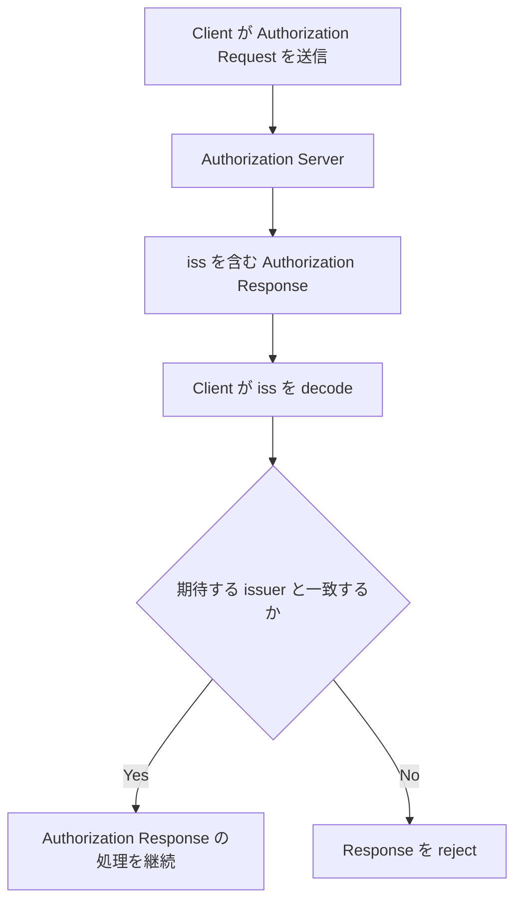
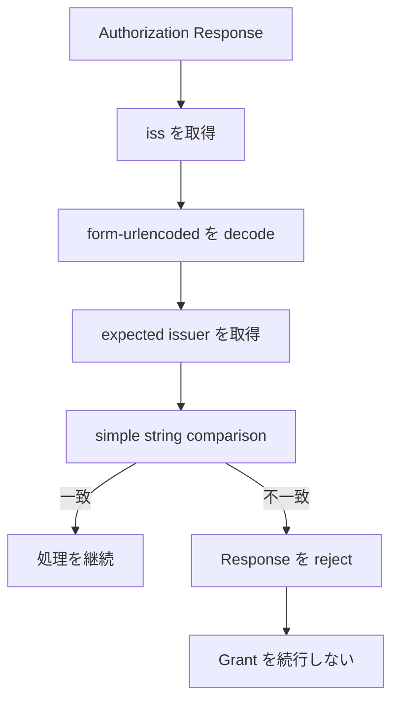

## この記事について

**記事タイプ:** Security Practice  
**対象読者:** 複数の Authorization Server と連携する OAuth Client 実装者  
**この記事で伝えること:** RFC 9207 の Authorization Response `iss` parameter を Client がどの issuer identifier と照合し、不一致時にどう処理するか  
**扱わないこと:** mix-up attack の全攻撃手順、JARM の JWT validation、OpenID Connect ID Token validation、Authorization Server Metadata 全体、Token Endpoint の処理

## `iss` は Authorization Response を作成した Authorization Server を示す

RFC 9207 §2 は、同仕様をサポートする Authorization Server に対し、Client への Authorization Response に `iss` parameter を含めて自身の identity を示すことを **MUST** としています。これは成功 response だけでなく error response にも適用されます。

`iss` の値は Authorization Response を作成した Authorization Server の issuer identifier です。値は `https` scheme の URL でなければならず（**MUST**）、query component と fragment component を含めてはなりません（RFC 9207 §2）。issuer identifier 自体は RFC 8414 で定義されています。

この記事では、Client がこの値を受け取ってから validation を完了するまでに範囲を限定します。



## `iss` は Authorization Response parameter として返る

Authorization Code Grant の成功 response では、Authorization Server は通常 User Agent を Client の redirection endpoint へ redirect します。RFC 9207 の `iss` は、その Authorization Response の parameter として `code` や `state` とともに返ります。

以下は RFC 9207 §2.1 の配置を示すための**非規範的な例**です。値は illustrative value です。

```http
HTTP/1.1 302 Found
Location: https://client.example/cb?code=illustrative-code&state=illustrative-state&iss=https%3A%2F%2Fas.example
```

この例では次の配置になります。

- HTTP status: `302 Found`
- `Location`: HTTP response header
- `code`: redirect URI の query parameter
- `state`: redirect URI の query parameter
- `iss`: redirect URI の query parameter。値は `application/x-www-form-urlencoded` の形式で encode されている

Error response にも `iss` が含まれます。以下は RFC 9207 §2.2 の形式に沿った**非規範的な例**です。

```http
HTTP/1.1 302 Found
Location: https://client.example/cb?error=access_denied&state=illustrative-state&iss=https%3A%2F%2Fas.example
```

## Metadata を使う場合は `issuer` と一致させる

RFC 9207 §2.3 は、同仕様をサポートする Authorization Server が Client に issuer identifier を提供することを **MUST** としています。

Authorization Server が RFC 8414 に従って metadata を公開する場合、metadata の `issuer` 値は Authorization Response の `iss` と同一でなければなりません（**MUST**, RFC 9207 §2.3）。また Authorization Server は、RFC 9207 §3 が定義する metadata parameter `authorization_response_iss_parameter_supported` を `true` にして `iss` support を示さなければなりません（**MUST**, §2.3）。

以下はこの記事で扱う member だけを示す**非規範的な最小例**です。

```json
{
  "issuer": "https://as.example",
  "authorization_response_iss_parameter_supported": true
}
```

- `issuer`: JSON string。Authorization Server の issuer identifier
- `authorization_response_iss_parameter_supported`: JSON boolean。RFC 9207 の Authorization Response `iss` support を示す。RFC 9207 §3 により、省略時の default は `false`

## Client は decode 後の値を expected issuer と比較する

RFC 9207 §2.4 により、同仕様をサポートする Client は Authorization Response に `iss` が存在する場合、その値を取り出さなければなりません（**MUST**）。Client は RFC 6749 Appendix B に従って `application/x-www-form-urlencoded` の値を decode しなければなりません（**MUST**）。

その後 Client は、decode した `iss` を、その Authorization Request を送信した Authorization Server の issuer identifier と比較しなければなりません（**MUST**）。比較方法は RFC 3986 §6.2.1 の simple string comparison です。

RFC 8414 の metadata を利用する Client は、Authorization Response の `iss` と metadata document の `issuer` を比較しなければなりません（**MUST**, RFC 9207 §2.4）。metadata を利用しない場合、期待する issuer identifier の決定方法は deployment-specific であり、RFC 9207 は静的設定を例示していますが、一つの方式を要求していません。

## 不一致なら Authorization Grant を続行しない

Authorization Response の `iss` が expected issuer identifier と一致しない場合、Client は Authorization Response を reject しなければならず（**MUST**）、Authorization Grant の処理を続行してはなりません（**MUST NOT**, RFC 9207 §2.4）。

Error response の場合も、Client はその error が意図した Authorization Server から来たものだと仮定してはなりません（**MUST NOT**, §2.4）。



## Server ごとの `iss` support 状態も validation に影響する

RFC 9207 をサポートする Authorization Server とサポートしない Authorization Server の両方を扱う Client は、各 Authorization Server が `iss` parameter をサポートするかどうかの state を保持しなければなりません（**MUST**, RFC 9207 §2.4）。

Client の configuration 上 `iss` をサポートする Authorization Server から `iss` のない Authorization Response を受け取った場合、Client はその response を reject しなければなりません（**MUST**）。一方、support を示していない Authorization Server から `iss` を受け取った場合、Client は response を discard することが **SHOULD** とされています。ただし、そのような response を受け入れるかどうかについて RFC 9207 は local policy / configuration に委ねる場合があることを明記しています。

一般に RFC 9207 をサポートする Client が `iss` を含まない Authorization Response を受け入れるか、`iss` を提供する Authorization Server のみをサポートするかについても **MAY** とされ、具体的な判断は local policy / configuration の範囲です（§2.4）。この記事では一方を推奨しません。

## 同じ issuer identifier を複数の Authorization Server に割り当てない

RFC 9207 §4 は、Client が `iss` を §2.4 の手順どおりに検証することを **MUST** とし、複数の Authorization Server が同じ issuer identifier を使用することを Client が許してはならないと規定しています（**MUST NOT**）。

特に Authorization Server の情報を Client に手動設定できる場合、Client は受け入れる `iss` value が Authorization Server ごとに unique であることを保証しなければなりません（**MUST**, §4）。

## まとめ

RFC 9207 の `iss` は Authorization Response を作成した Authorization Server の issuer identifier を明示します。Client は受信した `iss` を form-urlencoded 形式から decode し、Authorization Request の送信先として期待していた Authorization Server の issuer identifier と simple string comparison します。

RFC 8414 metadata を使用する場合、その比較対象は metadata の `issuer` です。不一致なら Client は Authorization Response を reject し、Authorization Grant を続行してはなりません。Server ごとの `iss` support 状態や、仕様をサポートしない Server からの response を許容する条件について RFC 9207 が local policy / configuration に委ねている部分は、仕様上の判断範囲として区別する必要があります。

## 一次資料

- RFC Editor, [RFC 9207: OAuth 2.0 Authorization Server Issuer Identification](https://www.rfc-editor.org/rfc/rfc9207.html), §2–§4
- RFC Editor, [RFC 8414: OAuth 2.0 Authorization Server Metadata](https://www.rfc-editor.org/rfc/rfc8414.html)
- RFC Editor, [RFC 3986: Uniform Resource Identifier (URI): Generic Syntax](https://www.rfc-editor.org/rfc/rfc3986.html), §6.2.1
- RFC Editor, [RFC 6749: The OAuth 2.0 Authorization Framework](https://www.rfc-editor.org/rfc/rfc6749.html), Appendix B

最終確認: 2026-09-20
