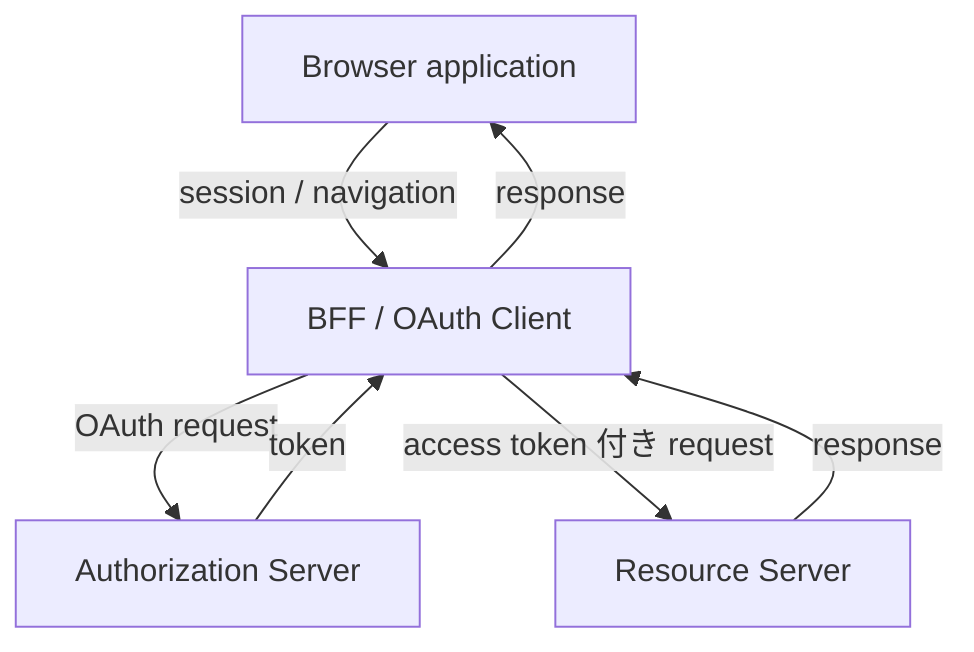
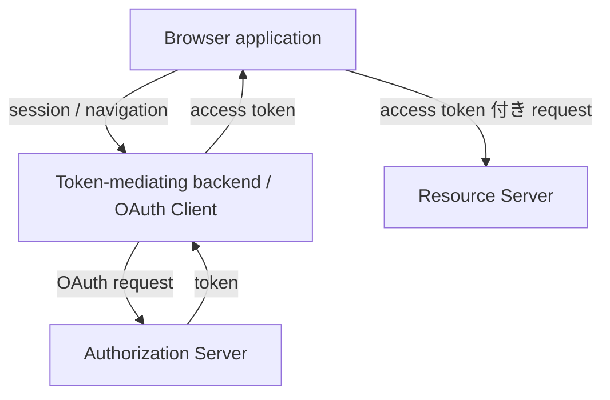
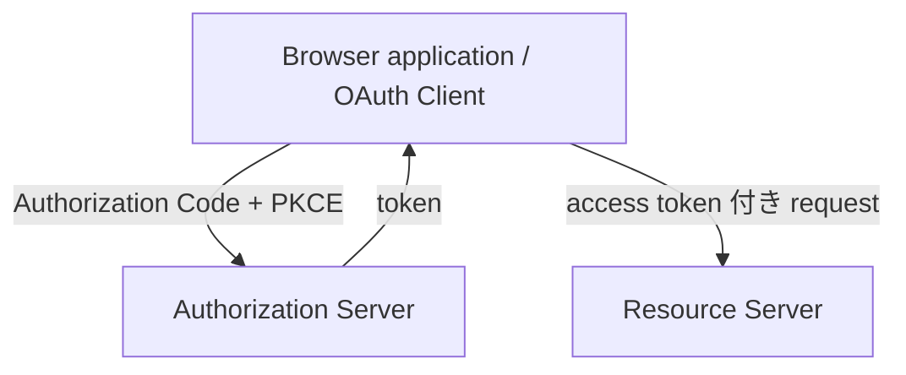

## この記事について

**記事タイプ:** Overview  
**対象読者:** Browser-based application で OAuth 2.0 を利用する構成を設計・レビューする開発者  
**この記事で伝えること:** RFC 10017 §6 が定義する BFF、token-mediating backend、browser-based OAuth client の3つの architecture pattern について、OAuth Client がどこにあり、token を誰が保持し、Resource Server への request がどこを通るかを区別する  
**扱わないこと:** malicious JavaScript の個別 attack scenario の詳細、cookie の全属性、CORS / CSP の設定方法、DPoP の詳細、Refresh Token の個別要件、OpenID Connect 固有処理

<!--
Article brief
Reader: Browser-based application で OAuth 2.0 を利用する構成を設計・レビューする開発者
Question: RFC 10017 の BFF、token-mediating backend、browser-based OAuth client では、OAuth Client・token・Resource Server request の配置がどう異なるのか
Answer: 3 pattern について OAuth responsibility の所在、access / refresh token の保持場所、Resource Server への request path を区別できる
Scope: RFC 10017 §6 の architecture pattern の構成上の差異
Out of scope: §5 の attack scenario の詳細、§6 各 pattern の全実装要件、§8–§10 の storage / sender-constrained token / service worker の詳細
Primary sources: RFC 10017 §1, §6.1, §6.2, §6.3
Diagram: 3 pattern を縦方向の小さな flowchart に分けて構成要素と token / request path を示す
-->

RFC 10017（BCP 212）"OAuth 2.0 for Browser-Based Applications" は、browser-based application が OAuth を利用して protected resource にアクセスする場合の architecture pattern を §6 で3つに整理しています。

この記事では3 pattern の構成上の違いだけを扱います。RFC 10017 は 2026年8月に Best Current Practice として公開されています。

## 3つの pattern

RFC 10017 §6 は次の3 pattern を示します。

1. **Backend for Frontend (BFF):** backend component が OAuth responsibility と Resource Server への request forwarding の両方を担う。
2. **Token-Mediating Backend:** backend component が OAuth responsibility を担い、access token を browser-based application に渡す。application は Resource Server を直接呼び出す。
3. **Browser-Based OAuth 2.0 Client:** browser-based application 自身が OAuth Client となり、backend component を介さず token を取得する。

RFC 10017 §6 は、これらを security と simplicity の trade-off が異なる pattern として説明し、security の高い順に記載しています。

## BFF では backend が OAuth Client になる

RFC 10017 §6.1 では、BFF は server-side component であり、frontend application の OAuth Client になります。BFF は confidential OAuth Client として Authorization Server と通信し、access token と refresh token を browser-based application に直接公開せず、cookie-based session に関連付けて管理します。

Resource Server への API request も BFF を経由します。Browser は session cookie を伴う request を BFF に送り、BFF が対応する access token を付加して Resource Server へ forward します。



この構成では access token と refresh token は BFF 側で管理され、browser-based application へ直接渡されません。

## Token-Mediating Backend では access token を browser に渡す

RFC 10017 §6.2 の token-mediating backend も、backend component が confidential OAuth Client として Authorization Server から token を取得します。

BFF との違いは Resource Server への request path です。Token-mediating backend は access token を browser-based application に提供し、application がその access token を使って Resource Server を直接呼び出します。Refresh token を利用する場合、§6.2.2.2 では backend が refresh token を取得して user session に関連付けます。



したがって、BFF と token-mediating backend はどちらも backend が OAuth Client ですが、access token が browser に露出するか、Resource Server request が backend を経由するかが異なります。

## Browser-Based OAuth Client では OAuth responsibility が browser にある

RFC 10017 §6.3 では、browser-based application 自身が OAuth Client として動作します。Backend component は token 取得に関与しません。

Application は Authorization Code flow と PKCE を使用して authorization code を取得し、browser API から Token Endpoint へ HTTP `POST` request を送り、token と交換します。RFC 10017 §6.3.2.1 は、この pattern の public client が access token を取得するとき PKCE を実装することを **MUST** とし、Authorization Server にもその client に対して PKCE を support / enforce することを **MUST** としています。

以下は配置だけを示す**非規範的な例**です。値は illustrative value です。

```http
POST /token HTTP/1.1
Host: authorization.example
Content-Type: application/x-www-form-urlencoded

grant_type=authorization_code&code=illustrative-code&redirect_uri=https%3A%2F%2Fclient.example%2Fcallback&client_id=illustrative-client&code_verifier=illustrative-code-verifier
```

`grant_type`、`code`、`redirect_uri`、`client_id`、`code_verifier` は `application/x-www-form-urlencoded` の request body に配置されます。この例は RFC 10017 が参照する Authorization Code flow と PKCE の配置を示すもので、値自体に規範的意味はありません。



RFC 10017 §6.3.1 は、この browser-based application を public client とし、client credential を保持して Authorization Server に client authentication を行う構成ではないと説明しています。

## 3 pattern の境界

3 pattern を区別する中心は、OAuth responsibility と token / API request の位置です。

- **BFF:** backend が OAuth Client。token は backend が管理し、Resource Server request も backend が forward する。
- **Token-Mediating Backend:** backend が OAuth Client。refresh token は backend で管理できるが、access token は browser に渡され、browser が Resource Server を直接呼ぶ。
- **Browser-Based OAuth Client:** browser application 自身が public OAuth Client。token を browser が取得し、Resource Server を直接呼ぶ。

RFC 10017 §6 は BFF を security の高い側に位置付け、§6.1.4.3 では business applications、sensitive applications、personal data を扱う applications に BFF architecture を strongly recommended としています。また §6.2.4.3 は token-mediating backend を検討するとき、full BFF が viable alternative か評価することを strongly recommended としています。これは RFC 10017 自身の recommendation であり、本記事独自の評価ではありません。

## この記事で扱わなかったこと

RFC 10017 は architecture だけでなく、malicious JavaScript による attack scenario、session cookie、CSRF、refresh token、sender-constrained token、browser storage などについても規定・分析しています。それらの個別要件は、この3 pattern の構成上の差異という中心テーマから外れるため、この記事では展開しません。

## 一次資料

- IETF / RFC Editor, [RFC 10017: OAuth 2.0 for Browser-Based Applications](https://www.rfc-editor.org/rfc/rfc10017.html), §1, §6.1–§6.3
- IETF / RFC Editor, [RFC 6749: The OAuth 2.0 Authorization Framework](https://www.rfc-editor.org/rfc/rfc6749.html), §2.1, §4.1
- IETF / RFC Editor, [RFC 7636: Proof Key for Code Exchange by OAuth Public Clients](https://www.rfc-editor.org/rfc/rfc7636.html)

最終確認: 2026-09-20
