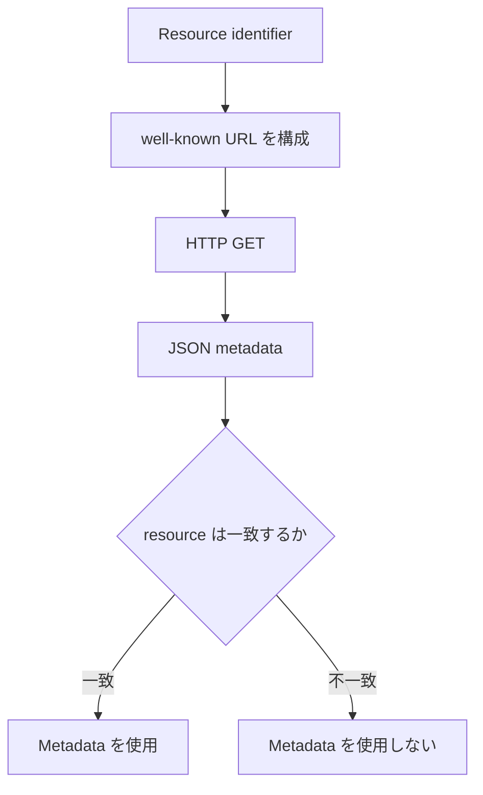

## この記事について

**記事タイプ:** Flow  
**対象読者:** OAuth Client で未知または動的に構成される Protected Resource の metadata 取得処理を実装・レビューする開発者  
**この記事で伝えること:** RFC 9728 に基づき、Protected Resource の resource identifier から metadata URL を構成し、HTTP GET で JSON object を取得して `resource` を検証するまでの流れ  
**扱わないこと:** Authorization Server Metadata 自体の取得・検証手順、OAuth grant の実行、Access Token の検証、signed metadata の詳細、Client 登録方法、どの Authorization Server を信頼するかという application-specific な判断

## Article brief

- **Reader:** OAuth Client で Protected Resource Metadata の discovery と validation を実装する開発者
- **Question:** Protected Resource Metadata はどの URL から取得し、取得した JSON の何を検証すればよいか
- **Answer:** resource identifier から well-known URL を構成し、GET で metadata を取得し、返された `resource` を取得元の resource identifier と一致確認する一連の処理を理解できる
- **Scope:** RFC 9728 §2、§3、§5.1 に定義された metadata の基本構造、well-known URL、HTTP request / response、`resource` validation、`WWW-Authenticate` の `resource_metadata`
- **Out of scope:** RFC 8414 の Authorization Server Metadata 処理、signed metadata の署名検証、OAuth authorization flow、Access Token validation、Client registration、Authorization Server の trust determination
- **Primary sources:** RFC 9728 §2、§3、§5.1
- **Diagram:** resource identifier から metadata URL を構成し、取得・`resource` 検証を行う `flowchart TD`

既存の「RFC 8414：Authorization Server Metadata はどこから取得し、何を検証するのか」は Authorization Server の issuer identifier を起点に endpoint と capability を取得する記事です。本記事は Protected Resource の resource identifier を起点に Resource Server 側の metadata を取得する処理だけを扱います。

## 1. Protected Resource Metadata は Resource Server 側の構成を表す

RFC 9728 §1 は、OAuth 2.0 Client または Authorization Server が Protected Resource と対話するために必要な情報を取得できる metadata format を定義しています。

RFC 9728 §2 の metadata parameter のうち、本記事の取得・検証フローに直接関係するものは次のとおりです。

- **`resource`:** REQUIRED。Protected Resource の resource identifier。
- **`authorization_servers`:** OPTIONAL。Protected Resource とともに使用できる Authorization Server の issuer identifier の JSON array。Protected Resource は、サポートする Authorization Server の一部を広告しないこともできます（MAY, §2）。
- **`scopes_supported`:** RECOMMENDED。Protected Resource への access を要求するときに使う scope value の JSON array。
- **`bearer_methods_supported`:** OPTIONAL。Bearer Token の送信方法を示す JSON array。定義済みの値は `header`、`body`、`query` です。省略時に default はありません。

`authorization_servers` が存在しても、どの Authorization Server が適切かを安全に決定する一般的方法は RFC 9728 の scope 外です（§7.6）。本記事でも選択基準は定義しません。

## 2. resource identifier から well-known URL を構成する

RFC 9728 §3 は、Protected Resource が metadata をサポートする場合、resource identifier の host component と path / query component の間に well-known URI string を挿入して metadata document を公開しなければならない（MUST）と規定しています。

default の well-known URI string は次のとおりです。

```text
/.well-known/oauth-protected-resource
```

resource identifier が次の場合を考えます。

```text
https://resource.example
```

metadata URL は次の形です。

```text
https://resource.example/.well-known/oauth-protected-resource
```

resource identifier に path component がある場合、たとえば次の resource identifier では、

```text
https://resource.example/resource1
```

metadata URL は次の形になります。

```text
https://resource.example/.well-known/oauth-protected-resource/resource1
```

RFC 9728 §3.1 は、host component の直後にある終端の `/` を除いてから well-known URI string を host と path / query の間へ挿入しなければならない（MUST）と規定しています。

## 3. Metadata は HTTP GET で取得する

RFC 9728 §3.1 により、Protected Resource Metadata document は HTTP `GET` で問い合わせなければなりません（MUST）。

次は配置を示す**非規範的な例**です。値は説明用です。

```http
GET /.well-known/oauth-protected-resource HTTP/1.1
Host: resource.example
```

RFC 9728 §3.2 により、成功時の response は `200 OK` を使用し（MUST）、`Content-Type: application/json` の JSON object を返します（MUST）。

次は本記事のテーマに必要な member だけを含む**非規範的な例**です。

```http
HTTP/1.1 200 OK
Content-Type: application/json

{
  "resource": "https://resource.example",
  "authorization_servers": [
    "https://authorization.example"
  ],
  "scopes_supported": [
    "read"
  ],
  "bearer_methods_supported": [
    "header"
  ]
}
```

この JSON object では、各 member は次の型です。

- `resource`: string。REQUIRED。
- `authorization_servers`: string の JSON array。OPTIONAL。
- `scopes_supported`: string の JSON array。RECOMMENDED。
- `bearer_methods_supported`: string の JSON array。OPTIONAL。

RFC 9728 §3.2 では、複数値の parameter は JSON array で表し、値が0個の parameter は response から省略しなければなりません（MUST）。未知の metadata parameter は無視しなければなりません（MUST）。

## 4. Client は `resource` を取得元と一致確認する

Metadata を取得できたことだけでは、その内容を使用できるとは限りません。

RFC 9728 §3.3 は、response の `resource` value が、metadata URL を構成するときに well-known URI path suffix を挿入した元の resource identifier と同一でなければならない（MUST）と規定しています。一致しない場合、response 内の data を使用してはなりません（MUST NOT）。

たとえば次の URL から metadata を取得したとします。

```text
https://resource.example/.well-known/oauth-protected-resource
```

この URL を `https://resource.example` から構成した場合、response の `resource` は次の値である必要があります。

```json
{
  "resource": "https://resource.example"
}
```

RFC 9728 §6 は、こうした string comparison を Unicode code point 単位の equality comparison として実行し、Unicode Normalization を適用してはならない（MUST NOT）と規定しています。

## 5. `WWW-Authenticate` で metadata URL を通知できる

RFC 9728 §5 は、Protected Resource が `WWW-Authenticate` response header field を使って Protected Resource Metadata URL を Client に返すことを認めています（MAY）。§5.1 が定義する parameter は `resource_metadata` です。

次は header の配置を示す**非規範的な例**です。

```http
HTTP/1.1 401 Unauthorized
WWW-Authenticate: Bearer resource_metadata="https://resource.example/.well-known/oauth-protected-resource"
```

`resource_metadata` は `WWW-Authenticate` header の auth-param として置かれ、その値は Protected Resource Metadata の URL です。

この URL を使って metadata を取得した場合、RFC 9728 §3.3 は、response の `resource` value が Client が Resource Server に request した URL と同一でなければならない（MUST）と規定しています。一致しない場合、その metadata を使用してはなりません（MUST NOT）。

また RFC 9728 §5.2 は、Protected Resource が metadata の変更を示すため、新しい `resource_metadata` value を含む `WWW-Authenticate` challenge を返すことを認めています（MAY）。Client がこれを受け取った場合、更新された metadata を取得し、§3.3 に従って検証してから新しい値を使用することが推奨されています（SHOULD）。

## 6. 取得と検証の流れ



この図は RFC 9728 §3.1–§3.3 の処理関係を簡略化した**非規範的な図**です。

**The metadata URL is derived from the resource identifier, and the returned `resource` value is checked against that identifier before the metadata is used.**  
（metadata URL は resource identifier から導出し、metadata を使用する前に、返された `resource` value をその identifier と照合します。）

## 7. Authorization Server Metadata とは起点が異なる

RFC 8414 の Authorization Server Metadata は Authorization Server の issuer identifier を起点に、Authorization Endpoint、Token Endpoint、JWK Set など Authorization Server 側の構成を取得します。

RFC 9728 の Protected Resource Metadata は Protected Resource の resource identifier を起点に、Resource Server 側の capability や関連する Authorization Server の issuer identifier などを取得します。

両者は well-known location から JSON metadata を取得する点では似ていますが、対象となる entity と検証する identifier が異なります。本記事では RFC 8414 側の取得・検証手順を繰り返しません。

## まとめ

RFC 9728 の Protected Resource Metadata 取得・検証フローは、次の処理に整理できます。

1. Protected Resource の resource identifier を基に metadata URL を構成する（§3）。
2. metadata document を HTTP `GET` で取得する（MUST, §3.1）。
3. 成功 response として `200 OK`、`application/json` の JSON object を受け取る（MUST, §3.2）。
4. response の `resource` が元の resource identifier と同一であることを確認する（MUST, §3.3）。
5. 一致しない場合、metadata data を使用しない（MUST NOT, §3.3）。
6. Protected Resource が `WWW-Authenticate` の `resource_metadata` で metadata URL を通知する場合もある（MAY, §5.1）。

## Primary sources

- RFC 9728, *OAuth 2.0 Protected Resource Metadata*, §2, §3, §5.1, §5.2, §6, §7.6  
  https://www.rfc-editor.org/rfc/rfc9728.html
- RFC 8414, *OAuth 2.0 Authorization Server Metadata* — Authorization Server Metadata との境界確認にのみ参照  
  https://www.rfc-editor.org/rfc/rfc8414.html
