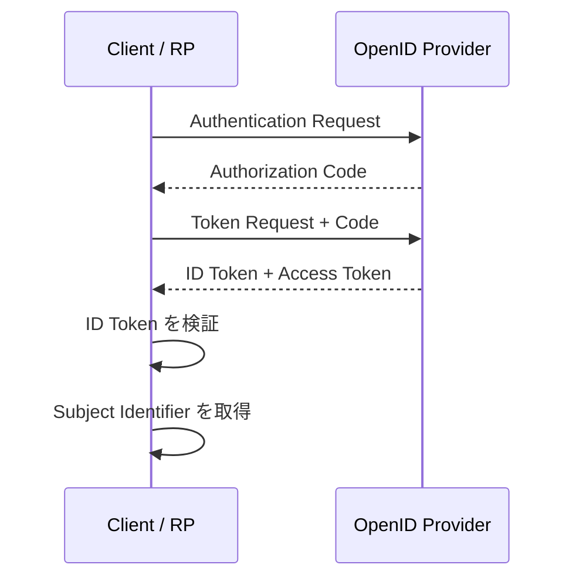

- **記事タイプ:** Overview
- **対象読者:** OAuth 2.0 の Authorization Code Flow は知っているが、OpenID Connect で ID Token が加わる意味を整理したい実装者
- **この記事で伝えること:** Authorization Code Flow において ID Token が認証結果を Claims として RP に伝え、RP が End-User の Subject Identifier を得るために使われること
- **扱わないこと:** ID Token の検証手順の詳細、Implicit / Hybrid Flow、UserInfo Endpoint、Access Token の Resource Server での利用、Logout、Self-Issued OP

## ID Token は認証結果を伝える JWT

OpenID Connect Core 1.0 §1 は、OpenID Connect を OAuth 2.0 上の identity layer と位置付けています。Client は Authorization Request に `openid` scope value を含めることで OpenID Connect の利用を要求し、認証についての情報は **ID Token** と呼ばれる JSON Web Token（JWT）で返されます。

§1.2 の定義では、ID Token は **Authentication event に関する Claims を含む JWT** です。ほかの Claims を含むこともできます（MAY）。

このため、Authorization Code と ID Token は同じものを表していません。Authorization Code Flow では、Authorization Endpoint がまず Authorization Code を Client に返し、その Code を Token Endpoint で交換した結果として ID Token と Access Token が返されます（§3.1、§3.1.1）。

## Authorization Code Flow のどこで ID Token が返るか

OpenID Connect Core 1.0 §1.2 は Authorization Code Flow を「Authorization Endpoint から Authorization Code が返り、すべての token が Token Endpoint から返る OAuth 2.0 flow」と定義しています。§3.1.1 は処理をさらに具体化し、Client が Authorization Code を Token Endpoint に提示した後、response body に ID Token と Access Token を含む response を受け取るとしています。



この図は OpenID Connect Core 1.0 §3.1.1 の Authorization Code Flow steps を簡略化したものです。End-User の authentication と consent の詳細は省略しています。

## Token Response では `id_token` JSON member に入る

OpenID Connect Core 1.0 §3.1.3.3 では、Token Endpoint の successful Token Response は OAuth 2.0 の Token Response に加えて `id_token` parameter を含むと定義されています。Authorization Code Flow では ID Token は Authorization Endpoint の query parameter ではなく、Token Endpoint の JSON response の `id_token` member として返ります。

以下は配置を示すための**非規範的な例**です。値は illustrative value であり、実際の token 値を表すものではありません。

```http
HTTP/1.1 200 OK
Content-Type: application/json

{
  "access_token": "illustrative-access-token",
  "token_type": "Bearer",
  "id_token": "illustrative-id-token-jwt"
}
```

- `id_token`: ID Token を表す JSON member。
- `access_token`: Access Token を表す JSON member。ID Token とは役割が異なります。
- `token_type`: Access Token の type を示す member であり、ID Token の type を示すものではありません。

## ID Token の Claims Set は何を表すか

OpenID Connect Core 1.0 §2 は ID Token の Claims を定義しています。次は、この記事のテーマに必要な構造だけを示す**非規範的な最小例**です。値は illustrative value です。

```json
{
  "iss": "https://op.example",
  "sub": "illustrative-subject",
  "aud": "illustrative-client-id",
  "exp": 1790000000,
  "iat": 1789999400
}
```

§2 では、`iss`、`sub`、`aud`、`exp`、`iat` は REQUIRED です。

ここでこの記事の中心となるのは `sub` です。`sub` は Issuer 内で End-User を指す Subject Identifier です。§3.1.1 の最後の step は、Client が ID Token を validation し、End-User の Subject Identifier を取得することを示しています。

個々の Claim をどの条件で受理するか、署名をどう検証するかといった validation procedure は §3.1.3.7 の別テーマであり、この記事では扱いません。

## Access Token とは役割が異なる

OpenID Connect Core 1.0 §1 は、OAuth 2.0 が HTTP resource への limited access を得て利用するための Access Token の仕組みを提供する一方、それ自体では End-User の authentication information を提供する標準的方法を定義しないと説明しています。OpenID Connect はその上に authentication を追加し、その結果を ID Token で Client に返します。

**The ID Token carries claims about the authentication event; the Access Token is used for access to protected resources.**  
（ID Token は認証イベントに関する Claims を運び、Access Token は protected resource へのアクセスに使われます。）

したがって、Authorization Code Flow で両方が同じ Token Response に含まれていても、ID Token と Access Token は交換可能なデータではありません。本記事では ID Token の役割だけを扱い、Access Token の Resource Server における処理は扱いません。

## まとめ

Authorization Code Flow では、Authorization Endpoint が返すのは Authorization Code です。Client はその Code を Token Endpoint に提示し、Token Endpoint から ID Token と Access Token を受け取ります。

ID Token は Authentication event に関する Claims を含む JWT です。Client は ID Token を validation した後、そこから End-User の Subject Identifier を取得します。どの Claim をどのように検証するかは別の requirement であり、この役割の説明とは分離して扱います。

## 一次資料

- OpenID Foundation, **OpenID Connect Core 1.0 incorporating errata set 2**, §1, §1.2, §2, §3, §3.1, §3.1.1, §3.1.3.3, §3.1.3.6: https://openid.net/specs/openid-connect-core-1_0.html
