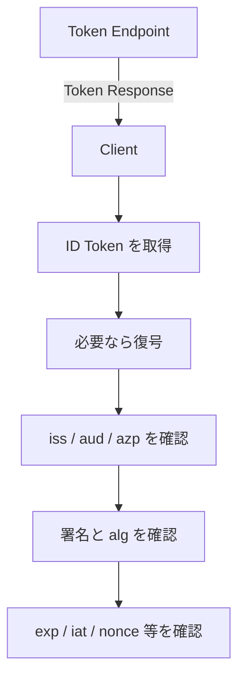

- **記事タイプ:** Requirement
- **対象読者:** OpenID Connect の Authorization Code Flow を実装する RP / Client 実装者
- **この記事で伝えること:** Token Endpoint から受け取った ID Token について、OpenID Connect Core 1.0 §3.1.3.7 が Client に要求する検証項目と、その対象となる JOSE Header / Claims Set を整理する
- **扱わないこと:** Implicit Flow / Hybrid Flow 固有の検証、Self-Issued OP、Access Token の検証、UserInfo Response の検証、Discovery や Dynamic Client Registration の手順、鍵ローテーションの実装方法

## Article brief

- **Reader:** OpenID Connect Authorization Code Flow の RP / Client 実装者
- **Question:** Token Endpoint から受け取った ID Token について、Client はどの値を何と照合しなければならないか
- **Answer:** `iss`、`aud`、`azp`、署名、`alg`、`exp`、`nonce` などについて、OpenID Connect Core 1.0 §3.1.3.7 の規範要件と Client 固有の判断事項を区別できる
- **Scope:** Authorization Code Flow の Token Response に含まれる ID Token の検証
- **Out of scope:** Authorization Endpoint から ID Token を受け取る flow、Access Token validation、UserInfo、Self-Issued OP、鍵取得・更新の運用設計
- **Primary sources:** OpenID Connect Core 1.0 §2、§3.1.3.3、§3.1.3.5–§3.1.3.8
- **Diagram:** Token Endpoint から ID Token を受け取り、Client が ID Token validation を行う処理の flowchart

## ID Token は Token Response の JSON member として返る

Authorization Code Flow では、Client は Token Endpoint に Token Request を送り、成功時には ID Token と Access Token を含む Token Response を受け取ります（OpenID Connect Core 1.0 §3.1.3.3）。Token Response の media type は `application/json` です。

以下は配置を示すための**非規範的な例**です。値は illustrative value です。

```http
HTTP/1.1 200 OK
Content-Type: application/json

{
  "access_token": "illustrative-access-token",
  "token_type": "Bearer",
  "id_token": "eyJ...illustrative..."
}
```

`id_token` は Token Response の JSON member です。ID Token 自体は JWT であり、OpenID Connect Core 1.0 §2 が Claims を定義します。

検証対象の位置を確認するため、署名された ID Token をデコードした内容を最小限の形で示します。これは**非規範的な例**であり、署名済み JWT そのものではありません。

JOSE Header:

```json
{
  "alg": "RS256",
  "kid": "illustrative-key-id"
}
```

Claims Set:

```json
{
  "iss": "https://issuer.example",
  "sub": "illustrative-subject",
  "aud": "illustrative-client-id",
  "exp": 1790000000,
  "iat": 1789999400,
  "nonce": "illustrative-nonce"
}
```

ここで `alg` は JOSE Header parameter であり、`iss`、`sub`、`aud`、`exp`、`iat`、`nonce` は Claims Set の member です。

## Token Response の検証から ID Token validation へ進む

OpenID Connect Core 1.0 §3.1.3.5 は、Client が Token Response を検証するとき、同仕様 §3.1.3.7 の ID Token validation rules に従うことを **MUST** としています。



図は検証対象を読みやすく並べたものであり、仕様の番号付き手順を置き換えるものではありません。

## 暗号化されている場合

OpenID Connect Core 1.0 §3.1.3.7 item 1 では、ID Token が encrypted の場合、Client は Registration 時に OP が ID Token の暗号化に使用すると指定した鍵と algorithm を用いて復号します。

Registration 時に OP との間で encryption を negotiated しているにもかかわらず ID Token が encrypted でない場合、RP はその ID Token を reject することが **SHOULD** です（§3.1.3.7 item 1）。

## `iss` は Issuer Identifier と完全一致させる

Client は、OpenID Provider の Issuer Identifier と ID Token の `iss` Claim の値が **exactly match** することを確認しなければなりません（**MUST**, §3.1.3.7 item 2）。

仕様は Issuer Identifier が通常 Discovery により取得されることを記載していますが、Discovery 自体の手順はこの記事では扱いません。

## `aud` に Client 自身の `client_id` が含まれることを確認する

Client は `aud` Claim に、`iss` が示す Issuer に登録した自身の `client_id` が audience として含まれることを検証しなければなりません（**MUST**, §3.1.3.7 item 3）。

`aud` は複数要素の array である場合があります（**MAY**, §3.1.3.7 item 3）。ID Token が Client を valid audience として列挙していない場合、または Client が trust していない追加 audience を含む場合、その ID Token は reject しなければなりません（**MUST**, §3.1.3.7 item 3）。

複数 audience の配置例を示します。これは**非規範的な例**です。

```json
{
  "iss": "https://issuer.example",
  "sub": "illustrative-subject",
  "aud": [
    "illustrative-client-id",
    "illustrative-other-audience"
  ],
  "azp": "illustrative-client-id",
  "exp": 1790000000,
  "iat": 1789999400
}
```

## 複数 audience と `azp`

ID Token が複数の audience を含む場合、Client は `azp` Claim が存在することを確認することが **SHOULD** です（OpenID Connect Core 1.0 §3.1.3.7 item 4）。

`azp` Claim が存在する場合、Client はその Claim Value が自身の `client_id` であることを確認することが **SHOULD** です（§3.1.3.7 item 5）。

## 署名と `alg`

Authorization Code Flow の Token Endpoint から ID Token を直接受け取る場合、OpenID Connect Core 1.0 §3.1.3.7 item 6 は、TLS server validation を token signature の確認に代えて issuer validation に使用してもよいとしています（**MAY**）。一方、その他の ID Token については、Client は JWT の `alg` Header Parameter が指定する algorithm を用い、JWS に従って署名を検証しなければなりません（**MUST**）。その際、Client は Issuer が提供する鍵を使用しなければなりません（**MUST**）。

`alg` は `RS256` の default、または Registration 時に Client が `id_token_signed_response_alg` で指定した algorithm であることが **SHOULD** です（§3.1.3.7 item 7）。

`alg` が `HS256`、`HS384`、`HS512` のような MAC-based algorithm の場合、§3.1.3.7 item 8 は検証鍵として、`aud` の `client_id` に対応する `client_secret` の UTF-8 representation の octets を使用すると定めています。multi-valued `aud`、または `aud` と異なる `azp` が存在する場合の MAC-based algorithm の behavior は unspecified です。

## `exp` は現在時刻より後でなければならない

Client は current time が `exp` Claim が表す時刻より前であることを確認しなければなりません（**MUST**, OpenID Connect Core 1.0 §3.1.3.7 item 9）。

`iat` Claim は、発行時刻が current time から離れすぎている token を reject するために利用できます。ただし acceptable range は Client specific です（§3.1.3.7 item 10）。仕様が Client の判断に委ねているため、この記事では具体的な時間幅を定めません。

## `nonce` を送った場合は同じ値を確認する

Authentication Request で `nonce` value を送った場合、ID Token に `nonce` Claim が存在し、その値が Authentication Request で送った値と同じであることを確認しなければなりません（**MUST**, OpenID Connect Core 1.0 §3.1.3.7 item 11）。

Client は `nonce` value について replay attack を確認することが **SHOULD** です。一方、replay detection の具体的方法は Client specific です（同 item 11）。

## `acr` と `auth_time` は要求した場合に確認する

`acr` Claim を要求した場合、Client は asserted Claim Value が適切であることを確認することが **SHOULD** です（OpenID Connect Core 1.0 §3.1.3.7 item 12）。`acr` Claim Value の意味と processing は同仕様の scope 外です。

`auth_time` Claim を明示的に要求した場合、または `max_age` parameter を使用した場合、Client は `auth_time` Claim value を確認し、最後の End-User authentication から時間が経過しすぎたと判断した場合には re-authentication を要求することが **SHOULD** です（§3.1.3.7 item 13）。どの程度の経過時間を許容するかについて、ここでは独自の値を設定しません。

## この検証は Access Token validation とは別である

OpenID Connect Core 1.0 §3.1.3.5 は Token Response validation の中で、ID Token validation と Access Token validation を別々の手順として参照しています。

Authorization Code Flow では、ID Token に `at_hash` Claim が含まれる場合、Client は Access Token の validation にその値を使用してもよいとされています（**MAY**, §3.1.3.8）。これは Access Token validation の論点であるため、この記事では計算方法や判定手順を扱いません。

## まとめ

Authorization Code Flow の Token Response に含まれる ID Token について、Client は OpenID Connect Core 1.0 §3.1.3.7 の validation rules に従います。

中心となる確認対象は、Issuer と `iss` の一致、自身の `client_id` を含む `aud`、必要に応じた `azp`、署名と `alg`、有効期限 `exp`、Authentication Request で送った場合の `nonce` です。`iat` の acceptable range や `nonce` の replay detection method など、仕様が Client specific としている事項については、仕様自体は一つの実装方針を指定していません。

## 一次資料

- OpenID Foundation, [OpenID Connect Core 1.0](https://openid.net/specs/openid-connect-core-1_0.html), §2, §3.1.3.3, §3.1.3.5–§3.1.3.8
