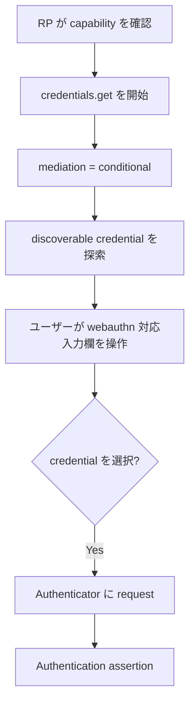

## この記事について

**記事タイプ:** Flow  
**対象読者:** WebAuthn の認証 UI を実装する Relying Party（RP）/ frontend 実装者  
**この記事で伝えること:** `navigator.credentials.get()` で `mediation: "conditional"` を指定したとき、Client が discoverable credential を探索し、ユーザーの UI 操作を契機に assertion request を進める処理  
**扱わないこと:** conditional registration (`navigator.credentials.create()`)、通常の modal な認証フロー、RP server による assertion の検証手順、passkey の同期方式

この記事は Web Authentication Level 3 の conditional mediation のうち、**authentication ceremony (`get`)** に範囲を限定します。

## Article brief

- **Reader:** WebAuthn の認証 UI を実装する RP / frontend 実装者
- **Question:** `mediation: "conditional"` を指定した `navigator.credentials.get()` は、通常の credential request と比べてどのように処理されるのか
- **Answer:** capability の確認、conditional request、discoverable credential の探索、`autocomplete="webauthn"` を持つ form control との interaction、credential 選択後の assertion request までの関係を追える
- **Scope:** WebAuthn Level 3 §5.1、§5.1.4、§5.1.4.1 の conditional authentication
- **Out of scope:** conditional create、§7.2 の RP-side assertion verification、UI の見た目や製品固有の挙動
- **Primary sources:** W3C Recommendation, Web Authentication: An API for accessing Public Key Credentials Level 3, §5.1、§5.1.4、§5.1.4.1
- **Diagram:** conditional authentication の処理順を示す flowchart

## 1. conditional mediation が変えるもの

WebAuthn Level 3 §5.1.4 は、通常の `navigator.credentials.get()` では User Agent が authenticator の選択と authorization を案内する UI を表示することを **SHOULD** としています。一方、`mediation` を `conditional` にすると、RP は credential が discover されない限り prominent modal UI を表示しないよう Client に示せます。

conditional mediation は assertion の検証規則を置き換える機能ではありません。本記事で扱うのは、Client が credential を discover し、ユーザーが選択して authenticator への request が発行されるまでの処理です。RP server が返された assertion を検証する処理は WebAuthn Level 3 §7.2 の別の手順です。

## 2. 最初に capability を確認する

WebAuthn Level 3 §5.1 の `PublicKeyCredential.isConditionalMediationAvailable()` は、`navigator.credentials.get()` で conditional mediation が利用可能かを示します。呼び出し結果は `Promise<boolean>` で、利用可能なら `true`、そうでなければ `false` になります。

RP は `mediation` に `conditional` を設定する前に、`isConditionalMediationAvailable()` または `getClientCapabilities()` で `conditionalGet` capability を確認することが **SHOULD** とされています（§5.1、§5.1.4）。

以下は配置を示す非規範的な例です。

```javascript
const available =
  await PublicKeyCredential.isConditionalMediationAvailable();

if (available) {
  const credential = await navigator.credentials.get({
    publicKey: requestOptions,
    mediation: "conditional"
  });
}
```

`mediation` は `navigator.credentials.get()` に渡す `CredentialRequestOptions` の member です。`publicKey` には `PublicKeyCredentialRequestOptions` を配置します。

## 3. conditional request の処理

WebAuthn Level 3 §5.1.4.1 では、`mediation` が `conditional` の場合、Client は `publicKey.allowCredentials` の値を `credentialIdFilter` として保持した後、処理に使う `allowCredentials` を空にします。仕様の note は、これによって conditional request で non-discoverable credential が使われることを防ぐと説明しています。

また Client は `lifetimeTimer` を infinity に設定します。仕様の note では、Document の lifetime 全体にわたって、ユーザーが `"webauthn"` autofill detail token を持つ form control と interaction できるようにするためと説明されています。



この図は §5.1.4 と §5.1.4.1 の処理関係を簡略化した非規範的な図です。

## 4. `autocomplete="webauthn"` とユーザー操作

§5.1.4.1 では、conditional request 中にユーザーが `input` または `textarea` と interaction し、その `autocomplete` attribute の non-autofill credential type が `"webauthn"` である場合の処理を定義しています。

仕様が示す値の例には次があります。

- `username webauthn`
- `current-password webauthn`

以下は配置だけを示す非規範的な HTML 例です。

```html
<input name="username" autocomplete="username webauthn">
```

`webauthn` token は、Normal または Contact 型の autofill detail token のうち最後のものの直後に置く必要があります（§5.1.4.1）。

## 5. credential が discover された後

conditional mediation で利用可能な authenticator が `silentCredentialDiscovery` operation をサポートする場合、Client は RP ID を渡して discoverable credential の metadata を取得します（§5.1.4.1）。

ユーザーが `autocomplete="webauthn"` の form control と interaction し、discover 済み credential が存在すると、User Agent はユーザーに credential を選択させます。この prompt は credential metadata の `name` や `displayName` などを表示することが **SHOULD** とされています。

ユーザーが credential を選択すると、Client は選択された credential ID を含む一時的な `allowCredentials` を構成し、その authenticator に credential request を発行します。その request が成功すると、Client は authentication assertion を構成して `navigator.credentials.get()` の結果へ進みます。

## 6. conditional request で credential が見つからない場合

通常の request では、条件によっては eligible credential が見つからないことを User Agent がユーザーに示し、`NotAllowedError` を投げる処理があります。§5.1.4.1 のこの分岐は `mediation` が `conditional` **ではない** 場合に適用されます。

conditional mediation では、credential の不存在を即時の失敗として Web site に公開する処理にはなっていません。Client は Document の lifetime にわたる interaction を扱えるよう conditional request の timer を infinity に設定します。

## 7. 仕様上の境界

conditional mediation が利用可能かどうかは Client capability です。RP は availability を確認することが **SHOULD** とされていますが、どの UI をどのような外観で提示するかはこの記事では規定しません。

また、credential 選択後に得られる authentication assertion の RP-side verification は conditional mediation 固有の検証手順ではありません。challenge、origin、RP ID hash、flags、signature などの検証は WebAuthn Level 3 §7.2 の authentication assertion verification に属します。

## Primary sources

- W3C, *Web Authentication: An API for accessing Public Key Credentials Level 3*, Recommendation, 25 August 2026, §5.1 `PublicKeyCredential` Interface
- W3C, *Web Authentication: An API for accessing Public Key Credentials Level 3*, §5.1.4 Use an Existing Credential to Make an Assertion
- W3C, *Web Authentication: An API for accessing Public Key Credentials Level 3*, §5.1.4.1 `PublicKeyCredential`'s `[[DiscoverFromExternalSource]]` Internal Method
