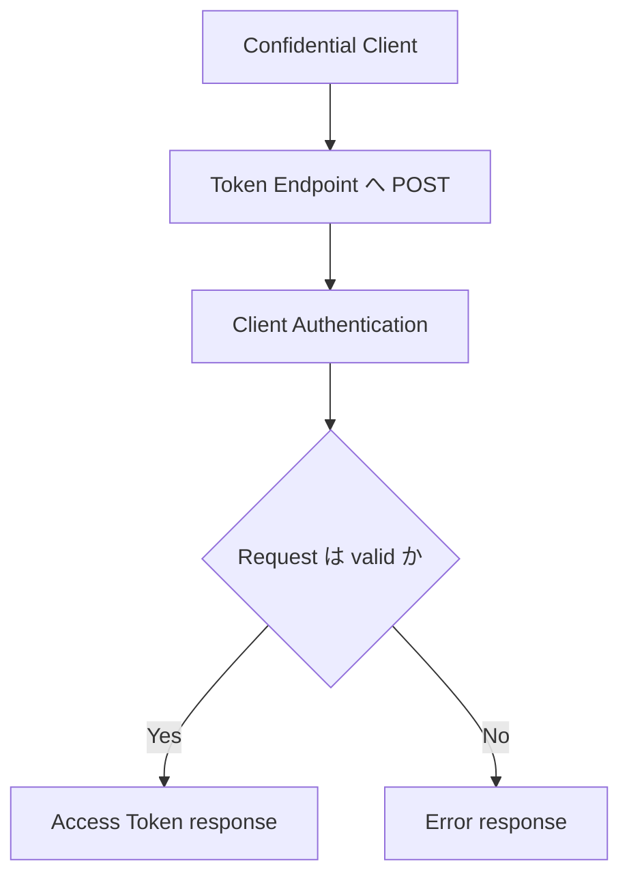

## この記事について

**記事タイプ:** Flow  
**対象読者:** OAuth 2.0 の Client Credentials Grant を実装し、Token Endpoint への request と response の位置づけを確認したい実装者  
**この記事で伝えること:** Client Credentials Grant では追加の Authorization Request を行わず、confidential client が Token Endpoint で認証され、Access Token を取得すること  
**扱わないこと:** Authorization Code Grant、Resource Owner Password Credentials Grant、個別の Client Authentication 拡張仕様、Access Token の Resource Server での検証、sender-constrained Access Token

## Article brief

- **Reader:** Client Credentials Grant の protocol flow と parameter 配置を確認したい OAuth 2.0 実装者
- **Question:** Client Credentials Grant では誰の authorization をどの request で表し、Token Endpoint に何を送るのか
- **Answer:** Client authentication 自体が authorization grant として使われるため追加の Authorization Request はなく、confidential client が `grant_type=client_credentials` と必要に応じて `scope` を Token Endpoint の form body に送る
- **Scope:** RFC 6749 §1.3.4, §3.2, §3.2.1, §4.4, §5.1, §5.2 に定義された Client Credentials Grant の request / response
- **Out of scope:** 他の grant type、Client Authentication 拡張、Access Token format、Resource Server 側の token validation
- **Primary sources:** RFC 6749 §1.3.4, §3.2, §3.2.1, §4.4, §5.1, §5.2
- **Diagram:** confidential client が Token Endpoint で認証され、Access Token response を受け取る flowchart

## Client Credentials Grant が表す authorization

RFC 6749 §1.3.4 は、client credentials または他の client authentication 手段を authorization grant として使用できる場合を定義しています。対象は、Client の管理下にある protected resource、または別の Resource Owner の resource について Authorization Server と事前に取り決められた access です。

RFC 6749 §4.4 は、この grant type を confidential client だけが使用しなければならないと規定しています（**MUST**）。別の Resource Owner に対する事前の取り決めをどのように行うかは仕様の範囲外です。



## 追加の Authorization Request は行わない

RFC 6749 §4.4.1 では、Client authentication が authorization grant として使用されるため、追加の Authorization Request は不要です。そのため、この grant の flow は Authorization Endpoint や browser redirect を必要とするものとして定義されていません。

Client は Token Endpoint に直接 Access Token Request を送ります。RFC 6749 §3.2 により、Access Token Request の HTTP method は `POST` でなければなりません（**MUST**）。Token Endpoint への request には TLS が要求されます（**MUST**, RFC 6749 §3.2）。

## Token Request の parameter は form body に置く

RFC 6749 §4.4.2 は、Client Credentials Grant の parameter を UTF-8 の `application/x-www-form-urlencoded` request entity-body に置くよう定義しています。

以下は配置を示すための**非規範的な例**です。host、credential、scope は illustrative value です。

```http
POST /token HTTP/1.1
Host: as.example
Authorization: Basic aWxsdXN0cmF0aXZl
Content-Type: application/x-www-form-urlencoded

grant_type=client_credentials&scope=illustrative.read
```

主要 parameter の位置は次のとおりです。

- `grant_type`: form body の parameter。**REQUIRED** で、値は `client_credentials` でなければなりません（**MUST**, RFC 6749 §4.4.2）。
- `scope`: form body の parameter。**OPTIONAL** です（RFC 6749 §4.4.2）。`scope` の一般的な処理は RFC 6749 §3.3 が定義します。
- `Authorization`: この例では HTTP Basic client authentication を HTTP header に置いています。RFC 6749 §4.4.2 は Client が Authorization Server に対して認証されることを **MUST** とし、具体的な client authentication は §3.2.1 と §2.3 に従います。

RFC 6749 §4.4.2 は Authorization Server に Client の認証を **MUST** としています。

## 成功時は Access Token Response を返す

Access Token Request が valid かつ authorized であれば、Authorization Server は RFC 6749 §5.1 に従って Access Token を発行します（RFC 6749 §4.4.3）。Client Credentials Grant の response には refresh token を含めないことが **SHOULD NOT** とされています（§4.4.3）。

以下は必要な構造を確認するための**非規範的な例**です。token value と lifetime は illustrative value です。

```http
HTTP/1.1 200 OK
Content-Type: application/json;charset=UTF-8
Cache-Control: no-store
Pragma: no-cache

{
  "access_token": "illustrative-access-token",
  "token_type": "Bearer",
  "expires_in": 3600,
  "scope": "illustrative.read"
}
```

- `access_token`: JSON string。**REQUIRED**（RFC 6749 §5.1）。
- `token_type`: JSON string。**REQUIRED**（RFC 6749 §5.1）。
- `expires_in`: JSON number。**RECOMMENDED**（RFC 6749 §5.1）。
- `scope`: JSON string。request と同一なら **OPTIONAL**、異なる場合は **REQUIRED**（RFC 6749 §5.1）。

RFC 6749 §5.1 は、token や credential を含む response について `Cache-Control: no-store` と `Pragma: no-cache` を送ることを Authorization Server に要求しています（**MUST**）。

## Client authentication または request が invalid なら error response になる

RFC 6749 §4.4.3 は、Client authentication に失敗した場合または request が invalid な場合、Authorization Server が §5.2 の error response を返すよう定義しています。

以下は形式を示す**非規範的な例**です。

```http
HTTP/1.1 400 Bad Request
Content-Type: application/json;charset=UTF-8
Cache-Control: no-store
Pragma: no-cache

{
  "error": "invalid_request"
}
```

`error` は JSON string の **REQUIRED** member です（RFC 6749 §5.2）。Client authentication に失敗した場合の HTTP status code と `WWW-Authenticate` の扱いは、Client が用いた authentication scheme に応じて RFC 6749 §5.2 が規定しています。

## まとめ

Client Credentials Grant では Client authentication が authorization grant として使われるため、追加の Authorization Request はありません。RFC 6749 §4.4 により、この grant type を使用できるのは confidential client だけです。

Client は Token Endpoint に `POST` し、form body に `grant_type=client_credentials` と必要に応じて `scope` を置きます。同時に Client は Authorization Server に対して認証されなければなりません。request が valid かつ authorized なら Access Token が返り、refresh token は response に含めないことが **SHOULD NOT** とされています。

## 一次資料

- RFC Editor, [RFC 6749: The OAuth 2.0 Authorization Framework](https://www.rfc-editor.org/rfc/rfc6749.html), §1.3.4, §2.3, §3.2, §3.2.1, §3.3, §4.4, §5.1, §5.2

最終確認: 2026-09-21
