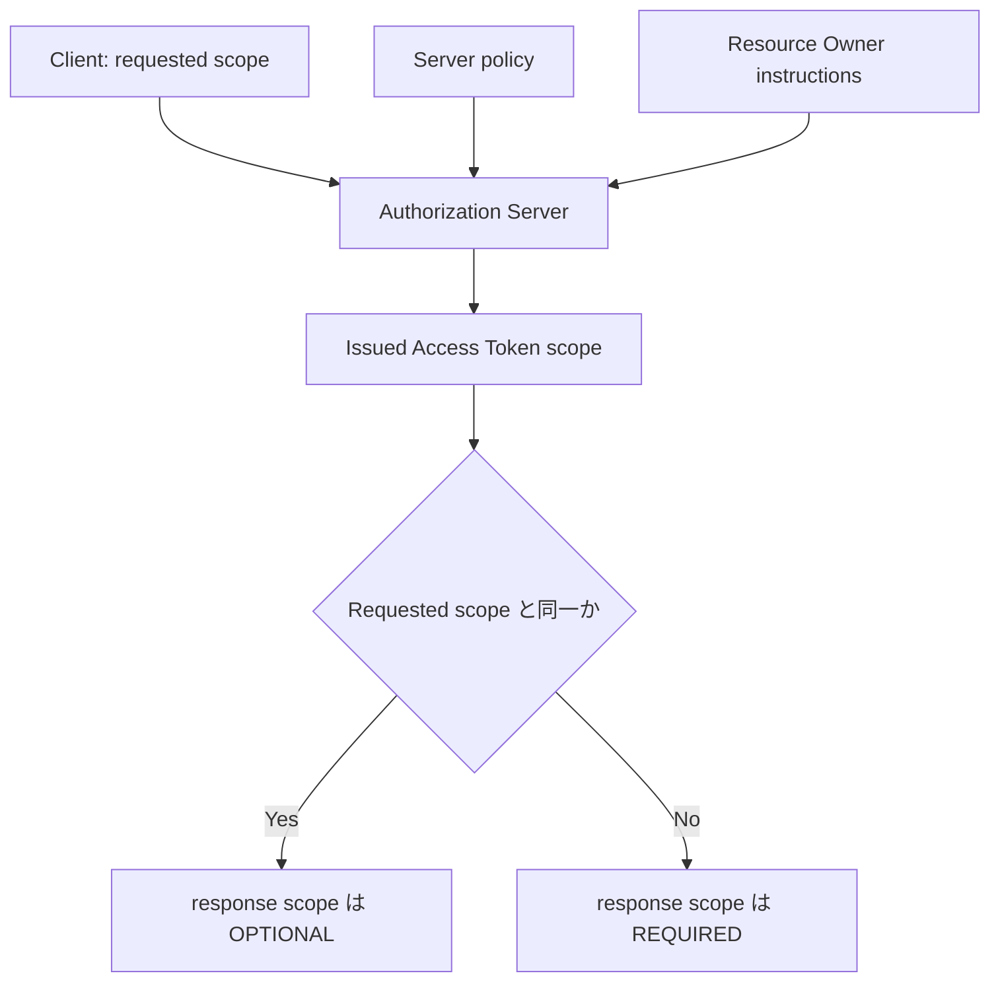

## この記事について

**記事タイプ:** Feature Deep Dive  
**対象読者:** OAuth 2.0 の `scope` parameter が request と response でどのように扱われるかを仕様本文から確認したい実装者  
**この記事で伝えること:** RFC 6749 §3.3 が定義する `scope` の構文、Client が要求した scope と実際に付与された scope の関係、および request で `scope` を省略した場合の Authorization Server の処理  
**扱わないこと:** 個々の scope 名の設計、Resource Indicators、Rich Authorization Requests、Access Token の形式、grant 固有の flow、scope に基づくアプリケーション独自の認可モデル

## Article brief

- **Reader:** Authorization Request / Token Request / Token Response に現れる `scope` の共通 semantics を確認したい OAuth 実装者
- **Question:** `scope` はどのような形式で要求され、Authorization Server は要求と異なる scope を付与できるのか。省略時と response ではどう扱うのか
- **Answer:** `scope` は space-delimited かつ case-sensitive な string のリストであり、Authorization Server は policy または Resource Owner の指示に基づいて要求 scope の全部または一部を無視できる。実際に発行した Access Token の scope が要求と異なる場合、response の `scope` は必須になる。request で省略された場合は predefined default で処理するか `invalid_scope` として失敗させる
- **Scope:** RFC 6749 §3.3 と Appendix A.4 に定義された `scope` request / response parameter の共通 semantics と構文。配置確認のため §4.1.1、§4.4.2、§5.1 の例を最小限参照する
- **Out of scope:** scope token の命名方針、Resource Indicators（RFC 8707）、RAR、Access Token の内部表現、Resource Server の authorization policy、grant ごとの全処理
- **Primary sources:** RFC 6749 §3.3, §4.1.1, §4.4.2, §5.1, Appendix A.4
- **Diagram:** requested scope、Authorization Server の policy / Resource Owner instructions、issued scope、response の `scope` parameter の関係を示す flowchart

## scope は space-delimited な case-sensitive string のリスト

RFC 6749 §3.3 は、Authorization Endpoint と Token Endpoint で Client が access request の範囲を `scope` request parameter により指定できると定義しています。Authorization Server は `scope` response parameter により、発行した Access Token の scope を Client に通知します。

`scope` の値は、space-delimited かつ case-sensitive な string のリストです。各 string の意味は Authorization Server が定義します。複数の string がある場合、その順序には意味がなく、各 string が requested scope に追加の access range を加えます（RFC 6749 §3.3）。

Appendix A.4 の ABNF は次のとおりです。

```text
scope       = scope-token *( SP scope-token )
scope-token = 1*( %x21 / %x23-5B / %x5D-7E )
```

この構文は scope token の文字列形式を定義します。個々の token にどの権限を対応させるかは RFC 6749 §3.3 では規定されていません。

## request での配置

`scope` の配置は、その parameter を使用する endpoint / grant の定義に従います。以下は配置を確認するための**非規範的な例**です。scope token 名は illustrative value であり、仕様がこれらの値を定義しているわけではありません。

Authorization Code Grant の Authorization Request では `scope` は query parameter です（RFC 6749 §4.1.1）。

```http
GET /authorize?response_type=code&client_id=illustrative-client&scope=illustrative.read%20illustrative.write HTTP/1.1
Host: as.example
```

Client Credentials Grant の Token Request では `scope` は `application/x-www-form-urlencoded` の request body parameter です（RFC 6749 §4.4.2）。

```http
POST /token HTTP/1.1
Host: as.example
Content-Type: application/x-www-form-urlencoded
Authorization: Basic <illustrative-client-credentials>

grant_type=client_credentials&scope=illustrative.read%20illustrative.write
```

どちらの例でも、`scope` 自体の共通 semantics は RFC 6749 §3.3 に従います。各 grant の他の requirement は本記事の scope 外です。

## Authorization Server は要求 scope の全部または一部を無視できる

RFC 6749 §3.3 により、Authorization Server は Authorization Server の policy または Resource Owner の指示に基づいて、Client が要求した scope の全部または一部を無視してもよい（**MAY**）とされています。

したがって、requested scope と issued Access Token の scope が常に同一になるとは限りません。



この図は RFC 6749 §3.3 と §5.1 の関係を要約したものです。新しい actor や authorization rule を追加するものではありません。

## issued scope が requested scope と異なる場合

発行した Access Token の scope が Client の requested scope と異なる場合、Authorization Server は実際に付与した scope を知らせるため `scope` response parameter を含めなければなりません（**MUST**, RFC 6749 §3.3）。

RFC 6749 §5.1 でも、successful Token Response の `scope` は requested scope と同一なら OPTIONAL、異なる場合は REQUIRED と定義されています。

以下は構造確認のための**非規範的な例**です。Client が `illustrative.read illustrative.write` を要求し、実際には `illustrative.read` が付与された場合を示します。

```http
HTTP/1.1 200 OK
Content-Type: application/json;charset=UTF-8
Cache-Control: no-store
Pragma: no-cache

{
  "access_token": "illustrative-access-token",
  "token_type": "Bearer",
  "scope": "illustrative.read"
}
```

この response では `scope` は JSON object の top-level member です。値は string で、RFC 6749 §3.3 の scope 構文に従います。`access_token` と `token_type` は §5.1 で REQUIRED です。例の値自体に規範的意味はありません。

## request で scope を省略した場合

Client が authorization を要求するときに `scope` parameter を省略した場合、Authorization Server は次のいずれかを行わなければなりません（**MUST**, RFC 6749 §3.3）。

- predefined default value を使用して request を処理する。
- invalid scope を示して request を失敗させる。

Authorization Server は scope requirement と、定義している場合は default value を文書化することが **SHOULD** とされています（RFC 6749 §3.3）。

RFC 6749 は、どの default scope を採用すべきかを規定していません。default value の内容は Authorization Server 側で定義される事項です。

## まとめ

RFC 6749 §3.3 の `scope` は、space-delimited かつ case-sensitive な string のリストです。Client は Authorization Endpoint または Token Endpoint の各定義に従って `scope` を配置します。

Authorization Server は policy または Resource Owner の指示に基づいて requested scope の全部または一部を無視してもよく（**MAY**, §3.3）、issued scope が requested scope と異なる場合は response の `scope` が必須です（**MUST**, §3.3）。Client が authorization request で `scope` を省略した場合、Authorization Server は predefined default で処理するか invalid scope として失敗させなければなりません（**MUST**, §3.3）。

## 一次資料

- RFC Editor, [RFC 6749: The OAuth 2.0 Authorization Framework](https://www.rfc-editor.org/rfc/rfc6749.html), §3.3, §4.1.1, §4.4.2, §5.1, Appendix A.4

最終確認: 2026-09-22
