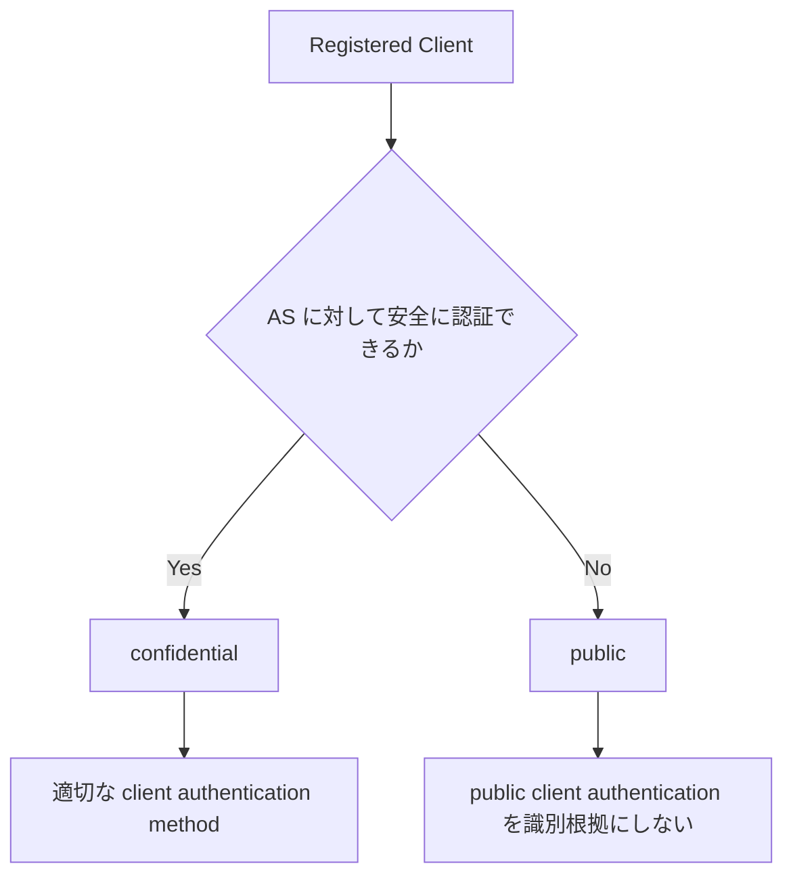

## この記事について

**記事タイプ:** Requirement  
**対象読者:** OAuth 2.0 Client の登録・設計時に、confidential / public の区分と client authentication との関係を確認したい実装者  
**この記事で伝えること:** RFC 6749 の Client Type は、Client が Authorization Server に対して安全に認証できる能力、特に client credential の機密性を維持できる能力に基づいて区分されること  
**扱わないこと:** grant type の選択、PKCE、Browser-Based Applications の architecture pattern、個別の client authentication 拡張、Access Token の検証

## Article brief

- **Reader:** OAuth Client の登録・設計時に Client Type の仕様上の意味を確認したい実装者
- **Question:** confidential client と public client は何を基準に区別され、client authentication とどのように関係するのか
- **Answer:** RFC 6749 は Authorization Server に対して安全に認証できる能力を基準に2種類を定義し、confidential client には適切な client authentication method を設定する一方、public client authentication を Client の識別根拠としてはならない
- **Scope:** RFC 6749 §2, §2.1, §2.2, §2.3 に定義された Client Type、client identifier、client authentication との関係
- **Out of scope:** grant type の適用条件、redirect URI validation、PKCE、Client Authentication 拡張、Browser-Based Applications の architecture pattern
- **Primary sources:** RFC 6749 §2, §2.1, §2.2, §2.3
- **Diagram:** Client の secure authentication capability から confidential / public の区分と authentication requirement への関係を示す flowchart

## Client Type は安全に認証できる能力に基づく

RFC 6749 §2.1 は OAuth Client を `confidential` と `public` の2種類に区分します。基準は Authorization Server に対して安全に認証できる能力、すなわち client credential の機密性を維持できる能力です。

- `confidential`: credential の機密性を維持できる Client、または他の手段で安全な client authentication を行える Clientです。
- `public`: credential の機密性を維持できず、他の手段でも安全な client authentication を行えない Clientです。

Client Type の指定は Authorization Server が定義する secure authentication と、許容する credential exposure level に基づきます。Authorization Server は Client Type について推測しないことが **SHOULD NOT** とされています（RFC 6749 §2.1）。



この図は RFC 6749 §2.1 と §2.3 の関係を要約したものです。新しい Client Type や authentication mechanism を追加するものではありません。

## 登録時に Client Type を指定する

RFC 6749 §2 は、Client を登録するとき Client developer が §2.1 に従って Client Type を指定することを **SHALL** としています。

Client が異なる Client Type と security context を持つ複数 component で構成される場合があります。Authorization Server がそのような Client をサポートせず、登録方法について guidance も提供しない場合、Client は各 component を別 Client として登録することが **SHOULD** とされています（RFC 6749 §2.1）。

## RFC 6749 が示す Client profile

RFC 6749 §2.1 は Client Type の説明に続いて、設計上の profile を3つ示しています。

- **web application:** web server 上で動作する confidential client。
- **user-agent-based application:** user-agent 内で実行される public client。
- **native application:** Resource Owner の device にインストールされ実行される public client。

これらは RFC 6749 が示す profile です。Client Type の指定そのものは、Authorization Server の secure authentication の定義と credential exposure level に基づきます。

## client_id は secret ではない

RFC 6749 §2.2 では、Authorization Server が登録済み Client に `client_id` を発行します。`client_id` は Client の registration information を表す一意な string ですが、secret ではありません。

`client_id` は Resource Owner に公開されるため、それ単独を client authentication に使用してはなりません（**MUST NOT**, RFC 6749 §2.2）。

以下は `client_id` が protocol parameter として現れる位置を確認するための**非規範的な例**です。値は illustrative value です。

```http
GET /authorize?response_type=code&client_id=illustrative-client HTTP/1.1
Host: as.example
```

この例では `client_id` は Authorization Request の query parameter です。Authorization Code Grant における parameter requirement 自体は RFC 6749 §4.1.1 が定義しており、本記事では Client Type の説明に必要な配置確認だけを示しています。

## confidential client と client authentication

RFC 6749 §2.3 は、Client Type が confidential の場合、Client と Authorization Server が Authorization Server の security requirement に適した client authentication method を確立すると定義しています。Authorization Server は、その security requirement を満たす任意の client authentication 形式を受け入れてもよい（**MAY**）とされています。

confidential client には通常、password や public/private key pair など、Authorization Server に対する認証に使用する client credential が発行または設定されます（RFC 6749 §2.3）。具体的な authentication method の選択は本記事の scope 外です。

## public client authentication を識別根拠にしてはならない

RFC 6749 §2.3 は、Authorization Server が public client と client authentication method を設定すること自体を **MAY** としています。一方、Authorization Server は public client authentication を Client の識別目的で信頼してはなりません（**MUST NOT**）。

また、Client は1つの request で複数の authentication method を使用してはなりません（**MUST NOT**, RFC 6749 §2.3）。

この規定は「public client は client authentication request を一切送れない」という意味ではありません。仕様が禁止しているのは、public client authentication を Client identity の信頼できる根拠として扱うことです。

## まとめ

RFC 6749 の Client Type は `confidential` と `public` の2種類で、Authorization Server に対して安全に認証できる能力を基準に区分されます。Client developer は登録時に Client Type を指定します（**SHALL**, §2）。

`client_id` は secret ではなく、単独で client authentication に使ってはなりません（**MUST NOT**, §2.2）。confidential client では適切な client authentication method を確立し、public client については authentication method を設定できる場合でも、その authentication を Client の識別根拠として信頼してはなりません（**MUST NOT**, §2.3）。

## 一次資料

- RFC Editor, [RFC 6749: The OAuth 2.0 Authorization Framework](https://www.rfc-editor.org/rfc/rfc6749.html), §2, §2.1, §2.2, §2.3

最終確認: 2026-09-22
