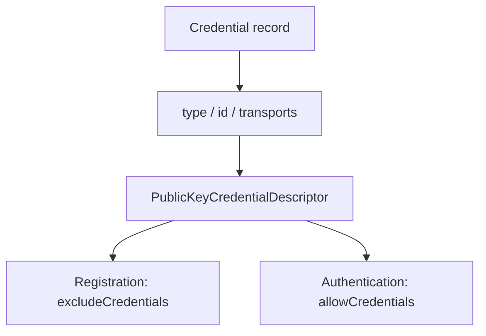

## この記事について

**記事タイプ:** Feature Deep Dive  
**対象読者:** WebAuthn の registration / authentication options を生成し、credential ID と authenticator transport 情報を扱う Relying Party（RP）の実装・レビュー担当者  
**この記事で伝えること:** `PublicKeyCredentialDescriptor` の `type` / `id` / `transports` の構造と、registration の `excludeCredentials`、authentication の `allowCredentials` での役割  
**扱わないこと:** credential record 全体の保存設計、discoverable credential の選択 UI、user verification、credential の署名検証、credential management の signal methods

WebAuthn Level 3 の `PublicKeyCredentialDescriptor` は、特定の public key credential を指すためのデータ構造です。本記事は W3C Web Authentication Level 3 §5.4、§5.5、§5.8.3、§5.8.4 に範囲を限定します。

**A credential descriptor identifies a credential; `transports` only hints at how its authenticator may be reached.**  
（credential descriptor は credential を識別し、`transports` はその Authenticator への到達方法についての hint だけを表します。）

## 1. PublicKeyCredentialDescriptor の3つの member

§5.8.3 では `PublicKeyCredentialDescriptor` を次の3 member で定義しています。

- `type`: required の `DOMString`。参照する public key credential の type を表します。値は `PublicKeyCredentialType` の member とすることが **SHOULD** です。現在定義されている credential type は `public-key` です（§5.8.2）。
- `id`: required の `BufferSource`。参照する public key credential の credential ID を格納します。
- `transports`: optional の `sequence<DOMString>`。Client が credential を管理する Authenticator と通信する方法についての hint です。値は `AuthenticatorTransport` の member とすることが **SHOULD** で、Client platform は unknown value を無視しなければなりません（**MUST**, §5.8.3）。

§5.8.3 は、credential record から descriptor を構成する場合、`type`、`id`、`transports` をそれぞれ対応する credential record の item に設定することを **SHOULD** としています。

## 2. registration では excludeCredentials に置く

`PublicKeyCredentialCreationOptions.excludeCredentials` は `sequence<PublicKeyCredentialDescriptor>` で、default は空の list です（§5.4）。RP は、この user account に mapping されている既存 credential をこの member に列挙することを **SHOULD** としています。

目的は、同じ user account に mapping された credential をすでに含む Authenticator 上で新しい credential が作成されることを防ぐことです。その状態になる場合、Client は別の Authenticator を使うよう user を導くか、それができなければ error を返すよう要求されます。

### 非規範的な配置例

次の JSON は `excludeCredentials` に descriptor が置かれる位置だけを示す非規範的な例です。credential ID を含む値は illustrative value です。

```json
{
  "publicKey": {
    "challenge": "aWxsdXN0cmF0aXZlLWNoYWxsZW5nZQ",
    "rp": { "name": "Illustrative RP" },
    "user": {
      "id": "aWxsdXN0cmF0aXZlLXVzZXI",
      "name": "illustrative-user",
      "displayName": "Illustrative User"
    },
    "pubKeyCredParams": [
      { "type": "public-key", "alg": -7 }
    ],
    "excludeCredentials": [
      {
        "type": "public-key",
        "id": "aWxsdXN0cmF0aXZlLWNyZWRlbnRpYWw",
        "transports": ["internal"]
      }
    ]
  }
}
```

この JSON 表現では `id` は base64url 文字列として示しています。Web Authentication API の `PublicKeyCredentialDescriptor.id` 自体の型は `BufferSource` です。

## 3. authentication では allowCredentials に置く

`PublicKeyCredentialRequestOptions.allowCredentials` も `sequence<PublicKeyCredentialDescriptor>` で、default は空の list です（§5.5）。

認証する user account がすでに識別されている場合、RP はその account の credential record に対応する credential descriptor を `allowCredentials` に列挙することを **SHOULD** としています。通常は account のすべての credential record を含めることが **SHOULD** です。また、各 item には可能な場合 `transports` を指定することが **SHOULD** とされています。

`allowCredentials` が空でなければ、列挙された credential のどれも使用できない場合に Client は error を返さなければなりません（**MUST**, §5.5）。list は preference の降順で、先頭が最も preferred な credential です。

### 非規範的な配置例

次は authentication options 内での配置を示す非規範的な最小例です。

```json
{
  "publicKey": {
    "challenge": "aWxsdXN0cmF0aXZlLWNoYWxsZW5nZQ",
    "allowCredentials": [
      {
        "type": "public-key",
        "id": "aWxsdXN0cmF0aXZlLWNyZWRlbnRpYWw",
        "transports": ["internal"]
      }
    ]
  }
}
```

`allowCredentials` が空の場合の account identification と `response.userHandle` の検証は別テーマであり、本記事では扱いません。

## 4. unknown type と空の allowCredentials は同じ意味ではない

§5.8.3 では、Client platform は unknown `type` を持つ `PublicKeyCredentialDescriptor` を無視しなければなりません（**MUST**）。ただし、`allowCredentials` の全要素が unknown `type` のため無視された場合は error としなければなりません（**MUST**）。

これは、最初から空の `allowCredentials` と、descriptor を列挙したもののすべてが unknown `type` だった場合を同じ意味として扱わないためです。

## 5. transports は到達方法についての hint

§5.8.4 は `usb`、`nfc`、`ble`、`smart-card`、`hybrid`、`internal` を `AuthenticatorTransport` として定義しています。これらは Client が特定の credential の Authenticator とどのように通信できるかについての hint です。

RP は通常、registration で返される `AuthenticatorAttestationResponse.getTransports()` から credential が対応する transport を知ります。§5.2.1 では、`getTransports()` が返す値について、RP は unknown value を受け入れて保存することを **SHOULD** としています。

**`transports` is reachability metadata, not a statement about the credential's cryptographic properties.**  
（`transports` は到達方法に関する metadata であり、credential の暗号学的性質を表すものではありません。）

## 6. create と get で同じ descriptor 構造を使う



この図は `PublicKeyCredentialDescriptor` の配置関係だけを示す非規範的な図です。credential selection や ceremony の他の検証処理は省略しています。

§5.8.3 が説明するように、同じ descriptor は `create()` では同一 Authenticator 上の duplicate credential creation を避けるために、`get()` では credential に現在到達できるか、どのように到達できるかを Client が判断するために使用されます。

## Primary sources

- W3C, *Web Authentication: An API for accessing Public Key Credentials Level 3*, Recommendation, 25 August 2026, §5.2.1 Information About Public Key Credential
- 同 §5.4 Options for Credential Creation (`excludeCredentials`)
- 同 §5.5 Options for Assertion Generation (`allowCredentials`)
- 同 §5.8.2 Credential Type Enumeration
- 同 §5.8.3 Credential Descriptor
- 同 §5.8.4 Authenticator Transport Enumeration

https://www.w3.org/TR/2026/REC-webauthn-3-20260825/
