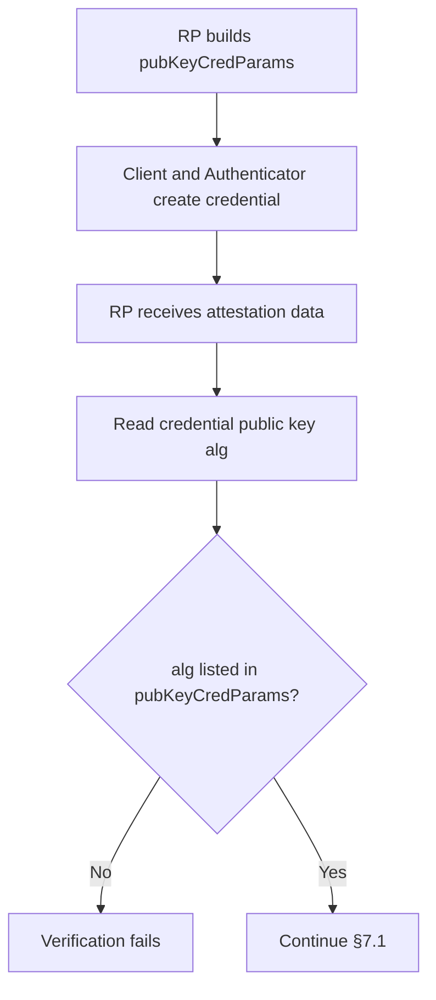

## この記事について

**記事タイプ:** Requirement  
**対象読者:** WebAuthn registration の credential creation options と credential public key の検証を実装・レビューする Relying Party（RP）の担当者  
**この記事で伝えること:** `pubKeyCredParams` の配置と `type` / `alg` の構造、配列順による preference、作成された credential public key の `alg` を RP が registration 時に照合する処理  
**扱わないこと:** algorithm 自体の暗号学的性質や選定評価、attestation statement の署名 algorithm、COSE_Key 全体の encoding、authentication assertion の署名検証

WebAuthn Level 3 では、RP は credential 作成時に `pubKeyCredParams` で対応する credential type と signature algorithm を列挙します。本記事は W3C Web Authentication Level 3 §5.3、§5.4、§5.8.5、§7.1 に範囲を限定します。

**`pubKeyCredParams` is an ordered list of credential types and signature algorithms supported by the RP.**  
（`pubKeyCredParams` は、RP が対応する credential type と signature algorithm を preference 順に並べたリストです。）

## 1. pubKeyCredParams は credential creation options の必須 member

§5.4 では `pubKeyCredParams` は `PublicKeyCredentialCreationOptions` の required member で、型は `sequence<PublicKeyCredentialParameters>` です。

各 `PublicKeyCredentialParameters` は §5.3 で次の2つの required member を持ちます。

- `type`: `DOMString`。作成する credential type を指定します。値は `PublicKeyCredentialType` の member とすることが **SHOULD** です。Client platform は unknown `type` を持つ `PublicKeyCredentialParameters` を無視しなければなりません（**MUST**, §5.3）。
- `alg`: `COSEAlgorithmIdentifier`。新しく生成される credential が使用する cryptographic signature algorithm と、それに伴う asymmetric key pair の種類を指定します。

### 非規範的な配置例

次は配置と構造だけを示す非規範的な最小例です。`challenge`、RP、user の値は illustrative value です。

```json
{
  "publicKey": {
    "rp": { "name": "Illustrative RP" },
    "user": {
      "id": "aWxsdXN0cmF0aXZlLXVzZXI",
      "name": "illustrative-user",
      "displayName": "Illustrative User"
    },
    "challenge": "aWxsdXN0cmF0aXZlLWNoYWxsZW5nZQ",
    "pubKeyCredParams": [
      { "type": "public-key", "alg": -8 },
      { "type": "public-key", "alg": -7 },
      { "type": "public-key", "alg": -257 }
    ]
  }
}
```

この例では `pubKeyCredParams` は `PublicKeyCredentialCreationOptions` の JSON member であり、各配列要素は `type` と `alg` を持つ object です。

## 2. 配列順が preference を表す

§5.4 は `pubKeyCredParams` を、RP が対応する key type と signature algorithm のリストとして定義し、most preferred から least preferred の順に並べるとしています。重複は許可されますが、実質的には無視されます。

Client と Authenticator は、可能な範囲で最も preference の高い type の credential を作成します。列挙された type のどれも作成できない場合、`create()` operation は失敗します。

広範な Authenticator をサポートしたい RP について、§5.4 は少なくとも次の COSE algorithm identifier を含めることを **SHOULD** としています。

- `-8`: EdDSA
- `-7`: ES256
- `-257`: RS256

追加の signature algorithm は必要に応じて含められます。この記事では、どの algorithm を採用すべきかという独自の評価は行いません。

## 3. Level 3 が NOT RECOMMENDED とする identifier

§5.4 は RFC 9864 で導入された fully-specified COSE algorithm identifier のうち、`-9`（ESP256）、`-51`（ESP384）、`-52`（ESP512）、`-19`（Ed25519）を `pubKeyCredParams` で **NOT RECOMMENDED** としています。同 section は、それぞれ `-7`（ES256）、`-35`（ES384）、`-36`（ES512）、`-8`（EdDSA）を代わりに、または追加で使用する形を示しています。

§5.8.5 の WebAuthn 固有の制約により、これらの identifier の組は WebAuthn 内ではそれぞれ同じ内容を表します。一方、§5.4 は implementation support の差があるため、実際には interchangeable ではないと説明しています。

## 4. RP は作成された credential public key の alg を照合する

`pubKeyCredParams` は request を作るためだけの値ではありません。Registration の検証にも使われます。

§7.1 step 20 では、RP は `authData` に含まれる credential public key の `alg` parameter が、`pkOptions.pubKeyCredParams` のいずれかの item の `alg` attribute と一致することを検証します。

**The registration check ties the created credential public key back to an algorithm the RP offered.**  
（registration の検証では、作成された credential public key が RP の提示した algorithm のいずれかに対応することを確認します。）



この図は `pubKeyCredParams` と §7.1 step 20 の関係だけを示す非規範的な図です。attestation statement verification など、registration の他の検証は省略しています。

## 5. credential algorithm と attestation algorithm は別の論点

§5.3 の `alg` は、新しく生成される credential が使用する signature algorithm を指定します。本記事はこの credential algorithm の negotiation と registration 時の照合だけを扱います。

Attestation statement format が使用する signature algorithm や、その format 固有の verification procedure は別の仕様上の処理であり、本記事の scope には含めません。

## Primary sources

- W3C, *Web Authentication: An API for accessing Public Key Credentials Level 3*, Recommendation, 25 August 2026, §5.3 Parameters for Credential Generation
- 同 §5.4 Options for Credential Creation (`pubKeyCredParams`)
- 同 §5.8.5 Cryptographic Algorithm Identifier
- 同 §7.1 Registering a New Credential, step 20

https://www.w3.org/TR/2026/REC-webauthn-3-20260825/
