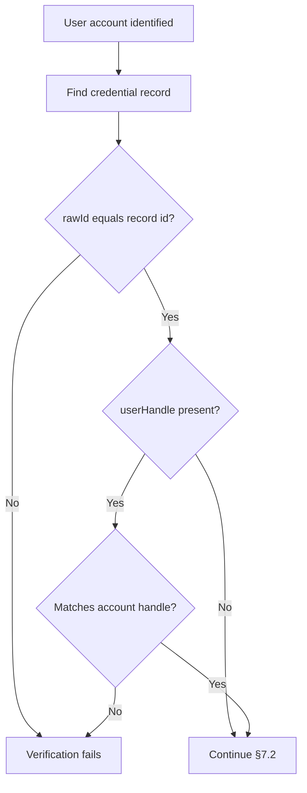
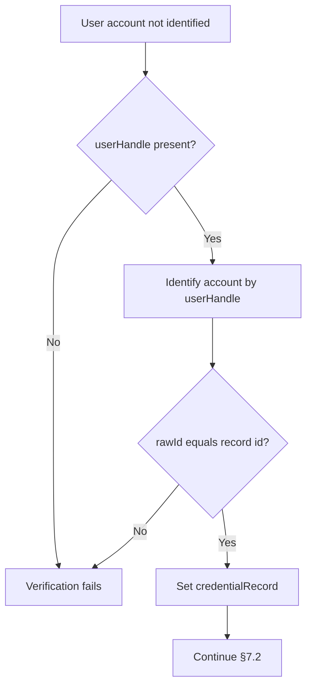

## この記事について

**記事タイプ:** Requirement  
**対象読者:** WebAuthn authentication の assertion verification を実装・レビューする Relying Party（RP）の担当者  
**この記事で伝えること:** `allowCredentials` の有無によって `response.userHandle` の要否が変わることと、RP が `userHandle` と `credential.rawId` を user account / credential record に対応付ける §7.2 step 6 の処理  
**扱わないこと:** credential registration、credential discovery UI、conditional mediation、challenge / origin / RP ID / UP / UV / signature の検証、account recovery

WebAuthn authentication では、RP が ceremony の開始前に user account を識別済みかどうかで、`response.userHandle` の扱いが異なります。本記事は W3C Web Authentication Level 3 §4、§5.2.2、§5.5、§7.2 に範囲を限定します。

**`userHandle` identifies the user account associated with a credential; it is not the credential ID itself.**  
（`userHandle` は credential に関連付けられた user account を識別する値であり、credential ID そのものではありません。）

## 1. userHandle はどこにあるか

§5.2.2 の `AuthenticatorAssertionResponse` では、`userHandle` は nullable な `ArrayBuffer` として定義されています。Authenticator が user handle を返さなかった場合は `null` です。

次は配置だけを示す非規範的な最小例です。値は illustrative value であり、特定の account や credential を表しません。

```json
{
  "id": "illustrative-credential-id",
  "rawId": "illustrative-credential-id",
  "type": "public-key",
  "response": {
    "clientDataJSON": "illustrative-client-data",
    "authenticatorData": "illustrative-authenticator-data",
    "signature": "illustrative-signature",
    "userHandle": "illustrative-user-handle"
  }
}
```

- 配置: `userHandle` は authentication response の `response` object 内。
- Web API 型: nullable `ArrayBuffer`。
- JSON serialization では `AuthenticatorAssertionResponseJSON.userHandle` は optional `Base64URLString`。
- `credential.rawId` は credential ID であり、`response.userHandle` とは別の値。

## 2. allowCredentials が空なら Authenticator は userHandle を返す

§5.2.2 は、authentication ceremony で使用した `allowCredentials` が空の場合、Authenticator が user handle を常に返すことを **MUST** としています。`allowCredentials` が空でない場合、Authenticator は user handle を返してもよく（**MAY**）、返さない場合もあります。

§5.5 では、RP が authentication 対象の user account をまだ識別していない場合、`allowCredentials` を空または未指定にできます。この場合は discoverable credential のみが使用され、結果の `AuthenticatorAssertionResponse.userHandle` によって user account を識別できます。

**An empty `allowCredentials` list changes the role of `userHandle`: the assertion must carry it so the RP can identify the account.**  
（`allowCredentials` が空の場合、assertion は `userHandle` を含む必要があり、RP はそれを使って account を識別できます。）

## 3. RP が user account を識別済みの場合

§7.2 step 6 では、authentication ceremony の開始前に user account が識別済みなら、RP はその account に `credential.rawId` と等しい `id` を持つ credential record が存在することを検証します。

そのうえで `response.userHandle` が存在する場合、RP はその値が識別済み user account の user handle と等しいことを検証します。

この分岐では `userHandle` が常に存在することは要求されません。存在した場合に account との一致を検証します。



この図は §7.2 step 6 の当該分岐だけを示す非規範的な図です。後続の assertion verification steps は省略しています。

## 4. RP が user account を未識別の場合

ceremony の開始前に user account が識別されていなかった場合、§7.2 step 6 は `response.userHandle` が存在することを検証します。

次に RP は、その `userHandle` が識別する user account に、`credential.rawId` と等しい `id` を持つ credential record が存在することを検証します。その record が、この authentication で使用する `credentialRecord` になります。



この図も §7.2 step 6 の処理だけを示す非規範的な図です。

## 5. userHandle と credential ID は別々に照合する

§4 では user handle を user account の identifier と定義しています。一方、credential ID は public key credential を lookup するための identifier です。

そのため §7.2 step 6 は、`userHandle` だけを確認して終わる処理ではありません。user account と credential record の対応を確認するため、`credential.rawId` と credential record の `id` も照合します。

**The RP verifies both account identity and credential membership.**  
（RP は account の識別と、その account に credential が属することの両方を検証します。）

## 6. この記事の範囲

本記事が扱うのは authentication assertion verification における `userHandle` と credential record の対応確認だけです。`clientDataJSON`、authenticator data、UP / UV flags、signature、signature counter など §7.2 の後続検証は、それぞれ独立した論点です。

## Primary sources

- W3C, *Web Authentication: An API for accessing Public Key Credentials Level 3*, Recommendation, 25 August 2026, §4 Terminology
- 同 §5.2.2 Web Authentication Assertion (`AuthenticatorAssertionResponse`)
- 同 §5.5 Options for Assertion Generation (`PublicKeyCredentialRequestOptions`)
- 同 §7.2 Verifying an Authentication Assertion, step 6

https://www.w3.org/TR/2026/REC-webauthn-3-20260825/
