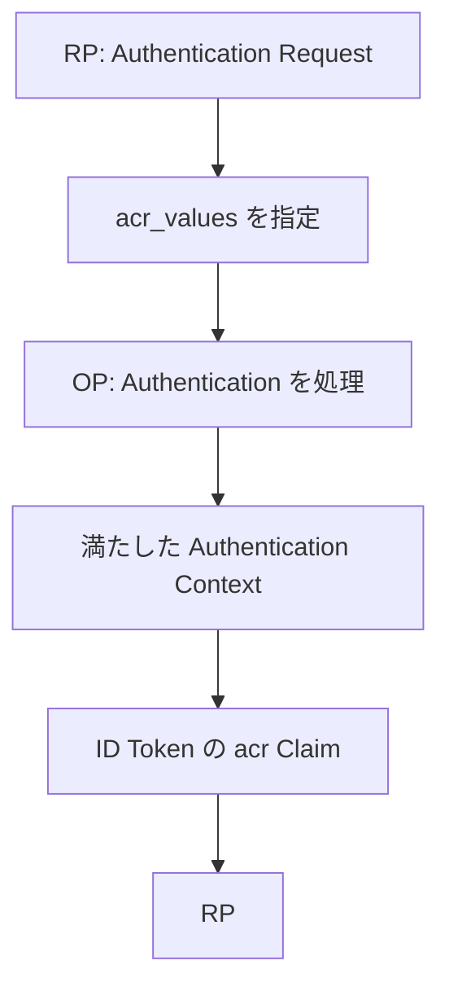

- **記事タイプ**: Requirement
- **対象読者**: OpenID Connect の Authentication Request を生成する RP と、要求された Authentication Context を処理する OP の実装者
- **この記事で伝えること**: `acr_values` がどこに置かれ、どのような要求を表し、認証で満たされた Authentication Context が ID Token の `acr` Claim としてどのように返るかを整理する
- **扱わないこと**: 個々の ACR 値の意味、`amr`、認証方式の選択方法、assurance level の評価、特定 deployment の認証ポリシー

## Article brief

- **Reader**: OIDC の RP / OP 実装者
- **Question**: RP は希望する Authentication Context をどう要求し、OP が実際に満たした Context をどう受け取るのか
- **Answer**: RP は Authentication Request の `acr_values` parameter に希望する `acr` 値を優先順で指定できる。この指定は `acr` Claim を Voluntary Claim として要求する。認証で満たされた Authentication Context Class は ID Token の `acr` Claim Value で表される。特定値を必須にする要求は `claims` parameter による Essential `acr` Claim request とは規範上異なる
- **Scope**: OpenID Connect Core 1.0 §2、§3.1.2.1、§5.5.1.1、§15.1 における `acr_values` と `acr`
- **Out of scope**: ACR 値そのものの定義、`amr`、EAP ACR Values の個別値、認証器・認証方式の選択、`claims` parameter 一般
- **Primary sources**: OpenID Connect Core 1.0 incorporating errata set 2 §2、§3.1.2.1、§5.5.1.1、§15.1
- **Diagram**: RP の `acr_values` 指定から OP の認証、ID Token の `acr` 返却までを示す `flowchart TD`

## `acr_values` は Authentication Request の parameter

OpenID Connect Core 1.0 §3.1.2.1 は `acr_values` を OPTIONAL な Authentication Request parameter として定義しています。値は、要求する Authentication Context Class Reference 値を空白区切りで並べた文字列で、並び順が preference の順序を表します。

`acr_values` による要求は、`acr` Claim を **Voluntary Claim** として要求します。したがって、後述する Essential `acr` Claim request と同じ意味ではありません。

次は非規範的な例です。値は説明用です。

```http
GET /authorize?response_type=code&client_id=illustrative-client&redirect_uri=https%3A%2F%2Fclient.example%2Fcb&scope=openid&acr_values=illustrative-acr-high%20illustrative-acr-basic HTTP/1.1
Host: op.example
```

この例では `acr_values` は Authorization Endpoint への HTTP GET request の **query parameter** にあります。値は space-separated string であり、URL 上では空白を `%20` として表しています。`illustrative-acr-high` と `illustrative-acr-basic` は仕様で意味を定義した値ではなく、配置と構造を示すための illustrative value です。

OpenID Connect Core 1.0 §15.1 は、OP が `acr_values` による特定 Authentication Context Class Reference 値の request をサポートすることを **MUST** としています。ただし同 section は、最低限必要なサポートは、この parameter の使用によって error が発生しないことであると明記しています。

## 認証で満たされた Context は `acr` Claim で返る

OpenID Connect Core 1.0 §2 は `acr` を ID Token の OPTIONAL Claim として定義しています。`acr` の値は、End-User authentication が満たした Authentication Context Class Reference を表す case-sensitive string です。

次は非規範的な最小 Claims Set の例です。署名など JWT 全体の構造はこの記事の対象外です。

```json
{
  "iss": "https://op.example",
  "sub": "illustrative-subject",
  "aud": "illustrative-client",
  "exp": 1790182800,
  "iat": 1790182200,
  "acr": "illustrative-acr-high"
}
```

`acr` は ID Token の JWT Claims Set に置かれます。ここでの値は illustrative value であり、特定の assurance level や authentication method を意味するものとして使用していません。

## `acr_values` と Essential `acr` request は同じではない

OpenID Connect Core 1.0 §5.5.1.1 は、`claims` parameter をサポートする実装で、ID Token の `acr` Claim を `essential: true` とし、さらに `value` または `values` で特定の ACR 値を要求する場合を別に規定しています。

この場合、Authorization Server は要求された値のいずれかに一致する `acr` Claim Value を返すことが **MUST** です。要件を満たすために End-User に追加要素での再認証を求めることは **MAY** です。Essential Claim の要件を満たせない場合、Authorization Server は failed authentication attempt として扱うことが **MUST** です。

一方、同 section は `acr_values` による `acr` request を Voluntary Claim request と明記しています。Voluntary Claim で要求値を提供できない場合、Authorization Server は session の現在の `acr` を返すことが **SHOULD** ですが、response に `acr` Claim を含めること自体は REQUIRED ではありません。

また、Client が `acr_values` と、特定値を列挙した ID Token 向け individual `acr` Claim request の両方を使用した場合、その resulting behavior は **unspecified** です（§5.5.1.1）。仕様はどちらを優先するかを定めていません。

## 処理の関係



この図は `acr_values` と `acr` の仕様上の関係だけを示しています。OP が具体的にどの authentication method を選択するか、どの ACR 値をどの assurance level に対応させるかは、この図には含めていません。

## まとめ

`acr_values` は Authentication Request で希望する Authentication Context Class Reference 値を preference 順に伝える OPTIONAL parameter です。これによる `acr` request は Voluntary Claim request です。認証で満たされた Authentication Context Class は ID Token の `acr` Claim Value で表されます。

特定の `acr` 値を Essential Claim として要求する場合は、OpenID Connect Core 1.0 §5.5.1.1 の別の規範要件が適用されます。`acr_values` と Essential `acr` Claim request は、同じ要求として扱うことはできません。

## Primary sources

- OpenID Foundation, **OpenID Connect Core 1.0 incorporating errata set 2**, §2 “ID Token”
- OpenID Foundation, **OpenID Connect Core 1.0 incorporating errata set 2**, §3.1.2.1 “Authentication Request”
- OpenID Foundation, **OpenID Connect Core 1.0 incorporating errata set 2**, §5.5.1.1 “Requesting the acr Claim”
- OpenID Foundation, **OpenID Connect Core 1.0 incorporating errata set 2**, §15.1 “Mandatory to Implement Features for All OpenID Providers”
