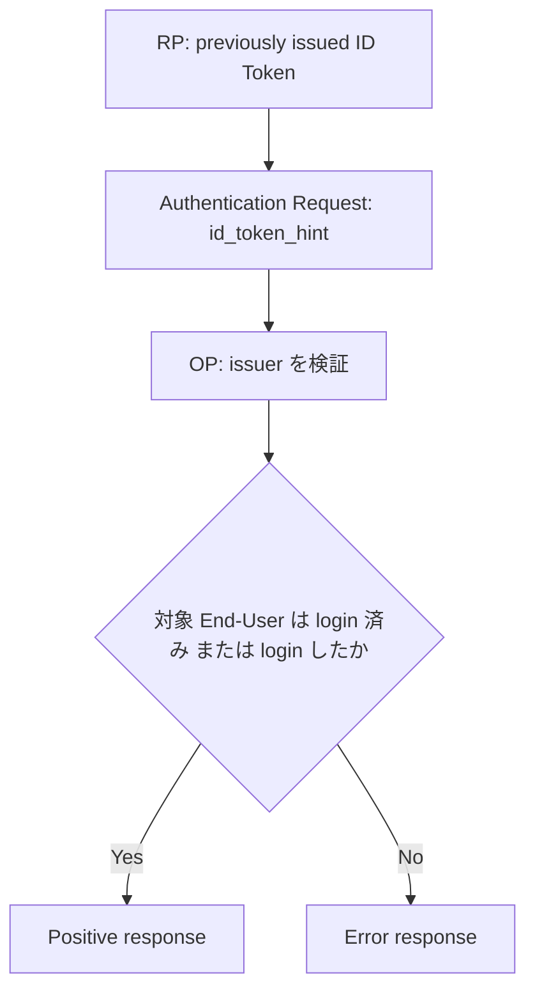

OpenID Connect Core 1.0 incorporating errata set 2 は、OP が以前発行した ID Token を `id_token_hint` として Authentication Request に渡す方法を定義しています。この記事では、その配置と OP が行う処理だけを扱います。

## この記事について

**記事タイプ:** Feature Deep Dive  
**対象読者:** OpenID Connect の RP / OP で Authentication Request を実装・レビューする担当者  
**この記事で伝えること:** `id_token_hint` の意味、request 上の配置、OP による issuer の確認、`prompt=none` との関係、期限切れ ID Token の扱いを確認する  
**扱わないこと:** RP-Initiated Logout の `id_token_hint`、CIBA、ID Token validation 全般、`login_hint`、`prompt` 各値の一般的な処理

## Article brief

- **Reader:** OpenID Connect の Authentication Request を実装・レビューする RP / OP 担当者
- **Question:** 過去に OP から受け取った ID Token を Authentication Request の hint として渡す場合、RP はどこに配置し、OP は何を確認してどう処理するのか
- **Answer:** RP は ID Token を `id_token_hint` parameter として Authorization Endpoint に送る。OP は自らが issuer であることを検証し、ID Token が示す End-User が login 済み、または request の結果 login した場合に positive response を返す。`prompt=none` では可能な場合 `id_token_hint` を含めることが SHOULD である
- **Scope:** OpenID Connect Core 1.0 incorporating errata set 2 §3.1.2.1、§3.1.2.2
- **Out of scope:** RP-Initiated Logout、CIBA、ID Token validation 全般、`login_hint`、`prompt` の一般的な semantics、OP 固有の session policy
- **Primary sources:** OpenID Connect Core 1.0 incorporating errata set 2 §3.1.2.1、§3.1.2.2
- **Diagram:** RP が以前受領した ID Token を `id_token_hint` として送り、OP が issuer と End-User の session / authentication result を確認する関係を `flowchart TD` で示す

## 1. `id_token_hint` は Authentication Request parameter

Core §3.1.2.1 は `id_token_hint` を OPTIONAL の Authentication Request parameter として定義しています。値は、Authorization Server が以前発行した ID Token です。その ID Token は、Client との間にある End-User の現在または過去の authenticated session に関する hint として OP に渡されます。

Authorization Code Flow で HTTP `GET` を使用する場合、`id_token_hint` は Authorization Endpoint の URI の query component に配置されます。

次は配置だけを示す非規範的な例です。`illustrative-id-token` は実際の JWT ではなく、値の位置を示すための illustrative value です。

```http
GET /authorize?response_type=code&client_id=illustrative-client&scope=openid&redirect_uri=https%3A%2F%2Fclient.example%2Fcb&id_token_hint=illustrative-id-token HTTP/1.1
Host: op.example
```

実際に送る場合、`id_token_hint` の値は OP が以前発行した ID Token です。

## 2. OP は issuer であることを検証する

Core §3.1.2.2 は、`id_token_hint` が存在する場合、OP がその ID Token の issuer であったことを検証しなければならない（MUST）と規定しています。

同じ section は、ID Token によって識別される RP が OP に current session または recent session を持つ場合、`exp` を過ぎていても OP がその ID Token を受け入れることを SHOULD としています。

これは、RP が authentication の結果として ID Token を受け取る際の通常の `exp` validation とは別の文脈です。ここでは、過去に発行された ID Token が `id_token_hint` として OP に戻される場合の規定を扱っています。

## 3. hint が示す End-User と response

Core §3.1.2.1 では、`id_token_hint` の ID Token が識別する End-User がすでに login 済みである場合、またはその request の結果として login した場合、Authorization Server は positive response を返します。この判断では、OP は ID Token 以外の情報も評価できます。

一方、その End-User が login 済みでも request の結果 login したわけでもない場合、Authorization Server は `login_required` などの error を返さなければなりません（MUST）。

`id_token_hint` は、任意の別ユーザーへの切り替えを指示する parameter として定義されているわけではありません。Core §3.1.2.2 は、特定の `sub` Claim value が要求された場合、Authorization Server が別の user の ID Token や Access Token を返してはならない（MUST NOT）ことも規定し、そのような request は `id_token_hint` でも行えると説明しています。

## 4. `prompt=none` との関係

Core §3.1.2.1 は、可能な場合、`prompt=none` を使用するときに `id_token_hint` が存在することを SHOULD としています。

`prompt=none` なのに `id_token_hint` がない場合、Authorization Server は `invalid_request` error を返してもよい（MAY）とされています。ただし、`id_token_hint` がなくても処理可能なら、server は可能な限り successful response を返すことが SHOULD です。

したがって、`prompt=none` における `id_token_hint` は常に REQUIRED という規定ではありません。

次は parameter の配置関係だけを示す非規範的な例です。

```http
GET /authorize?response_type=code&client_id=illustrative-client&scope=openid&redirect_uri=https%3A%2F%2Fclient.example%2Fcb&prompt=none&id_token_hint=illustrative-id-token HTTP/1.1
Host: op.example
```

`prompt=none` 自体の End-User interaction と error response の詳細は、この記事の範囲外です。

## 5. encrypted ID Token を hint に使う場合

Core §3.1.2.1 は、RP が OP から受け取った ID Token が encrypted であり、それを `id_token_hint` に使う場合、Client が encrypted ID Token の内部にある signed ID Token を復号しなければならない（MUST）としています。

Client は、その signed ID Token を Authorization Server が復号できる key を使って再暗号化し、その値を `id_token_hint` として使用してもよい（MAY）とされています。

この記事では JOSE の暗号処理そのものは扱いません。

## 6. 処理関係



この図は `id_token_hint` に直接関係する処理だけを示しています。Authentication Request validation 全体や authentication method は追加していません。

## まとめ

`id_token_hint` は、OP が以前発行した ID Token を、End-User の現在または過去の authenticated session に関する hint として Authentication Request に渡す OPTIONAL parameter です。

OP は、その ID Token の issuer が自らであることを検証しなければなりません（MUST、§3.1.2.2）。また、RP に current session または recent session がある場合は、`exp` を過ぎた ID Token でも hint として受け入れることが SHOULD とされています。

`prompt=none` では、可能な場合 `id_token_hint` を含めることが SHOULD ですが、常に REQUIRED ではありません。

## 参照仕様

- OpenID Connect Core 1.0 incorporating errata set 2, §3.1.2.1 Authentication Request
- OpenID Connect Core 1.0 incorporating errata set 2, §3.1.2.2 Authentication Request Validation
