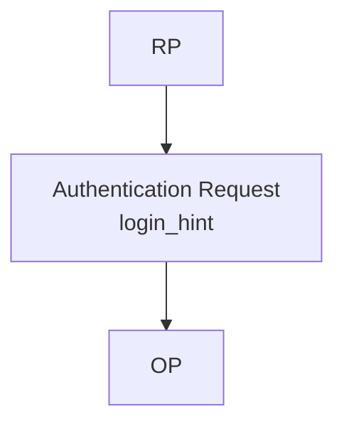

OpenID Connect Core 1.0 incorporating errata set 2 は、Authentication Request の `login_hint` parameter を、認証対象の End-User に関する hint を OpenID Provider（OP）へ渡すために定義しています。

## この記事について

**記事タイプ:** Feature Deep Dive  
**対象読者:** OpenID Connect の Relying Party（RP）と OpenID Provider（OP）で Authentication Request を実装・レビューする担当者  
**この記事で伝えること:** `login_hint` の配置、値の意味、OP に委ねられている処理範囲を確認する  
**扱わないこと:** `id_token_hint`、`prompt`、CIBA の login hint 群、第三者起点ログイン、OP 固有のアカウント選択 UI

## Article brief

- **Reader:** OpenID Connect の Authentication Request を実装・レビューする RP / OP 担当者
- **Question:** RP は End-User に関する login hint をどこに指定でき、その値を OP はどのように扱うのか
- **Answer:** RP は Authentication Request の OPTIONAL parameter `login_hint` に hint を指定できる。値の意味は OP の裁量に委ねられており、Core は特定の識別子形式や、その hint に従って認証対象を確定する処理を要求していない
- **Scope:** OpenID Connect Core 1.0 incorporating errata set 2 §3.1.2.1
- **Out of scope:** `id_token_hint`、`prompt`、`acr_values`、`max_age`、CIBA、第三者起点ログイン、Discovery、OP 固有 UI
- **Primary sources:** OpenID Connect Core 1.0 incorporating errata set 2 §3.1.2.1
- **Diagram:** RP が `login_hint` を Authentication Request に配置し、OP が hint として受け取る関係を `flowchart TD` で示す

## 1. `login_hint` は Authentication Request parameter

OpenID Connect Core §3.1.2.1 は `login_hint` を OPTIONAL の Authentication Request parameter として定義しています。RP は、認証対象となる End-User に関する hint を Authorization Server に渡すためにこの parameter を使用できます。

Authorization Code Flow で HTTP `GET` を使用する場合、`login_hint` は Authorization Endpoint に送る URI の query component に配置されます。

次は配置を示す非規範的な例です。`alice@example.com` は illustrative value であり、この値の形式自体に規範的意味はありません。

```http
GET /authorize?response_type=code&client_id=illustrative-client&scope=openid&redirect_uri=https%3A%2F%2Fclient.example%2Fcb&login_hint=alice%40example.com HTTP/1.1
Host: op.example
```

この例では、`login_hint` は JSON member、HTTP header、request body の member ではなく、Authorization Request の query parameter です。

## 2. 値の意味は OP の裁量に委ねられている

Core §3.1.2.1 は、`login_hint` を End-User に関する hint として定義したうえで、その string value の意味を OP の裁量に委ねています。

仕様は common use case として、RP があらかじめ End-User から取得した e-mail address、phone number、username などを値として使用する場合を説明しています。また、ID Token の `sub` Claim の値など、別の情報を hint として使用する場合もあり得ることを **MAY** としています。

したがって、Core §3.1.2.1 は `login_hint` の値を e-mail address に限定していません。また、`login_hint` の値だけを根拠として OP が特定の End-User を認証済みとして扱う、という処理も規定していません。

## 3. Discovery で使った値との関係

Core §3.1.2.1 は、Discovery で使用した hint value がある場合、`login_hint` の値をその値と一致させることを **RECOMMENDED** としています。

これは `login_hint` の一般的な形式を固定する規定ではありません。値の意味そのものは、同じ §3.1.2.1 により OP の裁量に委ねられています。

## 4. `login_hint` が示す関係

次の図は、この記事で扱う範囲だけを示します。



`login_hint` は RP から OP に渡される hint です。Core §3.1.2.1 は、この parameter によって特定の authentication method、account selection UI、または End-User identification algorithm を指定していません。

## 5. `login_hint` と他の parameter を分けて読む

`login_hint` の役割は、End-User に関する hint を渡すことです。Authentication Request には `id_token_hint` や `prompt` など別の parameter もありますが、それぞれ別の規定を持ちます。

特に `login_hint` の値の意味が OP の裁量に委ねられていることから、`login_hint` 自体に `prompt` の interaction requirement や `id_token_hint` の semantics を付加して読むことはできません。この記事では、それらの parameter の要件は扱いません。

## まとめ

OpenID Connect Core 1.0 incorporating errata set 2 §3.1.2.1 における `login_hint` は、Authentication Request に置く OPTIONAL parameter です。

RP は認証対象の End-User に関する hint を OP に渡せますが、その string value の意味は OP の裁量に委ねられています。仕様は e-mail address、phone number、username などを common use case として説明し、ほかの情報を使用することも **MAY** としています。また、Discovery で使用した hint value がある場合、それと一致する値を使用することが **RECOMMENDED** です。

## Primary source

- OpenID Connect Core 1.0 incorporating errata set 2, §3.1.2.1 Authorization Request
  - https://openid.net/specs/openid-connect-core-1_0.html#AuthRequest
