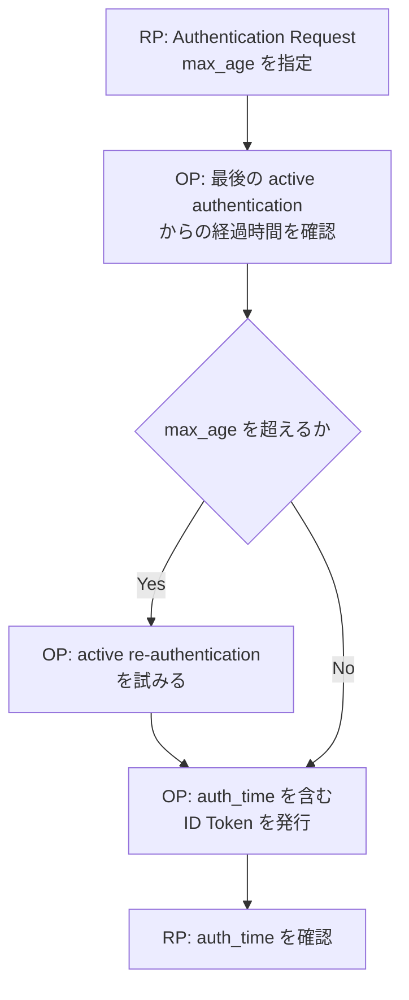

OpenID Connect Core 1.0 incorporating errata set 2 は、RP が End-User の認証から許容する経過時間を `max_age` で指定し、その認証時刻を ID Token の `auth_time` Claim で受け取る仕組みを定義しています。

## この記事について

**記事タイプ:** Requirement  
**対象読者:** OpenID Connect の Relying Party（RP）と OpenID Provider（OP）で、認証からの経過時間を扱う実装者・レビュー担当者  
**この記事で伝えること:** `max_age` の配置と OP の処理、`max_age` 使用時に `auth_time` が ID Token に必要になること、および RP による `auth_time` の確認要件を整理する  
**扱わないこと:** `prompt` 全般、`acr` / `amr` の評価、セッション管理、認証方式の選択、ID Token 全体の検証、RP 独自の再認証ポリシー

## Article brief

- **Reader:** OpenID Connect で認証からの経過時間を扱う RP / OP の実装者・レビュー担当者
- **Question:** RP は許容する認証経過時間をどこで指定し、OP はいつ再認証を試み、RP は ID Token のどの値から認証時刻を確認するのか
- **Answer:** RP は Authentication Request の `max_age` に秒数を指定する。経過時間が `max_age` を超える場合、OP は End-User の active re-authentication を試みなければならない。`max_age` を使用した場合、返される ID Token には `auth_time` が必要であり、RP はその値を確認することが SHOULD とされる
- **Scope:** OpenID Connect Core 1.0 incorporating errata set 2 §2、§3.1.2.1、§3.1.3.7、§15.1
- **Out of scope:** `prompt` の各値、Authentication Context、OP session の管理方法、具体的な認証方式、ID Token の署名・issuer・audience 等の一般的な validation
- **Primary sources:** OpenID Connect Core 1.0 incorporating errata set 2 §2、§3.1.2.1、§3.1.3.7、§15.1
- **Diagram:** RP の `max_age` 指定、OP による経過時間判定と必要時の active re-authentication、`auth_time` を含む ID Token の返却、RP の確認を `flowchart TD` で示す

## 1. `max_age` は Authentication Request parameter

OpenID Connect Core §3.1.2.1 は `max_age` を OPTIONAL の Authentication Request parameter として定義しています。値は、OP が End-User を最後に active authentication した時点から許容する経過時間を秒数で表します。

`max_age` は ID Token の Claim でも Token Endpoint の parameter でもありません。Authorization Endpoint に送る Authentication Request の parameter です。

Authorization Code Flow で HTTP `GET` を使用する場合、`max_age` は URI query component に配置されます。次は非規範的な例です。値 `900` は説明用であり、15分を選ぶことを仕様が推奨しているわけではありません。

```http
GET /authorize?response_type=code&client_id=illustrative-client&scope=openid&redirect_uri=https%3A%2F%2Fclient.example%2Fcb&max_age=900 HTTP/1.1
Host: op.example
```

この例では、主要 parameter の配置を示すために query string を省略せず記載しています。

## 2. 許容時間を超えた場合、OP は active re-authentication を試みる

Core §3.1.2.1 により、最後の active authentication からの経過時間が `max_age` の値より大きい場合、OP は End-User を active re-authenticate することを試みなければなりません（MUST）。

この規定は、RP が特定の認証方式を指定するものではありません。どの authentication method を使用するかという論点は、`max_age` parameter 自体の定義には含まれていません。

また、§3.1.2.1 は `max_age=0` が `prompt=login` と同等であると定めています。本記事では `prompt` のその他の値や処理は扱いません。

OpenID Connect Core §15.1 では、すべての OP が `max_age` による maximum authentication age の enforcement をサポートしなければならない（MUST）ことも Mandatory to Implement feature として規定されています。

## 3. `max_age` を使うと ID Token の `auth_time` が REQUIRED になる

Core §2 の `auth_time` は、End-User authentication が行われた時刻を表す Claim です。値は UTC の 1970-01-01T00:00:00Z からの秒数を表す JSON number です。

通常、`auth_time` の ID Token への inclusion は OPTIONAL です。ただし、次の場合は REQUIRED になります。

- Authentication Request で `max_age` を使用した場合
- `auth_time` を Essential Claim として要求した場合

さらに §3.1.2.1 は、`max_age` を使用した場合、返される ID Token が `auth_time` Claim Value を含まなければならない（MUST）と規定しています。

次は `max_age` を使用した authentication の結果として返される ID Token Claims Set の最小構造を示す非規範的な例です。数値は説明用です。

```json
{
  "iss": "https://op.example",
  "sub": "illustrative-subject",
  "aud": "illustrative-client",
  "exp": 1790154000,
  "iat": 1790150400,
  "auth_time": 1790150000
}
```

`auth_time` は JSON number であり、文字列ではありません。この例は Claims Set の配置を示すもので、ID Token の署名や一般的な validation 手順を表すものではありません。

## 4. RP は `auth_time` を確認する

Authorization Code Flow の ID Token Validation を定める Core §3.1.3.7 は、`auth_time` が個別の Claim request または `max_age` によって要求された場合、Client が `auth_time` Claim value を確認し、最後の End-User authentication から時間が経ちすぎていると判断した場合には re-authentication を要求することを SHOULD としています。

したがって、`max_age` は OP 側の active re-authentication 判定だけで完結する parameter ではありません。`max_age` を使った場合には `auth_time` が ID Token に入り、RP 側にもその値を確認する SHOULD が対応します。

ただし、仕様が SHOULD としている強度を MUST に読み替えることはできません。また、本記事では RP がどのような local policy で「時間が経ちすぎている」と判断するかについて、特定の値や方式を推奨しません。

## 5. `iat` と `auth_time` は別の時刻

ID Token の `iat` と `auth_time` は異なる意味を持ちます。

- `iat`: JWT が発行された時刻。Core §2 で REQUIRED
- `auth_time`: End-User authentication が行われた時刻。通常は OPTIONAL だが、`max_age` request などでは REQUIRED

したがって、`max_age` に対応する認証時刻を確認するために `iat` を `auth_time` の代わりとして扱うことは、Core が定義する Claim の意味とは一致しません。

Core §12.2 もこの区別を示しています。Refresh Token によって新しい ID Token が返される場合、`iat` は新しい ID Token の発行時刻を表します。一方、その ID Token に `auth_time` が含まれる場合、その値は新しい token の発行時刻ではなく original authentication の時刻を表さなければなりません（MUST）。

この refresh 処理自体は本記事の中心テーマではないため、ここでは両 Claim の意味の違いを確認する範囲に留めます。

## 6. 処理の関係

次の図は、`max_age` と `auth_time` に直接関係する処理だけを示します。



図は `max_age` の処理関係を示す非規範的な要約です。Authentication Request / Response 全体の actor や error processing は省略しています。

## 7. 仕様上の要点

- `max_age` は Authentication Request の OPTIONAL parameter で、最後の active authentication から許容する経過時間を秒数で指定する（Core §3.1.2.1）。
- 経過時間が `max_age` を超える場合、OP は End-User の active re-authentication を試みなければならない（MUST、§3.1.2.1）。
- `max_age` を使用した場合、返される ID Token は `auth_time` Claim Value を含まなければならない（MUST、§3.1.2.1）。
- `auth_time` は End-User authentication が行われた時刻を表す JSON number であり、`max_age` request 時は REQUIRED（§2）。
- `auth_time` が `max_age` によって要求された場合、Client はその値を確認し、必要と判断した場合に re-authentication を要求することが SHOULD（§3.1.3.7）。
- すべての OP は `max_age` による maximum authentication age enforcement をサポートしなければならない（MUST、§15.1）。

## Primary sources

- OpenID Connect Core 1.0 incorporating errata set 2, §2 “ID Token”
- OpenID Connect Core 1.0 incorporating errata set 2, §3.1.2.1 “Authentication Request”
- OpenID Connect Core 1.0 incorporating errata set 2, §3.1.3.7 “ID Token Validation”
- OpenID Connect Core 1.0 incorporating errata set 2, §15.1 “Mandatory to Implement Features for All OpenID Providers”
- OpenID Connect Core 1.0 incorporating errata set 2, §12.2 “Successful Refresh Response” — `iat` と `auth_time` の意味の違いを確認する箇所のみ
