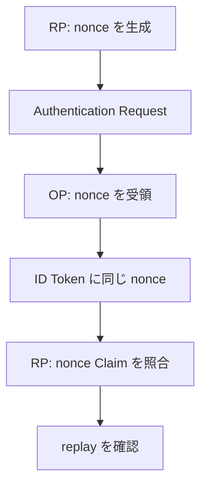

- **記事タイプ**: Requirement
- **対象読者**: OpenID Connect の Authentication Request を生成し、返された ID Token を検証する RP と、ID Token を発行する OP の実装者
- **この記事で伝えること**: `nonce` が Authentication Request のどこに置かれ、OP が ID Token にどう引き継ぎ、RP が何を検証する必要があるかを整理する
- **扱わないこと**: OAuth 2.0 の `state`、PKCE、ID Token の署名検証全般、Refresh Request で発行される ID Token、Implicit / Hybrid Flow 固有の `nonce` 要件、具体的な乱数生成 API

## Article brief

- **Reader**: OIDC の RP / OP 実装者
- **Question**: RP が Authentication Request に `nonce` を含めた場合、その値は ID Token にどう反映され、RP は何を検証するのか
- **Answer**: Authorization Code Flow では `nonce` は OPTIONAL な Authentication Request parameter である。指定する場合は推測困難にするため十分な entropy が必要で、OP はその値を変更せず ID Token の `nonce` Claim に含める。RP は送信した値と返された Claim の値が同一であることを検証し、replay attack についても確認する
- **Scope**: OpenID Connect Core 1.0 §2、§3.1.2.1、§3.1.3.7、§15.5.2 における Authorization Code Flow の `nonce`
- **Out of scope**: `state`、PKCE、Implicit Flow、Hybrid Flow、Refresh Token response、Self-Issued OP、ID Token validation 全般、乱数生成 API の選定
- **Primary sources**: OpenID Connect Core 1.0 incorporating errata set 2 §2、§3.1.2.1、§3.1.3.7、§15.5.2
- **Diagram**: RP が `nonce` を Authentication Request に含め、OP が同じ値を ID Token に含め、RP が照合する流れを示す `flowchart TD`

## `nonce` は Authentication Request の parameter

OpenID Connect Core 1.0 §3.1.2.1 は、Authorization Code Flow の `nonce` を OPTIONAL な Authentication Request parameter として定義しています。`nonce` は Client session と ID Token を関連付け、replay attack を軽減するための string value です。

同 section は、攻撃者による値の推測を防ぐため、`nonce` に十分な entropy が存在することを **MUST** としています。

次は非規範的な例です。`illustrative-nonce-7f3a9c` は配置を示すための illustrative value であり、十分な entropy を備えた実値の例として示すものではありません。

```http
GET /authorize?response_type=code&client_id=illustrative-client&redirect_uri=https%3A%2F%2Fclient.example%2Fcb&scope=openid&nonce=illustrative-nonce-7f3a9c HTTP/1.1
Host: op.example
```

この例では `nonce` は Authorization Endpoint への HTTP GET request の **query parameter** にあります。

## OP は同じ値を ID Token に含める

OpenID Connect Core 1.0 §2 は、Authentication Request に `nonce` が存在した場合、Authorization Server が ID Token に `nonce` Claim を含めることを **MUST** としています。その Claim Value は Authentication Request で送られた `nonce` value です。

同 section は、Authorization Server が `nonce` value にそれ以外の処理を行わないことを **SHOULD** としています。`nonce` は case-sensitive string です。

次は非規範的な最小 Claims Set の例です。

```json
{
  "iss": "https://op.example",
  "sub": "illustrative-subject",
  "aud": "illustrative-client",
  "exp": 1790182800,
  "iat": 1790182200,
  "nonce": "illustrative-nonce-7f3a9c"
}
```

`nonce` は ID Token の JWT Claims Set の member として置かれます。この例の値に規範的な意味はありません。

## RP は送信した `nonce` と ID Token の Claim を照合する

OpenID Connect Core 1.0 §3.1.3.7 は Authorization Code Flow の ID Token validation を定めています。

Authentication Request で `nonce` value を送信した場合、ID Token に `nonce` Claim が存在することが **MUST** です。Client は、その値が Authentication Request で送信した値と同じであることを確認します。

さらに Client は `nonce` value について replay attack を確認することを **SHOULD** としています。ただし、replay attack を検出する具体的な方法は Client-specific です。仕様は単一の実装方式を要求していません。

OpenID Connect Core 1.0 §2 でも、ID Token に `nonce` Claim が存在する場合、Client が Authentication Request で送信した `nonce` parameter の値と等しいことを検証することを **MUST** としています。

## `nonce` の保持方法は一つに固定されていない

OpenID Connect Core 1.0 §15.5.2 は implementation notes として、`nonce` parameter value が per-session state を含み、攻撃者に推測されない必要があると説明しています。

同 section は Web Server Client の一例として、cryptographically random value を HttpOnly session cookie に保存し、その値の cryptographic hash を `nonce` parameter として使用する方法を示しています。また JavaScript Client などについては、cryptographically random value を HTML5 local storage に保存し、その hash を利用する関連方式を例示しています。

これらは §15.5.2 に記載された実装例です。この記事では、特定の保持方式を選ぶことは推奨しません。

## 処理の関係



この図は Authorization Code Flow で Authentication Request に `nonce` を指定した場合の関係だけを示しています。`state`、Authorization Code、PKCE、署名検証など、別の処理は図に追加していません。

## まとめ

Authorization Code Flow の `nonce` は OPTIONAL な Authentication Request parameter です。ただし使用する場合、その値には推測を防ぐため十分な entropy が必要です（§3.1.2.1、**MUST**）。

Authentication Request に `nonce` があれば、OP は同じ値を ID Token の `nonce` Claim として返すことが **MUST** です（§2）。RP は ID Token の `nonce` が送信した値と同一であることを検証し、replay attack について確認することが **SHOULD** です（§3.1.3.7）。具体的な replay detection の方法は Client-specific です。

## Primary sources

- OpenID Foundation, **OpenID Connect Core 1.0 incorporating errata set 2**, §2 “ID Token”
- OpenID Foundation, **OpenID Connect Core 1.0 incorporating errata set 2**, §3.1.2.1 “Authentication Request”
- OpenID Foundation, **OpenID Connect Core 1.0 incorporating errata set 2**, §3.1.3.7 “ID Token Validation”
- OpenID Foundation, **OpenID Connect Core 1.0 incorporating errata set 2**, §15.5.2 “Nonce Implementation Notes”
