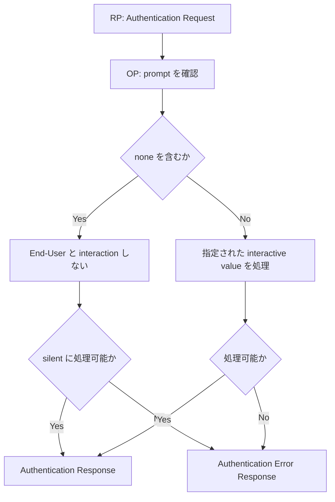

OpenID Connect Core 1.0 incorporating errata set 2 は、Authentication Request の `prompt` parameter で、OpenID Provider（OP）が End-User に authentication や consent の user interface を提示する際の動作を指定できるようにしています。

## この記事について

**記事タイプ:** Requirement  
**対象読者:** OpenID Connect の Relying Party（RP）と OpenID Provider（OP）で、Authentication Request と End-User interaction を実装・レビューする担当者  
**この記事で伝えること:** `prompt` の配置、`none` / `login` / `consent` / `select_account` の規定、複数値と error response の関係を整理する  
**扱わないこと:** `max_age`、`id_token_hint` の詳細、`offline_access`、具体的な authentication method、consent の法的評価、OP 固有の UI

## Article brief

- **Reader:** OpenID Connect の Authentication Request と End-User interaction を実装・レビューする RP / OP 担当者
- **Question:** RP は End-User interaction に関する要求をどこに指定し、OP は `none` / `login` / `consent` / `select_account` を受け取ったとき何をしなければならない、または何をすべきなのか
- **Answer:** RP は Authentication Request の `prompt` に space-delimited な値を指定する。`none` は authentication / consent UI の表示を禁止し、`login` は再認証、`consent` は consent、`select_account` は account selection に関する処理を指定する。各値に対する規範強度と、処理できない場合の error を区別して確認できる
- **Scope:** OpenID Connect Core 1.0 incorporating errata set 2 §3.1.2.1、§3.1.2.3、§3.1.2.6、§15.1
- **Out of scope:** `max_age`、`id_token_hint` の詳細、`offline_access`、Authentication Context、authentication method、consent の成立要件、製品固有 UI
- **Primary sources:** OpenID Connect Core 1.0 incorporating errata set 2 §3.1.2.1、§3.1.2.3、§3.1.2.6、§15.1
- **Diagram:** RP が `prompt` を含む Authentication Request を送り、OP が `none` と interactive values を分岐して処理し、response または error response を返す関係を `flowchart TD` で示す

## 1. `prompt` は Authentication Request parameter

OpenID Connect Core §3.1.2.1 は `prompt` を OPTIONAL の Authentication Request parameter として定義しています。値は case-sensitive な ASCII string の space-delimited list です。

定義済みの値は次の4つです。

- `none`
- `login`
- `consent`
- `select_account`

Authorization Code Flow で HTTP `GET` を使用する場合、`prompt` は Authorization Endpoint に送る URI の query component に配置されます。次は非規範的な例です。

```http
GET /authorize?response_type=code&client_id=illustrative-client&scope=openid&redirect_uri=https%3A%2F%2Fclient.example%2Fcb&prompt=login HTTP/1.1
Host: op.example
```

`prompt` に複数値を指定する場合は space-delimited list であり、query parameter では space を form URL encoding に従って表現します。次は `login consent` を指定する配置例です。

```http
GET /authorize?response_type=code&client_id=illustrative-client&scope=openid&redirect_uri=https%3A%2F%2Fclient.example%2Fcb&prompt=login%20consent HTTP/1.1
Host: op.example
```

これらは parameter の配置を示す非規範的な例であり、例示した値の組み合わせを推奨するものではありません。

## 2. `none` は authentication / consent UI を表示させない

Core §3.1.2.1 では、`prompt=none` の場合、Authorization Server は authentication または consent の user interface page を表示してはなりません（MUST NOT）。End-User がすでに authenticated でない場合、requested Claims に対する Client の pre-configured consent がない場合、または request を処理するためのその他の条件を満たさない場合は error が返されます。

さらに Core §3.1.2.3 は、`prompt=none` の Authentication Request について Authorization Server が End-User と interaction してはならない（MUST NOT）と規定しています。End-User がすでに authenticated でなく、silent authentication もできない場合、Authorization Server は error を返さなければなりません（MUST）。

Core §3.1.2.1 は、`none` と他の `prompt` value を同じ request に含めた場合には error が返されると定めています。

## 3. `login` は再認証を要求する

Core §3.1.2.1 では、`prompt=login` を受け取った Authorization Server は End-User に reauthentication を促すことが SHOULD とされています。reauthentication ができない場合は error を返さなければなりません（MUST）。典型的な error は `login_required` です。

加えて Core §3.1.2.3 は authentication 処理そのものについて、Authentication Request が `prompt=login` を含む場合、End-User がすでに authenticated であっても Authorization Server が End-User を reauthenticate しなければならない（MUST）と規定しています。

したがって、§3.1.2.1 の UI に関する SHOULD と、§3.1.2.3 の reauthentication 処理に関する MUST は別の規定です。

## 4. `consent` と `select_account` の規定

### `consent`

Core §3.1.2.1 では、Authorization Server は Client に情報を返す前に End-User に consent を促すことが SHOULD とされています。consent を取得できない場合は error を返さなければなりません（MUST）。典型的な error は `consent_required` です。

### `select_account`

Core §3.1.2.1 では、Authorization Server は End-User に user account の選択を促すことが SHOULD とされています。この値は、Authorization Server に複数 account の current session がある End-User が account を選択できるようにするために定義されています。

End-User による account selection choice を取得できない場合、Authorization Server は error を返さなければなりません（MUST）。典型的な error は `account_selection_required` です。

## 5. `prompt=none` と Authentication Error Response

Core §3.1.2.6 は、`prompt=none` で request を interaction なしに完了できない場合に使用できる OpenID Connect 固有の error code を定義しています。

- `interaction_required`: 処理を続けるために何らかの End-User interaction が必要な場合に MAY return
- `login_required`: UI を表示せずには End-User authentication を完了できない場合に MAY return
- `account_selection_required`: 使用する session を End-User に選択させる必要がある場合に MAY return
- `consent_required`: UI を表示せずには End-User consent を得られない場合に MAY return

Authorization Code Flow では、Redirection URI が invalid でない限り、Authorization Server は appropriate error と、request に `state` が含まれていればその `state` を Redirection URI に返します。Core §3.1.2.6 により、`state` は Authentication Request に含まれていた場合 REQUIRED です。

次は `prompt=none` の request を interaction なしに処理できなかった場合の形式を示す非規範的な例です。ここでは `login_required` を説明用に使用しています。

```http
HTTP/1.1 302 Found
Location: https://client.example/cb?error=login_required&state=illustrative-state
```

この例は error response の配置を示すものであり、すべての `prompt=none` failure が `login_required` になることを意味しません。

## 6. 未知の `prompt` value と OP の必須サポート

Core §3.1.2.1 では、OP が理解しない `prompt` value を受け取った場合、error を返してもよく（MAY）、その値を無視してもよい（MAY）とされています。

一方、Core §15.1 は Mandatory to Implement Features for All OpenID Providers として、すべての OP が `prompt` parameter をサポートしなければならない（MUST）とし、`none` や `login` など仕様で定められた user interface behavior を含めています。

未知の extension value に対する MAY と、Core で定義された `prompt` parameter の必須サポートは別の規定です。

## 7. 処理関係

次の図は、この記事で扱う `prompt` の処理関係だけを示します。



この図は `prompt` に関する分岐だけを示しており、Authentication Request validation 全体や具体的な authentication method を追加していません。

## まとめ

`prompt` は Authentication Request に置かれる OPTIONAL parameter で、値は space-delimited list です。`none` は End-User interaction を禁止し、`login`、`consent`、`select_account` はそれぞれ reauthentication、consent、account selection に関する処理を指定します。

重要なのは、各規定の強度を分けて読むことです。`prompt=none` では UI を表示してはならない（MUST NOT）。`prompt=login` の UI prompt は SHOULD ですが、§3.1.2.3 では reauthentication 自体が MUST です。`consent` と `select_account` の prompt は SHOULD であり、それぞれ実行できない場合の error は MUST とされています。

## 参照仕様

- OpenID Connect Core 1.0 incorporating errata set 2, §3.1.2.1 Authentication Request
- OpenID Connect Core 1.0 incorporating errata set 2, §3.1.2.3 Authorization Server Authenticates End-User
- OpenID Connect Core 1.0 incorporating errata set 2, §3.1.2.6 Authentication Error Response
- OpenID Connect Core 1.0 incorporating errata set 2, §15.1 Mandatory to Implement Features for All OpenID Providers
