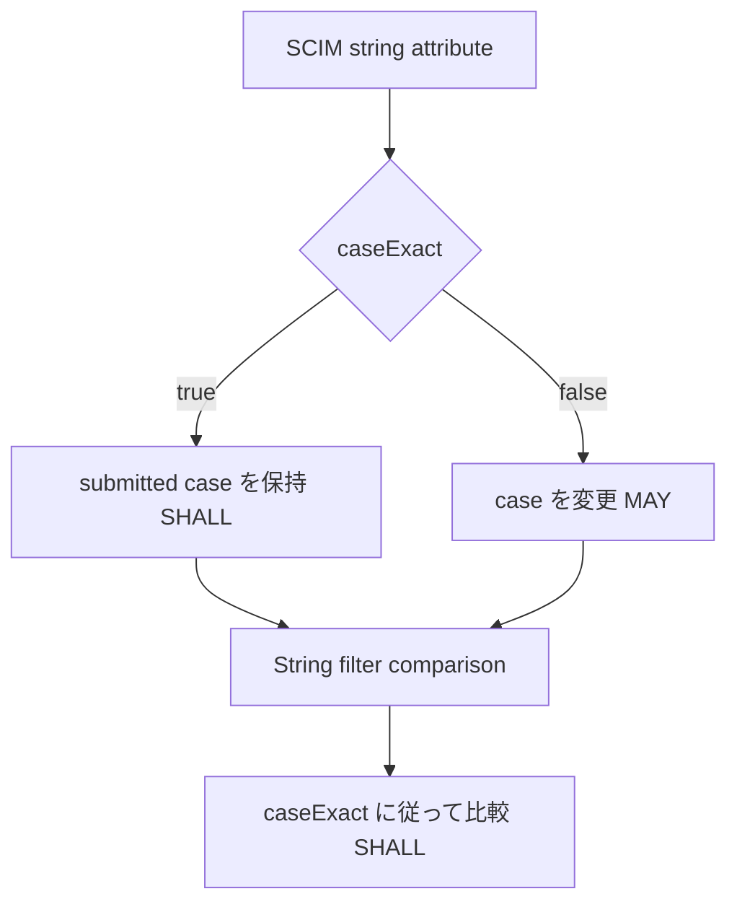

<!--
Article brief
- Type: Requirement
- Reader: SCIM 2.0 の schema と filter 処理を実装またはレビューする Client / Service Provider 開発者
- Question: caseExact は何を規定し、文字列値の保存と filter 比較で大文字・小文字をどう扱うのか
- Answer: caseExact の既定値、true/false の保存時の扱い、String filter 比較への適用、attribute name/operator 自体の case-insensitive 規則を区別できる
- Scope: RFC 7643 §2.1, §2.2, §7 と RFC 7644 §3.4.2.2 に基づく caseExact characteristic と String filter comparison
- Out of scope: filter expression 全般、sorting、uniqueness、Unicode normalization、locale 固有の照合、個別製品の検索実装
- Primary sources: RFC 7643 §2.1, §2.2, §7; RFC 7644 §3.4.2.2
- Diagram: schema の caseExact 値から、値の保存時処理と String filter 比較時の case sensitivity に分岐する flowchart
-->

## この記事について

**記事タイプ:** Requirement  
**対象読者:** SCIM 2.0 の schema と filter 処理を実装またはレビューする Client / Service Provider 開発者  
**この記事で伝えること:** `caseExact` が文字列値の case sensitivity に与える規則と、attribute name / filter operator の case-insensitive 規則との違い  
**扱わないこと:** filter expression 全般、sorting、uniqueness、Unicode normalization、locale 固有の照合、個別製品の検索実装

SCIM schema の `caseExact` は、文字列属性の値を case-sensitive として扱うかを表す attribute characteristic です。RFC 7643 §2.2 では、明示されない場合の `caseExact` の既定値は `false`、すなわち case-insensitive と定義されています。

**`caseExact` applies to attribute values; it does not make SCIM attribute names case-sensitive.**  
（`caseExact` は attribute value に適用されるもので、SCIM の attribute name 自体を case-sensitive にするものではありません。）

この記事では、値の保存時の扱いと String filter comparison に範囲を限定します。

## 1. caseExact は schema 上の Boolean characteristic

RFC 7643 §7 は `caseExact` を Boolean value として定義しています。文字列属性が case-sensitive かどうかを示し、RFC 7643 §2.2 により、別途指定されない場合は `false` が既定値です。

Schema resource では、各 attribute definition の JSON member として `caseExact` が現れます。以下は RFC 7643 §8.7.1 の User schema に定義された `userName` の構造から、この記事に必要な member だけを示した**非規範的な最小例**です。

```json
{
  "name": "userName",
  "type": "string",
  "caseExact": false
}
```

この例の `false` は illustrative value ではなく、標準 User schema の `userName` に定義された characteristic です。

一方、RFC 7643 §3.1 の `externalId` は `caseExact` が `true` と定義されています。このように、同じ SCIM resource 内でも attribute ごとに値が異なり得ます。

## 2. caseExact=true では submitted value の case を保持する

RFC 7643 §7 は、case-exact な attribute について、Service Provider が submitted value の case を保持することを **SHALL** としています。

たとえば `caseExact=true` の string attribute に `IllustrativeValue` が送られた場合、この規則の対象となるのは文字列値の case です。

`caseExact=false` の attribute では、Service Provider は submitted value の case を変更してもよい（**MAY**）とされています。したがって、`false` は「受信した文字列の大文字・小文字を必ずそのまま保存する」という規則ではありません。



## 3. filter の String comparison でも caseExact を使う

RFC 7644 §3.4.2.2 は、String type attribute を比較するとき、その case sensitivity を attribute の `caseExact` characteristic によって決定することを **SHALL** としています。

以下は `filter` の配置を示す**非規範的な HTTP GET 例**です。RFC 7644 §3.4.2.2 では `filter` は query parameter です。

```http
GET /Users?filter=userName%20eq%20%22IllustrativeUser%22 HTTP/1.1
Host: example.com
Accept: application/scim+json
```

標準 User schema の `userName` は `caseExact=false` です。そのため、この String comparison の case sensitivity は `userName` の characteristic に従います。

ここで、`caseExact` が制御するのは literal と attribute value の文字列比較です。filter syntax の別の要素には別の規則があります。

## 4. attribute name と filter operator は別の規則で case-insensitive

RFC 7643 §2.1 は SCIM attribute name を case-insensitive と定義しています。さらに RFC 7644 §3.4.2.2 は、filter 内の attribute name と attribute operator も case-insensitive と定めています。

したがって、RFC 7644 が示す次の2つの形式は同じ logical value に評価されます。

```text
filter=userName Eq "john"
filter=Username eq "john"
```

この同値性は、`userName` の `caseExact` が attribute name や `eq` operator に適用されるからではありません。attribute name と operator 自体に case-insensitive の規則があるためです。

**The casing of a filter's attribute name and operator is a different question from the casing of the String value being compared.**  
（filter の attribute name / operator の大文字・小文字と、比較対象となる String value の大文字・小文字は別の論点です。）

## 5. caseExact が規定しないこと

RFC 7643 §7 と RFC 7644 §3.4.2.2 がここで規定しているのは、submitted string value の case の扱いと、String comparison の case sensitivity です。

この記事では、Unicode normalization、locale 固有の照合規則、検索 index の実装方法を `caseExact` から導出しません。これらについて、上記 section の規定を超える特定方式を `caseExact` の要件として扱うことはしません。

また、filter expression の operator 全体、logical operator の precedence、multi-valued attribute の matching rule は別の論点なので扱いません。

## まとめ

`caseExact` は SCIM schema が attribute value の case sensitivity を示すための characteristic です。RFC 7643 §2.2 の既定値は `false` です。

`caseExact=true` なら、Service Provider は submitted value の case を保持します（RFC 7643 §7: **SHALL**）。`false` なら case を変更できます（同 §7: **MAY**）。String type attribute の filter comparison では、Service Provider はその attribute の `caseExact` に従って case sensitivity を決定します（RFC 7644 §3.4.2.2: **SHALL**）。

一方、SCIM attribute name、および filter 内の attribute name と operator は、それぞれの仕様規定によって case-insensitive です。値の比較に対する `caseExact` と混同しないことが、仕様上の境界を把握するポイントです。

## Primary sources

- RFC 7643, §2.1 “Attributes”, §2.2 “Attribute Characteristics”, §3.1 “Common Attributes”, §7 “Schema Definition”, §8.7.1 “User Schema”
- RFC 7644, §3.4.2.2 “Filtering”
