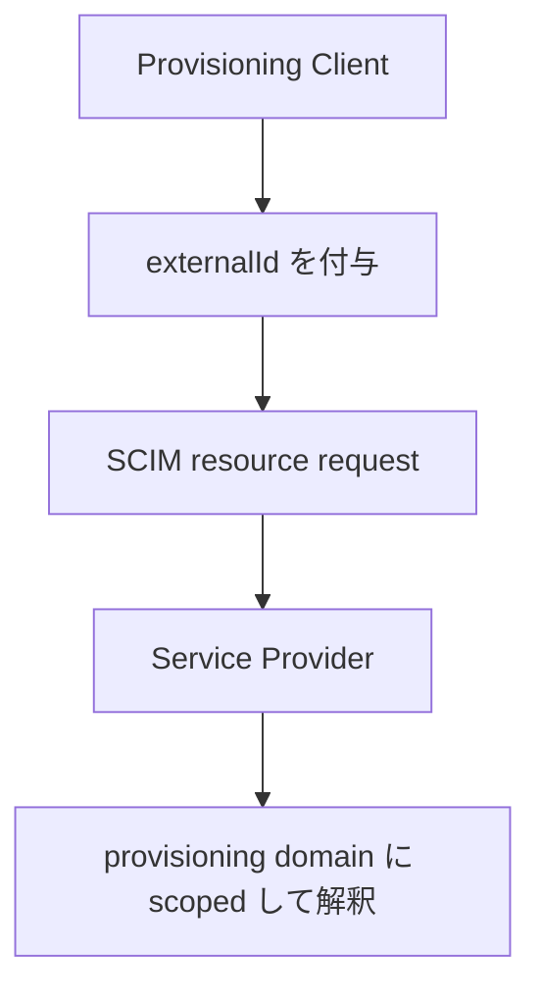

**記事タイプ:** Requirement  
**対象読者:** SCIM resource と provisioning system 側の識別子を対応付ける Client / Service Provider の実装者  
**この記事で伝えること:** `externalId` を誰が発行するのか、どのスコープで解釈するのか、`id` と何が異なるのかを仕様の要件として整理する  
**扱わないこと:** `userName` の一意性、SCIM `id` の生成方式、filter expression 全般、tenant の識別方法、database key の設計

## Article brief

- **Reader:** SCIM resource と provisioning system 側の識別子を対応付ける Client / Service Provider の実装者
- **Question:** SCIM の `externalId` は誰が設定し、Service Provider はどの範囲でその値を解釈するのか
- **Answer:** `externalId` は provisioning client が発行する OPTIONAL な resource attribute であり、Service Provider が発行してはならず、provisioning domain に scoped して解釈すること、および multi-tenant context で要求される uniqueness の範囲を追える
- **Scope:** RFC 7643 §3.1、RFC 7644 §6.2
- **Out of scope:** `userName`、filter grammar、SCIM `id` の生成方式、tenant の識別方法、custom schema attribute の一意性設計
- **Primary sources:** RFC 7643 §3.1、RFC 7644 §6.2
- **Diagram:** provisioning client が `externalId` を付与して resource を作成し、Service Provider が provisioning domain のスコープで保持・解釈する関係

SCIM には Service Provider が割り当てる `id` とは別に、provisioning client 側の識別子を resource に関連付ける `externalId` があります。本記事では `externalId` の発行主体とスコープだけを扱います。

## 1. `externalId` は provisioning client が定義する識別子

RFC 7643 §3.1 は `externalId` を、provisioning client が定義する resource の識別子として定義しています。各 resource は空でない `externalId` を含めることができます（**MAY**）。したがって、`externalId` はすべての SCIM resource に必須の attribute ではありません。

同じ §3.1 は、`externalId` の値は常に provisioning client が発行し、Service Provider が指定してはならない（**MUST NOT**）と規定しています。

一方、同じ節の `id` は Service Provider が発行する identifier です。`externalId` と `id` は、発行主体が異なります。

**`externalId` is client-issued; `id` is service-provider-issued.**  
（`externalId` は Client が発行し、`id` は Service Provider が発行します。）

## 2. request body では resource の JSON member に置く

次は配置を示すための**非規範的な例**です。`source-user-1042` は illustrative value です。

```http
POST /Users HTTP/1.1
Host: scim.example
Content-Type: application/scim+json
Accept: application/scim+json

{
  "schemas": [
    "urn:ietf:params:scim:schemas:core:2.0:User"
  ],
  "userName": "illustrative-user",
  "externalId": "source-user-1042"
}
```

`externalId` は HTTP header や query parameter ではなく、SCIM resource の JSON member です。

- 型: String
- cardinality: single-valued
- presence: OPTIONAL（resource は非空の値を **MAY** include）

この例の `userName` は User resource の必須構造を満たすために置いており、本記事では `userName` の一意性や比較規則を扱いません。

## 3. Service Provider は provisioning domain に scoped して解釈する

RFC 7643 §3.1 は、Service Provider が `externalId` を provisioning domain に scoped した値として常に解釈しなければならない（**MUST**）と規定しています。

同節は、`externalId` により provisioning client が自身の domain の identifier を使って resource を識別でき、Service Provider の `id` とのローカル mapping を保持する必要を避けられる場合がある、と説明しています。

ただし、仕様は `externalId` を Service Provider 全体で一意にするとは規定していません。provisioning domain の境界をどのように実装・識別するかは、本記事の一次資料が特定の方式を定めていないため、ここでは選択しません。

## 4. multi-tenant context では uniqueness の範囲が限定される

RFC 7644 §6.2 は multi-tenant implementation における identifier を扱っています。この節では、`externalId` は client が定義する値であり、関連する Tenant に関連付けられた resources の範囲でのみ一意であることが required とされています。

つまり、SCIM protocol は `externalId` に対して、すべての Tenant を横断する global uniqueness を要求していません。

同じ §6.2 では、Service Provider がすべての Tenant の全 resource を通じて一意な SCIM `id` を実装することを選択できますが、それは required ではありません。この点も `externalId` のスコープとは分けて扱う必要があります。

## 5. 発行主体とスコープの関係

次の図は、本記事で扱う関係だけを示します。



この図は `externalId` の発行と解釈の関係を示すもので、認証、認可、resource matching algorithm、tenant routing を表すものではありません。

## まとめ

RFC 7643 §3.1 では、`externalId` は provisioning client が定義する resource identifier です。resource は非空の `externalId` を含めることができ（**MAY**）、その値は provisioning client が発行し、Service Provider が指定してはなりません（**MUST NOT**）。Service Provider はその値を provisioning domain に scoped して解釈しなければなりません（**MUST**）。

RFC 7644 §6.2 の multi-tenant context では、`externalId` の uniqueness は関連する Tenant に関連付けられた resources の範囲で要求されます。仕様は全 Tenant を横断する global uniqueness を要求していません。

## 一次資料

- RFC 7643, §3.1 Common Attributes (`id`, `externalId`)
- RFC 7644, §6.2 SCIM Identifiers with Multiple Tenants
