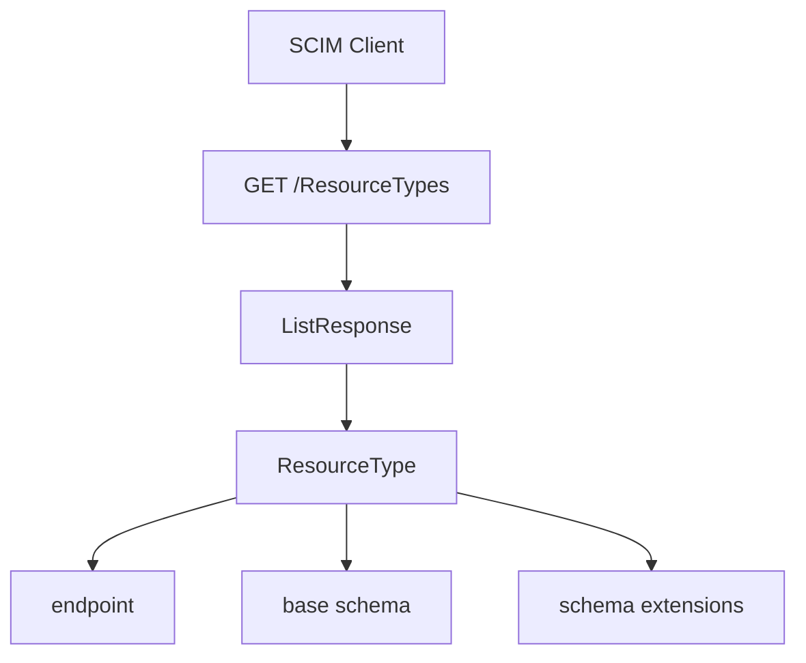

- **記事タイプ**: Feature Deep Dive
- **対象読者**: SCIM Client / Service Provider の実装者で、利用可能な resource type と endpoint を仕様から確認したい人
- **この記事で伝えること**: `/ResourceTypes` が返す ResourceType resource と、`name`、`endpoint`、`schema`、`schemaExtensions` の関係
- **扱わないこと**: `/Schemas` の attribute definition、`/ServiceProviderConfig` の capability discovery、User / Group resource の CRUD、認証・認可方式

## Article brief

**Reader**: SCIM Client / Service Provider の実装者。

**Question**: Client は Service Provider が公開する resource type、対応 endpoint、base schema、schema extension をどのように discovery するのか。

**Answer**: RFC 7644 §4 の `/ResourceTypes` と RFC 7643 §6 の ResourceType schema を対応付け、resource type から endpoint と schema 構成を確認できる。

**Scope**: RFC 7644 §3.2・§4、RFC 7643 §6。`GET /ResourceTypes`、ResourceType resource、`name`、`endpoint`、`schema`、`schemaExtensions`。

**Out of scope**: Schema resource の attribute characteristics、ServiceProviderConfig、resource operation、deployment 固有の resource type 設計。

**Primary sources**: RFC 7644 §3.2・§4、RFC 7643 §6。

**Diagram**: Client が `/ResourceTypes` を取得し、返された ResourceType から endpoint と schema を対応付ける flowchart。

## `/ResourceTypes` は resource type の discovery endpoint

RFC 7644 §3.2 は、拡張 resource の endpoint 名について resource name を複数形にする規約を **SHOULD** としています。一方で複数形が一意に決まらない場合があるため、Client は `/ResourceTypes` endpoint で resource endpoint を discovery することを **SHOULD** としています。

RFC 7644 §4 では、`GET /ResourceTypes` は Service Provider が利用可能にしている resource type を discovery するための操作として定義されています。各 resource type は、その resource の endpoint、core schema URI、対応する schema extension を記述します。

`ResourceType` resource 自体は RFC 7643 §6 で定義され、read-only です。schema URI は `urn:ietf:params:scim:schemas:core:2.0:ResourceType` です。

## ResourceType の主要属性

RFC 7643 §6 では、特に次の属性が resource type と resource representation の対応を表します。

- `name`: resource type の名前。適用可能な場合、Service Provider は名前を指定することが **MUST** です。`meta.resourceType` から参照されます。required です。
- `endpoint`: Service Provider の Base URL に対する HTTP-addressable endpoint。required です。
- `schema`: resource type の primary/base schema URI。この値は関連する Schema resource の `id` と等しいことが **MUST** です。required です。
- `schemaExtensions`: resource type に対応する schema extension のリスト。optional です。

`schemaExtensions` の各要素は `schema` と `required` を持ちます。`schema` は extended Schema resource の `id` と等しいことが **MUST** です。`required` が `true` の場合、その resource type の resource は当該 schema extension と、その extension で required と宣言された attribute を含むことが **MUST** です。`false` の場合、その schema extension を省略することが **MAY** です（RFC 7643 §6）。

## 非規範的な HTTP / JSON 例

次は配置と構造を示すための**非規範的な例**です。値は illustrative value です。

```http
GET /ResourceTypes HTTP/1.1
Host: scim.example.com
Accept: application/scim+json
```

`/ResourceTypes` は複数 resource の取得なので、RFC 7644 §4 に従い ListResponse として ResourceType resources を返します。以下では構造確認に必要な部分だけを示します。

```json
{
  "schemas": [
    "urn:ietf:params:scim:api:messages:2.0:ListResponse"
  ],
  "totalResults": 1,
  "Resources": [
    {
      "schemas": [
        "urn:ietf:params:scim:schemas:core:2.0:ResourceType"
      ],
      "id": "User",
      "name": "User",
      "endpoint": "/Users",
      "schema": "urn:ietf:params:scim:schemas:core:2.0:User"
    }
  ]
}
```

この例では `endpoint` は ResourceType JSON object の member です。HTTP query parameter や header ではありません。`schema` も同じ ResourceType object の JSON member で、resource type の primary/base schema URI を表します。

個別の resource type は RFC 7644 §4 に従い `/ResourceTypes/{id}` から取得できます。

## discovery で確認できる関係



この discovery により、Client は resource type の名前から endpoint を推測するだけでなく、Service Provider が公開する ResourceType resource に基づいて endpoint と schema 構成を確認できます。

## `/Schemas` との役割の違い

`/ResourceTypes` が記述するのは、resource type と endpoint、base schema、schema extension の対応です。Schema resource 自体の attribute definition は RFC 7643 §7 と RFC 7644 §4 の `/Schemas` が扱います。本記事では attribute の mutability、returned、uniqueness などの Schema resource の詳細には踏み込みません。

## Primary sources

- RFC 7644, §3.2 "SCIM Endpoints and HTTP Methods"
- RFC 7644, §4 "Service Provider Configuration Endpoints"
- RFC 7643, §6 "ResourceType Schema"
