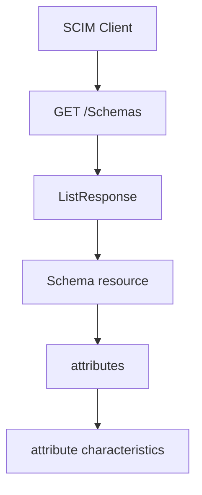

- **記事タイプ**: Feature Deep Dive
- **対象読者**: SCIM Client / Service Provider を実装し、Service Provider が公開する schema と属性特性を確認したい実装者
- **この記事で伝えること**: `/Schemas` から Schema resource を取得する方法と、Schema resource の `id`、`name`、`description`、`attributes` が表す範囲を説明する
- **扱わないこと**: `/ResourceTypes` による endpoint discovery、`/ServiceProviderConfig` による capability discovery、個々の User / Group 属性の意味、独自 schema extension の設計方法

## Article brief

**Reader**: SCIM の schema discovery を実装する Client / Service Provider の実装者。

**Question**: Service Provider がサポートする schema と、その schema に属する属性の型・複数値性・mutability・returned・uniqueness などを、標準の discovery endpoint からどのように取得して解釈するか。

**Answer**: `GET /Schemas` はサポートする Schema resource を ListResponse で返し、個別 schema は `/Schemas/{schema URI}` で取得できる。各 Schema resource は RFC 7643 §7 の定義に従い、schema URI と属性定義を表す。

**Scope**: RFC 7644 §4 の `/Schemas` discovery と、RFC 7643 §7 の Schema resource の構造。

**Out of scope**: ResourceType、ServiceProviderConfig、CRUD、filter grammar、独自 extension の登録手続き、各 core attribute の業務上の意味。

**Primary sources**: RFC 7644 §4、RFC 7643 §2.2、§7、§8.7。

**Diagram**: Client が `/Schemas` を取得し、Schema resource の `attributes` から attribute characteristics を読む関係を flowchart で示す。

## `/Schemas` は何を返すか

RFC 7644 §4 は、Service Provider がサポートする resource schema の情報を取得する discovery endpoint として `/Schemas` を定義しています。

`GET /Schemas` は、サポートするすべての schema を `ListResponse` 形式で返します（**SHALL**, RFC 7644 §4）。個別の schema definition は、schema URI を `/Schemas` に付加した URI から取得できます。

Schema resource の内容は RFC 7643 §7 で定義されています。RFC 7643 §7 は、resource object で使用される各 `schemas` URI に対応する Schema resource が存在すると規定しています。

## 非規範的な取得例

次の例は配置と構造を示すための**非規範的な例**です。URI と値は illustrative value です。

```http
GET /Schemas/urn:ietf:params:scim:schemas:core:2.0:User HTTP/1.1
Host: scim.example.com
Accept: application/scim+json
```

応答する Schema resource の最小化した例を示します。

```http
HTTP/1.1 200 OK
Content-Type: application/scim+json

{
  "id": "urn:ietf:params:scim:schemas:core:2.0:User",
  "name": "User",
  "description": "User Account",
  "attributes": [
    {
      "name": "userName",
      "type": "string",
      "multiValued": false,
      "required": true,
      "caseExact": false,
      "mutability": "readWrite",
      "returned": "default",
      "uniqueness": "server"
    }
  ]
}
```

この JSON object は Schema resource です。`attributes` は JSON array であり、各要素が schema に属する attribute の定義を表します。

## Schema resource が表すもの

RFC 7643 §7 では Schema resource を read-only とし、関連する attributes の mutability を `readOnly` としています。

主な member は次のとおりです。

- `id`: schema を識別する URI。常に返されます。
- `name`: schema の人間可読な名前。
- `description`: schema の人間可読な説明。
- `attributes`: schema に含まれる attribute definition の配列。

`attributes` の各要素では、RFC 7643 §2.2 と §7 に従って attribute characteristics が表現されます。たとえば `type` は値の型、`multiValued` は複数値かどうか、`required` は resource に値が必要かどうか、`mutability` は変更可能性、`returned` は response への返却特性、`uniqueness` は一意性の特性を表します。

これらは Schema resource が公開する schema metadata です。この記事では、それぞれの characteristic に対する実装方針は追加しません。

## 一覧取得と個別取得

複数の schema を返す場合、RFC 7644 §4 は `urn:ietf:params:scim:api:messages:2.0:ListResponse` の message form を使用することを **SHALL** としています。

一方、特定の Schema resource を要求した場合は、単一の User や Group を取得するときと同様に単一 JSON object を返します（RFC 7644 §4）。

また、`/Schemas` と `/ResourceTypes` に対する filtering、sorting、pagination の query parameter は無視することを **SHALL** としています。`filter` が指定された場合、Service Provider は HTTP `403 Forbidden` を返すことを **SHOULD** としています（RFC 7644 §4）。

## Discovery の関係



この図は `/Schemas` の discovery だけを示しています。resource endpoint を発見する `/ResourceTypes` や capability を取得する `/ServiceProviderConfig` は別の discovery resource です。

## まとめ

`/Schemas` は、Service Provider がサポートする schema と、その schema に属する attribute definition を取得するための endpoint です。RFC 7644 §4 は一覧取得と個別取得の HTTP 上の規則を定め、RFC 7643 §7 は Schema resource の構造を定義しています。

Schema resource の `attributes` を読むことで、Client は attribute の型、cardinality、mutability、returnability、uniqueness など、仕様で公開される schema metadata を確認できます。

## Primary sources

- RFC 7644, §4, Service Provider Configuration Endpoints: https://www.rfc-editor.org/rfc/rfc7644.html#section-4
- RFC 7643, §2.2, Attribute Characteristics: https://www.rfc-editor.org/rfc/rfc7643.html#section-2.2
- RFC 7643, §7, Schema Definition: https://www.rfc-editor.org/rfc/rfc7643.html#section-7
- RFC 7643, §8.7, Schema Representation: https://www.rfc-editor.org/rfc/rfc7643.html#section-8.7
