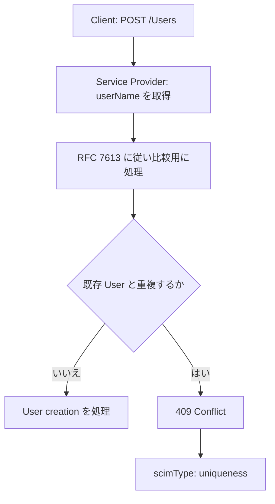

**記事タイプ:** Requirement  
**対象読者:** SCIM User resource の作成・更新と `userName` の検証を実装する Client / Service Provider の実装者  
**この記事で伝えること:** `userName` の必須性、一意性、case-insensitive な性質、比較前の文字列処理、および resource 作成時に重複した場合の HTTP 409 / `scimType: uniqueness` を仕様の要件として整理する  
**扱わないこと:** `externalId`、認証時の username 処理、filter 全般、任意の custom schema attribute の一意性設計、tenant の識別方法

## Article brief

- **Reader:** SCIM User resource の作成・更新と `userName` の検証を実装する Client / Service Provider の実装者
- **Question:** SCIM の `userName` は必須か、どの範囲で一意で、重複した User を作成しようとした場合に Service Provider は何を返すのか
- **Answer:** `userName` の REQUIRED / uniqueness / case-insensitive という属性特性、比較前に適用する RFC 7613 の PRECIS 処理、および作成時の uniqueness conflict の response を追える
- **Scope:** RFC 7643 §2.2, §4.1.1, §8.7.1、RFC 7644 §3.3, §3.12, §5, §7.8
- **Out of scope:** `externalId`、認証時の username 処理、filter 全般、custom schema の uniqueness 設計、tenant の識別方法
- **Primary sources:** RFC 7643 §2.2, §4.1.1, §8.7.1、RFC 7644 §3.3, §3.12, §5, §7.8、RFC 7613 §3–§4
- **Diagram:** Client が User creation request を送り、Service Provider が `userName` を比較用に処理して一意性を確認し、重複時に 409 Error を返す流れ

SCIM Core Schema の User resource では、`userName` は単なる表示用文字列ではなく、明示的な必須性と一意性を持つ属性です。本記事では、その制約と resource 作成時の重複エラーだけを扱います。

## 1. `userName` は User resource の REQUIRED attribute

RFC 7643 §4.1.1 は `userName` を User の一意な識別子として定義しています。各 User は空でない `userName` を含めなければなりません（**MUST**）。また、その値は Service Provider の User 全体で一意でなければなりません（**MUST**）。

RFC 7643 §8.7.1 の User schema representation では、`userName` の主要な attribute characteristic は次のとおりです。

- `type`: `string`
- `multiValued`: `false`
- `required`: `true`
- `caseExact`: `false`
- `mutability`: `readWrite`
- `returned`: `default`
- `uniqueness`: `server`

`caseExact: false` なので、`userName` は case-insensitive な属性です。

RFC 7643 §2.2 の一般的な `uniqueness: server` は、現在の SCIM endpoint または tenancy の文脈で値が一意であることを **SHOULD** と定義します。一方、User の `userName` については §4.1.1 がより具体的に、Service Provider の User 全体で一意であることを **MUST** と規定しています。

## 2. request body では User resource の JSON member に置く

次は配置と最小構造を示すための**非規範的な例**です。`illustrative-user` は illustrative value です。

```http
POST /Users HTTP/1.1
Host: scim.example
Content-Type: application/scim+json
Accept: application/scim+json

{
  "schemas": [
    "urn:ietf:params:scim:schemas:core:2.0:User"
  ],
  "userName": "illustrative-user"
}
```

`userName` は HTTP header や query parameter ではなく、User resource の JSON member です。この例では `schemas` が resource に適用される core User schema を示します。

## 3. 一意性を比較する前に PRECIS の処理を適用する

RFC 7644 §5 は、`userName` の一意性を比較・評価する前に、Service Provider が RFC 7613 §3 と §4 の internationalized string に対する preparation、enforcement、comparison rules を使用しなければならない（**MUST**）と規定しています。

RFC 7644 §7.8 も、username の uniqueness を検査するような Unicode string comparison では、比較前に文字列を適切に prepare しなければならない（**MUST**）としています。

したがって、SCIM の `userName` の一意性判定は、受信した Unicode code point sequence を無条件にそのまま比較する、という仕様ではありません。具体的な国際化文字列処理は RFC 7644 が参照する RFC 7613 の規則に従います。

## 4. User 作成時に重複した場合は 409 と `uniqueness`

RFC 7644 §3.3 は、作成しようとした resource が既存 resource と conflict すると Service Provider が判断した場合を規定しています。例として duplicate `userName` が明示されています。

この場合、Service Provider は HTTP status code `409 Conflict` と `scimType` error code `uniqueness` を返さなければなりません（**MUST**, RFC 7644 §3.3）。

次は response の配置を示す**非規範的な例**です。`detail` の文言は illustrative value です。

```http
HTTP/1.1 409 Conflict
Content-Type: application/scim+json

{
  "schemas": [
    "urn:ietf:params:scim:api:messages:2.0:Error"
  ],
  "scimType": "uniqueness",
  "detail": "The userName conflicts with an existing User.",
  "status": "409"
}
```

RFC 7644 §3.12 では、SCIM error response は `urn:ietf:params:scim:api:messages:2.0:Error` で識別されます。`status` は HTTP status code を JSON string として持つ REQUIRED attribute、`scimType` は OPTIONAL な SCIM detail error keyword、`detail` は OPTIONAL な human-readable message です。§3.3 の duplicate creation の場合は、その `scimType` として `uniqueness` を返すことが **MUST** です。

## 5. 処理の関係

次の図は、本記事で扱う User creation と `userName` uniqueness の関係だけを示します。



**The uniqueness check is a protocol-visible requirement, not merely a database implementation detail.**  
（一意性の確認は単なるデータベース実装上の詳細ではなく、プロトコル上観測可能な要件です。）

重複をどのデータ構造や database constraint で検出するかは RFC 7643 / RFC 7644 の規定対象ではありません。本記事ではその実装方式を選択しません。

## まとめ

SCIM User の `userName` は、RFC 7643 §4.1.1 により空でない値が **MUST** であり、Service Provider の User 全体で一意であることも **MUST** です。schema representation では `required: true`、`caseExact: false`、`uniqueness: server` と表現されます。

一意性の比較前には RFC 7644 §5 に従う internationalized string processing が必要です。User creation が duplicate `userName` と conflict する場合、RFC 7644 §3.3 により Service Provider は `409 Conflict` と `scimType: uniqueness` を返さなければなりません（**MUST**）。

## 一次資料

- RFC 7643, §2.2 Attribute Characteristics
- RFC 7643, §4.1.1 Singular Attributes (`userName`)
- RFC 7643, §8.7.1 Resource Schema Representation
- RFC 7644, §3.3 Creating Resources
- RFC 7644, §3.12 HTTP Status and Error Response Handling
- RFC 7644, §5 Preparation and Comparison of Internationalized Strings
- RFC 7644, §7.8 Case-Insensitive Comparison and International Languages
- RFC 7613, §3–§4
