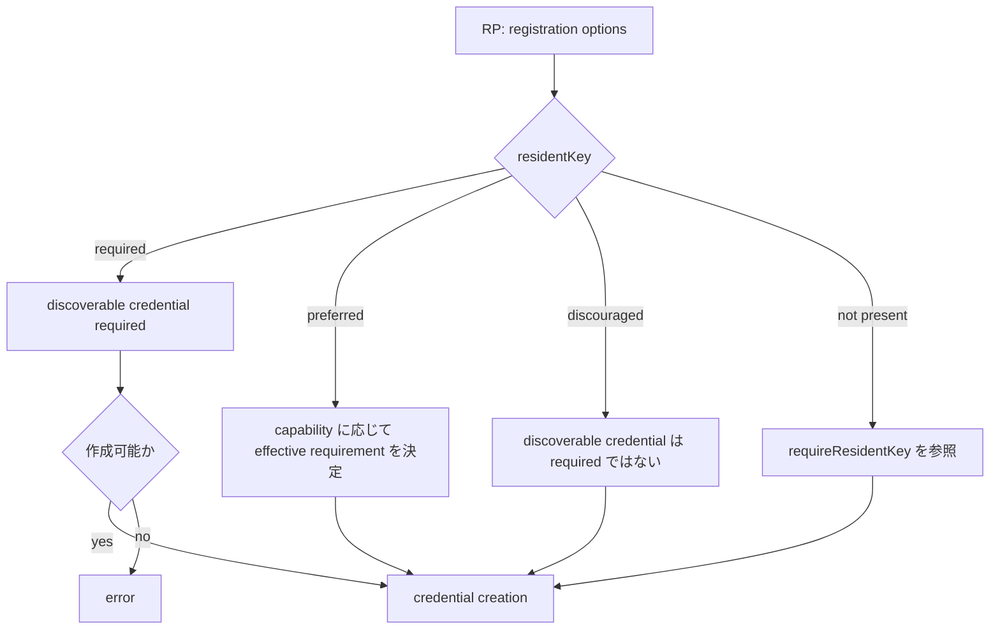

## この記事について

**記事タイプ:** Requirement  
**対象読者:** WebAuthn の registration options を生成し、discoverable credential の作成要件を実装・レビューする Relying Party（RP）の担当者  
**この記事で伝えること:** `authenticatorSelection.residentKey` の `discouraged` / `preferred` / `required` が credential creation に与える意味と、後方互換用 `requireResidentKey` との関係  
**扱わないこと:** authentication 時の `allowCredentials`、conditional mediation、user verification の要件、credential backup、passkey の同期方式、Authenticator の保存容量や製品固有の挙動

WebAuthn Level 3 では、client-side discoverable credential は、RP が credential ID を `allowCredentials` で与えない authentication ceremony でも discoverable かつ利用可能な public key credential source として定義されています（§4）。本記事は、その作成要件を registration options で指定する `residentKey` と、後方互換用の `requireResidentKey` に範囲を限定します。

**`residentKey` expresses how strongly the RP requires a discoverable credential to be created.**  
（`residentKey` は、discoverable credential の作成を RP がどの程度要求するかを表します。）

## Article brief

- **Reader:** WebAuthn registration options を生成する RP の実装・レビュー担当者
- **Question:** `residentKey` の3値は何を意味し、`requireResidentKey` とどう関係するのか
- **Answer:** 各値の credential creation semantics、`required` の失敗条件、`residentKey` 未指定時の effective value、`requireResidentKey` の後方互換上の位置付けを区別できる
- **Scope:** WebAuthn Level 3 §4、§5.4.4、§5.4.6、および credential creation algorithm の `residentKey` / `requireResidentKey` 処理
- **Out of scope:** authentication ceremony、conditional mediation、user verification、backup state、製品固有の storage policy
- **Primary sources:** W3C Web Authentication Level 3 §4、§5.4.4、§5.4.6、credential creation algorithm
- **Diagram:** registration options から effective resident-key requirement と credential creation の結果までを示す flowchart

## 1. `residentKey` を置く場所

`residentKey` は `PublicKeyCredentialCreationOptions` の直下ではなく、`authenticatorSelection` の member です。`AuthenticatorSelectionCriteria` は §5.4.4 で次の member を持つ dictionary として定義されています。

- `residentKey`: `DOMString`。RP が client-side discoverable credential の作成をどの程度求めるかを指定します。
- `requireResidentKey`: `boolean`、default は `false`。WebAuthn Level 1 との後方互換のために保持されています。

`residentKey` の値は `ResidentKeyRequirement` の member とすることが **SHOULD** です。Client platform は unknown value を、その member が存在しないものとして扱い、無視しなければなりません（**MUST**, §5.4.4）。

### 非規範的な配置例

次は `residentKey` の配置だけを確認するための非規範的な例です。文字列や byte sequence の JSON 表現は illustrative value です。

```json
{
  "publicKey": {
    "challenge": "aWxsdXN0cmF0aXZlLWNoYWxsZW5nZQ",
    "rp": {
      "name": "Illustrative RP"
    },
    "user": {
      "id": "aWxsdXN0cmF0aXZlLXVzZXI",
      "name": "illustrative-user",
      "displayName": "Illustrative User"
    },
    "pubKeyCredParams": [
      {
        "type": "public-key",
        "alg": -7
      }
    ],
    "authenticatorSelection": {
      "residentKey": "required",
      "requireResidentKey": true
    }
  }
}
```

この例の `publicKey` object は `navigator.credentials.create()` に渡す registration options の構造を示しています。Web IDL 上の `challenge` と `user.id` は `BufferSource` であり、ここでは JSON で位置を確認できるよう illustrative な文字列表現を使っています。

## 2. `discouraged` / `preferred` / `required`

`ResidentKeyRequirement` は §5.4.6 で3値を定義しています。

### `discouraged`

RP は server-side credential の作成を prefer しますが、client-side discoverable credential も受け入れます。Client と Authenticator は、可能なら server-side credential を作成することが **SHOULD** です（§5.4.6）。

`discouraged` は「discoverable credential の作成を禁止する」という意味ではありません。仕様は、RP が作成される credential を server-side credential に限定することはできないと説明しています。

### `preferred`

RP は client-side discoverable credential の作成を strongly prefer しますが、server-side credential も受け入れます。Client と Authenticator は、可能なら discoverable credential を作成することが **SHOULD** です（§5.4.6）。

credential creation algorithm では、`residentKey` が `preferred` の場合、Authenticator が client-side credential storage modality を備えていれば effective `requireResidentKey` は `true` になり、備えていない、または Client が capability を判定できなければ `false` になります。

### `required`

RP は client-side discoverable credential を要求します。作成できない場合、Client は error を返さなければなりません（**MUST**, §5.4.6）。

credential creation algorithm でも、`residentKey` が `required` で、候補 Authenticator が client-side discoverable public key credential source を保存できない場合、その Authenticator は候補から除外されます。利用可能な Authenticator がこの要件を満たさなければ `ConstraintError` となり得ます。

## 3. `residentKey` を省略した場合

§5.4.4 は `residentKey` が指定されない場合の effective value を `requireResidentKey` から決定します。

- `requireResidentKey` が `true` なら effective `residentKey` は `required`。
- `requireResidentKey` が `false` または省略されていれば effective `residentKey` は `discouraged`。

credential creation algorithm でも `residentKey` が存在しない場合、effective `requireResidentKey` は `requireResidentKey` member の値になります。

この関係により、Level 1 の `requireResidentKey` を使う registration options と、Level 3 の `residentKey` を使う options の両方について処理が定義されています。

## 4. `requireResidentKey` は後方互換用

§5.4.4 は `requireResidentKey` を WebAuthn Level 1 との backwards compatibility のために保持された member としています。

RP は `residentKey` を `required` に設定する場合に限って `requireResidentKey` を `true` にすることが **SHOULD** です（§5.4.4）。この規定は `requireResidentKey` と `residentKey` の対応を示すものであり、`preferred` や `discouraged` を `requireResidentKey=true` で表現するものではありません。

## 5. 処理関係

次の図は §5.4.4、§5.4.6 と credential creation algorithm の関係を簡略化したものです。図は仕様上の actor や処理だけを示します。



`preferred` と `discouraged` は、作成される credential の種類を RP が必ず決定できる値ではありません。§5.4.6 は、この2値では Authenticator が client-side discoverable credential と server-side credential のどちらを作成する場合もあると説明しています。

## 6. まとめ

`residentKey` は registration 時の `authenticatorSelection` に置かれ、discoverable credential の作成に対する RP の requirement を表します。`discouraged` は server-side credential を prefer し、`preferred` は discoverable credential を strongly prefer し、`required` は discoverable credential を要求します。`required` で作成できない場合、Client は error を返すことが **MUST** です（§5.4.6）。

`requireResidentKey` は Level 1 との後方互換用 member です。`residentKey` が省略された場合には effective value の決定に使われ、RP は `residentKey=required` の場合に限って `requireResidentKey=true` とすることが **SHOULD** です（§5.4.4）。

## Primary sources

- W3C, *Web Authentication: An API for accessing Public Key Credentials — Level 3*, §4 “Terminology”
- W3C, *Web Authentication: An API for accessing Public Key Credentials — Level 3*, §5.4.4 “Authenticator Selection Criteria”
- W3C, *Web Authentication: An API for accessing Public Key Credentials — Level 3*, §5.4.6 “Resident Key Requirement Enumeration”
- W3C, *Web Authentication: An API for accessing Public Key Credentials — Level 3*, credential creation algorithm (`residentKey` / `requireResidentKey` processing)
