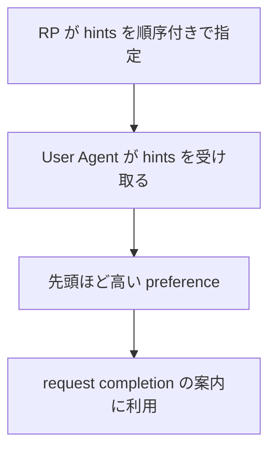

## この記事について

**記事タイプ:** Feature Deep Dive  
**対象読者:** WebAuthn の registration / authentication options を生成し、User Agent に認証器の利用方法に関するヒントを渡す RP の実装・レビュー担当者  
**この記事で伝えること:** `hints` の配置、`security-key` / `client-device` / `hybrid` の意味、複数 hint の順序、および `transports` / `authenticatorAttachment` との関係  
**扱わないこと:** 認証器を選択する UI の具体的な表示、製品固有の挙動、credential discovery の詳細、conditional mediation、attestation、user verification の要件

WebAuthn Level 3 は、Relying Party（RP）が request をどのような認証器の使い方で完了できそうかを User Agent に伝えるため、`hints` を定義しています。`hints` は要件ではなく、User Agent を拘束しません（§5.8.8）。

**Hints guide the user agent; they do not impose authenticator eligibility requirements.**  
（`hints` は User Agent を案内する情報であり、認証器の適格性要件を課すものではありません。）

## Article brief

- **Reader:** WebAuthn registration / authentication options を生成する RP の実装・レビュー担当者
- **Question:** `hints` はどこに置き、各値と順序は何を意味し、`transports` や `authenticatorAttachment` とどう関係するのか
- **Answer:** `hints` の配置と3つの定義済み値、優先順序、重複時の扱い、`transports` / `authenticatorAttachment` と矛盾した場合の仕様上の関係を区別できる
- **Scope:** WebAuthn Level 3 §5.4.2、§5.5、§5.8.8
- **Out of scope:** User Agent の具体的 UI、credential eligibility の全条件、conditional mediation、製品固有の UX
- **Primary sources:** W3C Web Authentication Level 3 §5.4.2、§5.5、§5.8.8
- **Diagram:** RP が指定した `hints` の順序と、User Agent が request completion の案内に利用する関係を示す flowchart

## 1. `hints` を置く場所

`hints` は registration と authentication の両方で使用できます。

- registration では `PublicKeyCredentialCreationOptions.hints` に置きます（§5.4.2）。
- authentication では `PublicKeyCredentialRequestOptions.hints` に置きます（§5.5）。
- 型はいずれも `sequence<DOMString>` で、default は空の sequence `[]` です。
- 各要素は `PublicKeyCredentialHint` で定義された値を使用します（§5.8.8）。

### 非規範的な registration 例

次は `hints` の配置を確認するための非規範的な最小例です。文字列や byte sequence の JSON 表現は illustrative value です。

```json
{
  "publicKey": {
    "challenge": "aWxsdXN0cmF0aXZlLWNoYWxsZW5nZQ",
    "rp": {
      "name": "Illustrative RP"
    },
    "user": {
      "id": "aWxsdXN0cmF0aXZlLXVzZXI",
      "name": "illustrative-user",
      "displayName": "Illustrative User"
    },
    "pubKeyCredParams": [
      {
        "type": "public-key",
        "alg": -7
      }
    ],
    "hints": [
      "security-key",
      "hybrid"
    ]
  }
}
```

### 非規範的な authentication 例

`hints` は `navigator.credentials.get()` に渡す `publicKey` object にも配置できます。

```json
{
  "publicKey": {
    "challenge": "aWxsdXN0cmF0aXZlLWNoYWxsZW5nZQ",
    "hints": [
      "client-device"
    ]
  }
}
```

これらの例は API option の構造を示すものであり、特定の認証器や UI が選択されることを意味しません。

## 2. 定義済みの3つの hint

WebAuthn Level 3 §5.8.8 の `PublicKeyCredentialHint` は、次の3値を定義しています。

### `security-key`

RP が、物理 security key を使って request を完了すると考えていることを示します。

registration の `PublicKeyCredentialCreationOptions` でこの hint を使用する場合、古い User Agent との互換性のため、`authenticatorAttachment` を `cross-platform` に設定することが **SHOULD** とされています（§5.8.8）。

### `client-device`

RP が、client device に接続された platform authenticator を使って request を完了すると考えていることを示します。

registration でこの hint を使用する場合、古い User Agent との互換性のため、`authenticatorAttachment` を `platform` に設定することが **SHOULD** とされています（§5.8.8）。

### `hybrid`

RP が、smartphone などの general-purpose authenticator を使って request を完了すると考えていることを示します。仕様は、この値について local platform authenticator を UI で promote しないことも示しています（§5.8.8）。

registration でこの hint を使用する場合、古い User Agent との互換性のため、`authenticatorAttachment` を `cross-platform` に設定することが **SHOULD** とされています（§5.8.8）。

## 3. 複数の hint は順序を持つ

`hints` は順序付きです。WebAuthn Level 3 §5.8.8 は、複数の hint を decreasing preference、つまり優先度の高いものから順に指定すると定義しています。

2つの hint が矛盾する場合は、先に置かれた hint が優先されます。同じ hint が複数回現れた場合、2回目以降は無視されます。

また、より具体的な hint と、それを認識しない User Agent 向けのより一般的な hint を併記できます。この場合、仕様はより具体的な hint を先に置くべきであると説明しています（§5.8.8）。



この図は `hints` の情報の流れを示しています。`hints` 自体が User Agent を拘束するわけではありません。

## 4. `transports` / `authenticatorAttachment` と矛盾する場合

WebAuthn Level 3 §5.8.8 は、`hints` が credential の `transports` や `authenticatorAttachment` の情報と矛盾してもよいことを **MAY** としています。その場合、`hints` が優先されます。

仕様はあわせて、discoverable credential を使用するときには `transports` の値が提供されないため、その種の request の一部の側面を表す手段として `hints` が使われることを説明しています。

ここでいう優先は User Agent に対する hint 情報の関係です。§5.8.8 が明記するように、`hints` は requirement ではなく User Agent を拘束しません。

## 5. `hints` と認証器の要件を分けて読む

`PublicKeyCredentialCreationOptions.authenticatorSelection` は、registration に参加する authenticator が満たすべき capability や setting を RP が指定するための member です（§5.4.2）。一方、`hints` は User Agent がユーザーとの interaction を組み立てるための情報です。

したがって、仕様上は次の2点を分けて扱います。

- `hints`: request をどのように完了できそうかを User Agent に伝える。User Agent を拘束しない。
- `authenticatorSelection`: registration に参加する authenticator の capability / setting に関する指定を保持する。

`hints` の値から、仕様にない認証器の適格性条件や security property を導くことはできません。

## まとめ

WebAuthn Level 3 の `hints` は、registration と authentication の双方で RP から User Agent に渡せる順序付きの情報です。定義済みの値は `security-key`、`client-device`、`hybrid` の3つです。

複数の hint は優先度の高い順に並び、矛盾する場合は先の値が優先されます。`hints` は `transports` や `authenticatorAttachment` と矛盾することが **MAY** で、その場合は `hints` が優先されます。ただし、`hints` は requirement ではなく、User Agent を拘束しません（WebAuthn Level 3 §5.8.8）。

## Primary sources

- W3C, *Web Authentication: An API for accessing Public Key Credentials Level 3*, §5.4.2 PublicKeyCredentialCreationOptions
- W3C, *Web Authentication: An API for accessing Public Key Credentials Level 3*, §5.5 PublicKeyCredentialRequestOptions
- W3C, *Web Authentication: An API for accessing Public Key Credentials Level 3*, §5.8.8 User-agent Hints Enumeration
