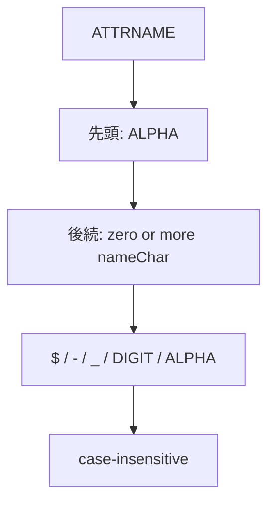

- **記事タイプ**: Requirement
- **対象読者**: SCIM schema の attribute 名を定義・実装し、使用できる文字と大文字・小文字の扱いを仕様本文から確認したい読者
- **この記事で伝えること**: RFC 7643 §2.1 が定める attribute name の ABNF、先頭文字と後続文字の制約、および attribute name が case-insensitive であること
- **扱わないこと**: attribute value の `caseExact`、filter の比較規則、attribute path 全体の構文、schema URI、JSON member name 一般の仕様、個別 Core schema attribute の意味

## Article brief

**Reader**: SCIM schema の attribute 名を定義・実装し、使用できる文字と大文字・小文字の扱いを確認したい読者。

**Question**: SCIM attribute name にはどの文字を使用でき、大文字・小文字は区別されるのか。

**Answer**: RFC 7643 §2.1 は attribute name を `ATTRNAME = ALPHA *(nameChar)`、`nameChar = "$" / "-" / "_" / DIGIT / ALPHA` と定義している。したがって先頭は `ALPHA` で、後続には `$`、`-`、`_`、`DIGIT`、`ALPHA` を使用できる。また、attribute name は case-insensitive であり、この ABNF で定義される文字列は US-ASCII を文字集合とする。

**Scope**: RFC 7643 §2.1 の attribute name の ABNF、case-insensitive の扱い、US-ASCII character set、および attribute name に hyphen を使う場合について仕様が記載する実装上の注記。

**Out of scope**: attribute value の case sensitivity、`caseExact`、filter comparison、RFC 7644 の attribute path / filter grammar、schema URI、JSON member name 一般の仕様、個別 attribute の semantics。

**Primary sources**: RFC 7643 §2.1、RFC 5234 Appendix B.1。

**Diagram**: `ATTRNAME` の先頭文字と後続文字の構成を縦方向に示す `flowchart TD`。

## attribute name は ABNF で定義される

RFC 7643 §2.1 は SCIM attribute name に次の ABNF を定義しています。

```text
ATTRNAME = ALPHA *(nameChar)
nameChar = "$" / "-" / "_" / DIGIT / ALPHA
```

`ALPHA` と `DIGIT` は RFC 5234 Appendix B.1 の Core Rules です。`ATTRNAME` の先頭は `ALPHA` であり、その後には zero or more の `nameChar` が続きます。

**The first character of a SCIM attribute name is constrained more narrowly than the characters that may follow it.**  
（SCIM attribute name の先頭文字は、後続に使用できる文字より狭く制約されています。）

この ABNF から、先頭には `$`、`-`、`_`、数字を置けません。一方、2文字目以降では `$`、`-`、`_`、数字、英字を使用できます。

## case-insensitive として扱う

RFC 7643 §2.1 は attribute names を case insensitive としています。また、同 section は、別途指定されない限り、この仕様の ABNF strings は case insensitive で、character set は US-ASCII であると定めています。

したがって、この attribute-name grammar における大文字・小文字の違いは attribute name を区別する基準ではありません。RFC 7643 は attribute name がしばしば camel case で記述されることも説明していますが、camel case を構文上の必須形式にはしていません。

ここで扱うのは attribute **name** の case sensitivity です。attribute **value** の case sensitivity を表す `caseExact` characteristic は別の規則であり、この記事の Scope には含めません。

## 構造を非規範的な例で確認する

次は attribute name の配置だけを確認するための**非規範的な例**です。`example_2` は説明用の attribute name であり、RFC 7643 が定義する Core attribute ではありません。

Schema resource の attribute definition では、attribute name は `name` member の JSON string value として現れます。

```json
{
  "name": "example_2",
  "type": "string",
  "multiValued": false
}
```

resource representation では、定義された attribute name が JSON object の member name として現れます。次の値も説明用です。

```json
{
  "example_2": "Illustrative Value"
}
```

`example_2` は先頭が `ALPHA` で、後続の `_` と `DIGIT` は `nameChar` に含まれるため、RFC 7643 §2.1 の `ATTRNAME` grammar に適合します。

対して、次の文字列は attribute name の反例です。

```text
_example
2example
-example
$example
```

いずれも先頭文字が `ALPHA` ではないため、RFC 7643 §2.1 の `ATTRNAME` grammar に適合しません。

## hyphen に関する仕様上の注記

`-` は `nameChar` に含まれるため、2文字目以降では SCIM attribute name に使用できます。

RFC 7643 §2.1 は、hyphen が JavaScript の attribute name や一部の言語の attribute name では許可されず、対応する JavaScript attribute を宣言するときに escape が必要になる場合がある、と注記しています。一方、同 section は HTTP protocol と JSON notation について既知の問題はないとしています。

この記事では、この注記から特定の命名方式を推奨しません。

## attribute name の構成



この図は RFC 7643 §2.1 の grammar と case-insensitive の規則を整理したものであり、仕様にない actor や処理を追加していません。

## まとめ

RFC 7643 §2.1 から確認できる範囲は次のとおりです。

- attribute name は `ATTRNAME = ALPHA *(nameChar)` に適合しなければならない（**MUST**、RFC 7643 §2.1）。
- `nameChar` は `$`、`-`、`_`、`DIGIT`、`ALPHA`。
- attribute name は case-insensitive。
- 別途指定されない限り、この仕様の ABNF strings は case-insensitive で、character set は US-ASCII。
- hyphen は grammar 上は後続文字として使用できるが、RFC 7643 §2.1 は一部のプログラミング言語での扱いについて実装上の注記を置いている。

attribute value の `caseExact`、filter comparison、attribute path の grammar は、この attribute name の構文とは分離して扱います。

## Primary sources

- RFC 7643, §2.1 "Attributes": https://www.rfc-editor.org/rfc/rfc7643.html#section-2.1
- RFC 5234, Appendix B.1 "Core Rules": https://www.rfc-editor.org/rfc/rfc5234.html#appendix-B.1
