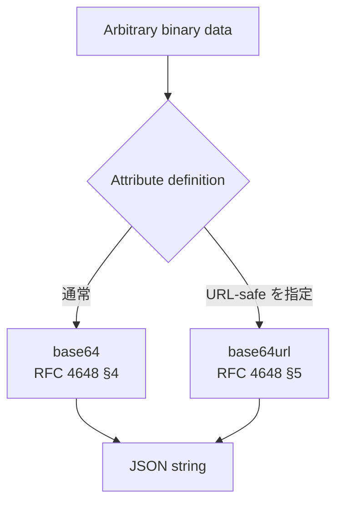

<!--
Article brief
- Type: Requirement
- Reader: SCIM 2.0 の schema と resource representation を実装またはレビューする Client / Service Provider 開発者
- Question: SCIM の binary attribute は JSON でどのように表現し、base64 / base64url と padding をどう扱うのか
- Answer: binary は Schema definition では type="binary" とされ、resource representation では base64 encoded JSON string であり、attribute definition が URL-safe encoding を指定する場合は base64url を使用でき、特段の指定がなければ trailing padding は省略できると理解できる
- Scope: RFC 7643 §2.3, §2.3.6 と RFC 4648 §4, §5 に基づく binary data type、JSON string representation、base64、base64url、trailing padding、caseExact と uniqueness
- Out of scope: binary attribute を使う個別 schema の設計、ファイル転送方式、MIME type、圧縮、暗号化、署名、base64 decoder の一般的な security practice
- Primary sources: RFC 7643 §2.3, §2.3.6; RFC 4648 §4, §5
- Diagram: arbitrary binary data から base64 / attribute definition が指定する base64url を経て JSON string になる関係を示す flowchart
-->

## この記事について

**記事タイプ:** Requirement  
**対象読者:** SCIM 2.0 の schema と resource representation を実装またはレビューする Client / Service Provider 開発者  
**この記事で伝えること:** `binary` attribute の JSON representation と、base64 / base64url、trailing padding に関する仕様上の要件  
**扱わないこと:** binary attribute を使う個別 schema の設計、ファイル転送方式、MIME type、圧縮、暗号化、署名、base64 decoder の一般的な security practice

SCIM の `binary` data type は、JSON に raw binary を直接配置する型ではありません。RFC 7643 は arbitrary binary data を base64 で encode し、その encoded value を JSON string として表現する方法を定義しています。

**A SCIM `binary` value is encoded binary data carried as a JSON string; it is not a JSON byte-array type.**  
（SCIM の `binary` 値は、encode された binary data を JSON string として運ぶものであり、JSON の byte-array 型ではありません。）

## 1. binary の JSON representation は string

RFC 7643 §2.3 の data type mapping では、SCIM data type `Binary` の Schema `type` は `binary` です。underlying JSON representation は、RFC 4648 §4 の base64、または RFC 4648 §5 の URL and filename safe alphabet によって encode された値を JSON string として表します。

以下は配置と構造を確認するための**非規範的な最小例**です。attribute 名と値は illustrative value です。

```json
{
  "attributes": [
    {
      "name": "illustrativeBinary",
      "type": "binary",
      "multiValued": false
    }
  ]
}
```

`type` は Schema definition の JSON member です。resource representation では、binary value 自体を JSON string に置きます。

```json
{
  "illustrativeBinary": "Zm9v"
}
```

この例の `Zm9v` は、RFC 4648 §4 の test vector で示される octet sequence `foo` の base64 representation です。例は SCIM attribute の配置を示すための非規範的なものです。

## 2. 通常の binary value は base64 encoded でなければならない

RFC 7643 §2.3.6 は `binary` を arbitrary binary data と定義し、attribute value は RFC 4648 §4 に従って base64 encode されなければならないと規定しています（**MUST**、RFC 7643 §2.3.6）。

RFC 4648 §4 の base64 は、arbitrary sequence of octets を printable characters で表現する encoding です。SCIM では、その encoded result を JSON string に格納します。

したがって、SCIM の resource representation で `binary` attribute に JSON array や JSON object を配置する、という data type mapping ではありません。RFC 7643 §2.3 は `binary` の JSON representation を string と定義しています。

## 3. base64url は attribute definition が指定できる

RFC 7643 §2.3.6 は、URL-safe encoding が必要な場合、attribute definition が RFC 4648 §5 の base64 URL encoding を使用するよう指定できるとしています（**MAY**、RFC 7643 §2.3.6）。

ここで重要なのは、`binary` であれば常に base64url を使うという規則ではないことです。RFC 7643 §2.3.6 が base64url を認めている条件は、URL-safe encoding が必要であり、attribute definition がそれを指定する場合です。

RFC 4648 §5 はこの encoding を `base64url` と呼び、通常の base64 と同一視しないよう説明しています。両者では alphabet の 62 番目と 63 番目の文字が異なります。

以下は、base64url を要求する attribute definition が別途存在すると仮定した場合の**非規範的な構造例**です。値は illustrative value です。

```json
{
  "illustrativeBinary": "_-4"
}
```

この例は JSON member の配置を示すためのものであり、特定の SCIM core attribute を定義するものではありません。

## 4. trailing padding は省略できる

RFC 7643 §2.3.6 は、attribute definition に別の指定がない限り、末尾の padding character `=` を省略できると規定しています（**MAY**、RFC 7643 §2.3.6）。

RFC 4648 §4 の通常の base64 では、入力長によって末尾に `=` padding が現れます。一方、SCIM の `binary` data type には、RFC 7643 §2.3.6 による上記の padding omission rule があります。

たとえば RFC 4648 §4 の test vector では `f` の base64 representation は `Zg==` です。SCIM では、attribute definition に別の指定がなければ trailing padding を省略できるため、同じ binary data について padding を省いた JSON string を使用することも §2.3.6 が認める範囲に含まれます。

```json
{
  "illustrativeBinary": "Zg"
}
```

この例は**非規範的**です。値は padding omission の位置を確認するための illustrative value です。

## 5. binary は case exact で、uniqueness はない

RFC 7643 §2.3.6 は、`binary` data type について case exact であり、uniqueness はないと定義しています。

これは `binary` data type 自体の性質です。本記事では、個別 schema が binary attribute をどの目的で利用するか、あるいは application が binary content をどのように比較・保存するかという実装方針には踏み込みません。

## 6. binary data から JSON string までの関係



この図は RFC 7643 §2.3.6 の data representation の関係だけを示しています。encoding を security mechanism として扱う意味はありません。

## 7. まとめ

SCIM の `binary` data type について、RFC 7643 §2.3 と §2.3.6 から確認できる要点は次のとおりです。

- Schema `type` は `binary` で、resource representation の JSON type は string です（RFC 7643 §2.3）。
- binary value は RFC 4648 §4 に従って base64 encode されなければなりません（**MUST**、RFC 7643 §2.3.6）。
- URL-safe encoding が必要な場合、attribute definition は RFC 4648 §5 の base64url を指定できます（**MAY**、RFC 7643 §2.3.6）。
- attribute definition に別の指定がなければ、trailing padding character は省略できます（**MAY**、RFC 7643 §2.3.6）。
- JSON representation では encoded value を string として表現します（RFC 7643 §2.3.6）。
- `binary` は case exact で、uniqueness はありません（RFC 7643 §2.3.6）。

**The encoding rule belongs to the SCIM data type definition, while the choice of base64url is made only when the attribute definition specifies that URL-safe form.**  
（encoding の基本規則は SCIM data type の定義に属し、base64url の選択は attribute definition が URL-safe form を指定する場合に限って行われます。）

## Primary sources

- RFC 7643, §2.3 “Attribute Data Types”
- RFC 7643, §2.3.6 “Binary”
- RFC 4648, §4 “Base 64 Encoding”
- RFC 4648, §5 “Base 64 Encoding with URL and Filename Safe Alphabet”
