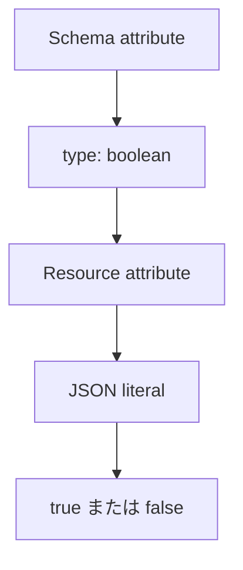

- **記事タイプ**: Requirement
- **対象読者**: SCIM schema を定義・実装し、`boolean` attribute の JSON 表現を仕様本文から確認したい読者
- **この記事で伝えること**: SCIM の `boolean` が JSON でどのように表現され、RFC 7643 が値について何を定義しているか
- **扱わないこと**: `string`、`integer`、真偽値を文字列として扱う実装、個別 schema の Boolean attribute の意味、filter の比較規則

## Article brief

**Reader**: SCIM schema を定義・実装し、`boolean` attribute の JSON 表現を確認したい読者。

**Question**: `type: "boolean"` の attribute は resource representation でどのような JSON value になり、使用できる literal は何か。

**Answer**: RFC 7643 §2.3.2 は Boolean を literal `true` または `false` と定義し、RFC 7643 §2.3 の Table 1 は underlying JSON type を RFC 7159 §3 の Value に対応付けている。Boolean には case sensitivity と uniqueness はない。

**Scope**: RFC 7643 §2.3 と §2.3.2 における Boolean data type と JSON representation。

**Out of scope**: `string`、`integer`、文字列 `"true"` / `"false"` を受理する実装上の挙動、個別 schema の Boolean attribute の意味、filter comparison。

**Primary sources**: RFC 7643 §2.3, §2.3.2。

**Diagram**: Schema definition の `type: "boolean"` と resource representation の JSON literal `true` / `false` の対応を示す `flowchart TD`。

## `boolean` は `true` または `false` で表現する

RFC 7643 §2.3.2 は Boolean を literal `true` または `false` と定義しています。JSON format については RFC 7159 §3 を参照しています。

RFC 7643 §2.3 の Table 1 では、SCIM data type `Boolean` の schema `type` は `"boolean"`、underlying JSON type は RFC 7159 §3 の Value とされています。

次は配置と構造を示す**非規範的な例**です。attribute 名 `exampleBoolean` と値は説明用です。

```json
{
  "name": "exampleBoolean",
  "type": "boolean",
  "multiValued": false
}
```

対応する resource value の例は次の形です。

```json
{
  "exampleBoolean": true
}
```

`true` は引用符で囲まれていません。SCIM Boolean の値として RFC 7643 §2.3.2 が挙げている literal です。

## JSON string とは異なる

次の例では値が引用符で囲まれているため JSON string です。

```json
{
  "exampleBoolean": "true"
}
```

これは `type: "boolean"` の resource value を示す例ではありません。RFC 7643 §2.3.2 が Boolean として定義する literal は `true` または `false` です。

この記事では、Service Provider が型の異なる値を受信した場合の処理を独自に定義しません。

## case sensitivity と uniqueness はない

RFC 7643 §2.3.2 は、Boolean には case sensitivity または uniqueness がないと定義しています。

この記述から、個別 attribute の業務上の意味や、`true` と `false` のどちらを使用すべきかという判断は導きません。たとえば User の `active` には別途 attribute 固有の定義がありますが、その意味はこの記事の Scope 外です。

## Schema definition と resource value の対応



A Boolean value is a JSON literal, not a quoted string.  
（Boolean value は JSON literal であり、引用符で囲まれた string ではありません。）

Schema resource の `type: "boolean"` は attribute definition に置かれます。実際の resource representation では、その attribute の値として `true` または `false` が現れます。

## まとめ

RFC 7643 §2.3 と §2.3.2 から確認できる範囲は次のとおりです。

- SCIM schema type は `boolean`。
- Boolean の literal は `true` または `false`。
- JSON format は RFC 7159 §3 を参照する。
- Boolean には case sensitivity と uniqueness はない。

個別 attribute における `true` / `false` の意味や、型が異なる入力を受けた場合の実装上の処理は、この data type の定義から追加要件として導きません。

## Primary sources

- RFC 7643, §2.3 "Attribute Data Types": https://www.rfc-editor.org/rfc/rfc7643.html#section-2.3
- RFC 7643, §2.3.2 "Boolean": https://www.rfc-editor.org/rfc/rfc7643.html#section-2.3.2
