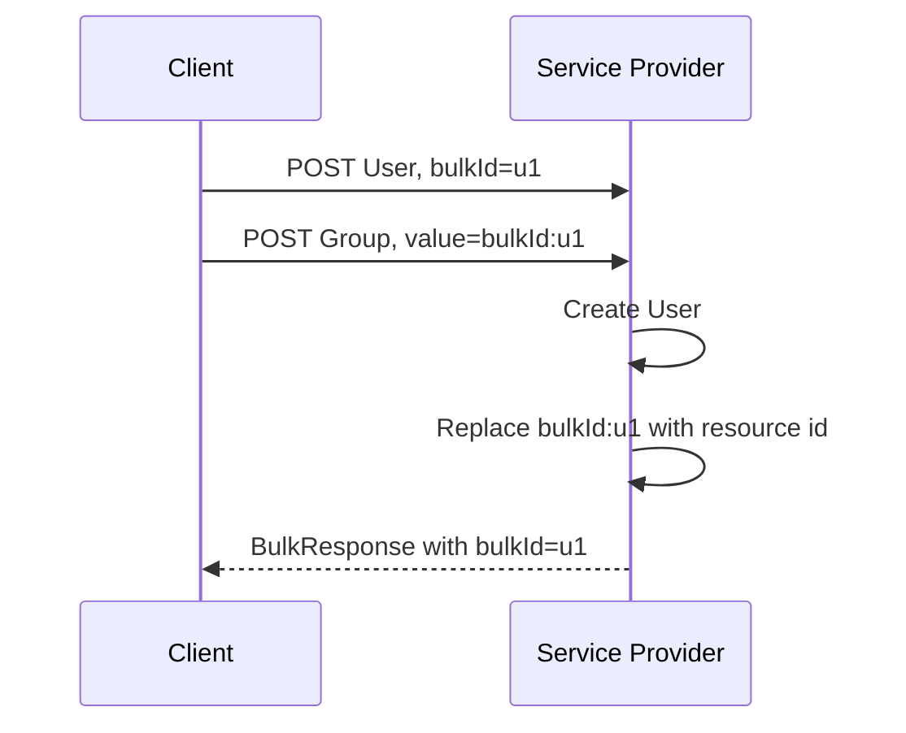

<!--
Article brief
- Type: Feature Deep Dive
- Reader: SCIM 2.0 の Bulk operation で複数 resource の作成と相互参照を実装・レビューする Client / Service Provider 開発者
- Question: 同一 Bulk request 内でまだ permanent resource id を持たない resource を、後続 operation からどう参照するか
- Answer: bulkId の配置、bulkId: prefix を使う参照形式、Service Provider による permanent resource id への置換、および Bulk response での対応付けを追える
- Scope: RFC 7644 §3.7, §3.7.2 に基づく Bulk request 内の bulkId temporary identifier
- Out of scope: Bulk 全般の error handling、failOnErrors、circular reference processing の詳細、maxOperations / maxPayloadSize、個別 deployment の transaction semantics
- Primary sources: RFC 7644 §3.7, §3.7.2
- Diagram: Client が bulkId を付けた POST operation を送り、後続 operation が bulkId:... で参照し、Service Provider が permanent resource id に置換する流れを示す sequenceDiagram
-->

## この記事について

**記事タイプ:** Feature Deep Dive  
**対象読者:** SCIM 2.0 の Bulk operation で複数 resource の作成と相互参照を実装・レビューする Client / Service Provider 開発者  
**この記事で伝えること:** `bulkId` temporary identifier の配置、`bulkId:` prefix による参照、permanent resource id への置換、Bulk response での対応付け  
**扱わないこと:** Bulk 全般の error handling、`failOnErrors`、circular reference processing の詳細、`maxOperations` / `maxPayloadSize`、個別 deployment の transaction semantics

SCIM Bulk operation では、同じ Bulk request の中で resource を作成し、その resource を別の operation から参照できます。作成前には Service Provider が割り当てる permanent resource `id` がまだ存在しないため、RFC 7644 §3.7.2 は Client が定義する surrogate identifier として `bulkId` を定義しています。

**`bulkId` is a temporary identifier for references inside a bulk operation; it is not the permanent SCIM resource `id`.**  
（`bulkId` は Bulk operation 内で参照するための一時的な識別子であり、SCIM resource の permanent `id` ではありません。）

## 1. bulkId は POST operation に置かれる

RFC 7644 §3.7 は、新しく作成する resource を参照できるようにするため、new resource を作成する POST operation に `bulkId` attribute を指定することを **MAY** としています。`bulkId` は Client が定義します。

次は配置だけを示す**非規範的な最小例**です。値は illustrative value です。

```http
POST /Bulk HTTP/1.1
Content-Type: application/scim+json

{
  "schemas": [
    "urn:ietf:params:scim:api:messages:2.0:BulkRequest"
  ],
  "Operations": [
    {
      "method": "POST",
      "path": "/Users",
      "bulkId": "illustrative-user",
      "data": {
        "schemas": [
          "urn:ietf:params:scim:schemas:core:2.0:User"
        ],
        "userName": "illustrative-user-name"
      }
    }
  ]
}
```

HTTP method は `POST`、request body の Content-Type は `application/scim+json` です。`bulkId` は BulkRequest の `Operations` array にある個々の operation object の member です。

## 2. 参照時は bulkId: を先頭に付ける

RFC 7644 §3.7.2 では、Bulk request 内で surrogate id を参照するとき、その値の先頭に literal `bulkId:` を付けることを要求しています。仕様の例では `bulkId` が `qwerty` なら、参照値は `bulkId:qwerty` です。

次は User を作成し、その User を新しい Group の member として参照する**非規範的な例**です。

```json
{
  "schemas": [
    "urn:ietf:params:scim:api:messages:2.0:BulkRequest"
  ],
  "Operations": [
    {
      "method": "POST",
      "path": "/Users",
      "bulkId": "illustrative-user",
      "data": {
        "schemas": [
          "urn:ietf:params:scim:schemas:core:2.0:User"
        ],
        "userName": "illustrative-user-name"
      }
    },
    {
      "method": "POST",
      "path": "/Groups",
      "bulkId": "illustrative-group",
      "data": {
        "schemas": [
          "urn:ietf:params:scim:schemas:core:2.0:Group"
        ],
        "displayName": "Illustrative Group",
        "members": [
          {
            "value": "bulkId:illustrative-user"
          }
        ]
      }
    }
  ]
}
```

ここで `bulkId` は operation object の member、`bulkId:illustrative-user` は Group resource の `members[].value` に置かれた参照値です。両者は同じ JSON member ではありません。

## 3. Service Provider は permanent resource id に置換する

RFC 7644 §3.7.2 は、resource が作成された後、Service Provider が `bulkId:...` という文字列を permanent resource id に置き換えることを **MUST** としています。

**The service provider MUST replace a `bulkId:` reference with the permanent resource id once the resource is created.**  
（resource が作成された後、Service Provider は `bulkId:` 参照を permanent resource id に置き換えなければなりません。）

この規定により、前節の Group member は保存後の resource representation では作成された User の permanent `id` を参照できます。この記事では permanent `id` の生成方式や transaction semantics は扱いません。

## 4. 作成 operation ごとに異なる bulkId を使う

RFC 7644 §3.7.2 は、複数の distinct request を作成し、それぞれに `bulkId` を持たせる場合、Client が各 request に異なる `bulkId` value を指定すると説明しています。

同 section の例では User 作成 operation と Group 作成 operation がそれぞれ別の `bulkId` を持ち、Group 作成 operation が User 側の `bulkId` を参照します。

## 5. Bulk response は同じ bulkId を返す

RFC 7644 §3.7 は、new resource を作成する POST operation で `bulkId` が指定された場合、Service Provider が newly created resource とともに同じ `bulkId` を返すことを **MUST** としています。Client はこれにより、Client が定義した temporary identifier と Service Provider が作成した resource を対応付けられます。

次は response 内での配置を示す**非規範的な最小例**です。

```http
HTTP/1.1 200 OK
Content-Type: application/scim+json

{
  "schemas": [
    "urn:ietf:params:scim:api:messages:2.0:BulkResponse"
  ],
  "Operations": [
    {
      "method": "POST",
      "bulkId": "illustrative-user",
      "location": "/Users/illustrative-permanent-id",
      "status": {
        "code": "201"
      }
    }
  ]
}
```

`illustrative-permanent-id` は配置を示す illustrative value であり、identifier の生成規則を表していません。

## 6. 処理の流れ



この図は RFC 7644 §3.7 と §3.7.2 で定義される actor と処理だけを示しています。Bulk request は1つの HTTP request ですが、図では `Operations` 内の2つの operation を読みやすく分けて表現しています。

## まとめ

`bulkId` は、同一 Bulk request 内でまだ permanent resource `id` を持たない resource を参照するための Client-defined surrogate identifier です。new resource を作成する POST operation に `bulkId` を指定することは **MAY** です（RFC 7644 §3.7）。

参照値では `bulkId:` prefix を使用します。resource 作成後、Service Provider はその参照を permanent resource id に置換することが **MUST** です（RFC 7644 §3.7.2）。また、POST operation に `bulkId` が指定された場合、Service Provider は同じ `bulkId` を newly created resource とともに返すことが **MUST** です（RFC 7644 §3.7）。

## Primary sources

- RFC 7644, §3.7 Bulk Operations
- RFC 7644, §3.7.2 `bulkId` Temporary Identifiers
