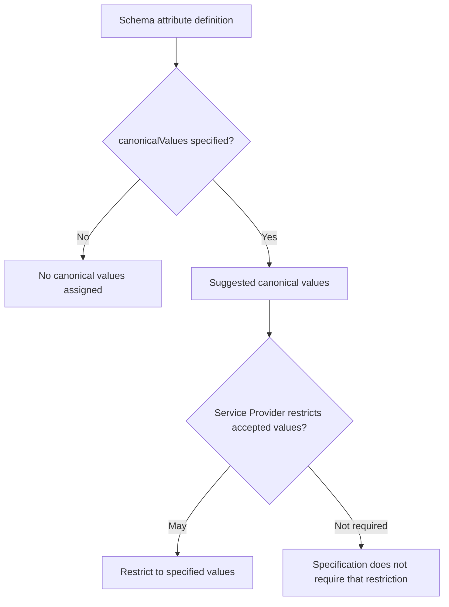

<!--
Article brief
- Type: Requirement
- Reader: SCIM 2.0 の schema を定義・実装・レビューする Client / Service Provider 開発者
- Question: canonicalValues は許可値の固定リストなのか、それとも推奨値なのか。Service Provider はそれ以外の値を受理する必要があるのか
- Answer: canonicalValues は suggested canonical values の集合であり OPTIONAL であること、指定された場合でも Service Provider は受理値をその集合に制限してもよい（MAY）ことを区別できる
- Scope: RFC 7643 §2.2, §2.3, §2.4, §7, §8.7.1 に基づく canonicalValues characteristic の意味、既定状態、Schema resource 上の構造、受理値制限の規範強度
- Out of scope: caseExact、uniqueness、filter evaluation、個別 attribute の業務上の語彙設計、Service Provider 固有 schema の設計方針
- Primary sources: RFC 7643 §2.2, §2.3, §2.4, §7, §8.7.1
- Diagram: schema に canonicalValues がある場合でも、値が集合外であることだけから一律の拒否を導けず、Service Provider が受理値を制限する場合としない場合があることを示す flowchart
-->

## この記事について

**記事タイプ:** Requirement  
**対象読者:** SCIM 2.0 の schema を定義・実装・レビューする Client / Service Provider 開発者  
**この記事で伝えること:** `canonicalValues` が「推奨される canonical value の集合」であり、列挙された値だけを常に許可する固定 enum ではないこと  
**扱わないこと:** `caseExact`、`uniqueness`、filter evaluation、個別 attribute の業務上の語彙設計、Service Provider 固有 schema の設計方針

SCIM schema の `canonicalValues` は、attribute に対して使用できる canonical value の候補を表す characteristic です。ただし、RFC 7643 が定義する規範強度を読むと、「列挙値以外を常に拒否する」という意味にはなりません。

**`canonicalValues` is a set of suggested canonical values, not an unconditional closed enumeration.**  
（`canonicalValues` は推奨される canonical value の集合であり、無条件に閉じた列挙型を意味するものではありません。）

この記事では `canonicalValues` 自体の意味と、Service Provider が受理値を制限できる範囲に限定します。

## 1. canonicalValues は attribute characteristic

RFC 7643 §2.2 は `canonicalValues` を SCIM attribute characteristic の1つとして挙げています。同 section では、別途指定されない場合は canonical value は割り当てられていないことが既定状態です。

RFC 7643 §7 は `canonicalValues` を、使用してもよい suggested canonical values の collection と定義し、この characteristic 自体を **OPTIONAL** としています。

したがって、schema に `canonicalValues` が存在しないことだけから、その attribute が無効である、あるいは値を受理できない、とは導けません。

## 2. Schema resource では string の multi-valued member

RFC 7643 §8.7.1 の Schema resource representation では、`canonicalValues` は attribute definition 内の JSON member として表されます。その schema definition 上の型は `string`、`multiValued` は `true` です。

以下は配置と構造だけを確認するための**非規範的な最小例**です。値は RFC 7643 で `type` sub-attribute の canonical value の例として使われる語を用いています。

```json
{
  "name": "type",
  "type": "string",
  "canonicalValues": [
    "work",
    "home",
    "other"
  ]
}
```

`canonicalValues` は JSON array であり、各要素は string です。Schema resource では attribute definition の member として配置されます。

## 3. canonicalValues があっても、集合外の値を必ず拒否する規則ではない

RFC 7643 §2.3 は、`canonicalValues` が指定されている場合、Service Provider が accepted values を指定値に制限してもよいことを **MAY** としています。

この **MAY** が重要です。仕様は、Service Provider に対して「列挙された値だけを必ず受理する」「列挙外の値を必ず拒否する」という一律の **MUST** を置いていません。

RFC 7643 §7 も、一部の場合には Service Provider が unsupported values を無視することを **MAY** としています。したがって、`canonicalValues` を JSON Schema の閉じた `enum` と同一視することはできません。



図の `May` は RFC 7643 §2.3 の **MAY** を表しています。どちらを採用すべきかについて、RFC 7643 は一方を推奨していません。

## 4. multi-valued attribute の type でも canonical value が使われる

RFC 7643 §2.4 は、multi-valued attribute の `type` sub-attributeについて、schema definition で Service Provider が recommended canonical values を定義してもよいことを **MAY** としています。

同 section は、multi-valued attribute を返す際、適切な場合には Service Provider が value を canonicalize することを **SHOULD** としています。その例として、email address や URL の `type` に `home` や `work` のような値を返すことが示されています。

ここでも、canonical value の定義と「その値以外を常に禁止すること」は別の規則です。

## 5. 仕様上の境界

`canonicalValues` から直接読み取れるのは、canonical value の候補と、Service Provider が accepted values をそれらに制限できるという規則です。

一方、列挙外の値を実際に受理するか、無視するか、制限するかは、RFC 7643 が一律に1つの挙動へ固定していません。個別 attribute に追加の規定がある場合は、その規定も別途確認する必要があります。

**The presence of `canonicalValues` does not, by itself, establish a MUST-level rejection rule for every other value.**  
（`canonicalValues` が存在すること自体は、それ以外のすべての値を拒否しなければならないという MUST レベルの規則を成立させません。）

## まとめ

`canonicalValues` は SCIM attribute の OPTIONAL characteristic で、suggested canonical values の collection です。指定されていない場合、既定では canonical value は割り当てられていません（RFC 7643 §2.2, §7）。

`canonicalValues` が指定されている場合、Service Provider は accepted values をその集合に制限してもよい（**MAY**）とされています（RFC 7643 §2.3）。したがって、`canonicalValues` を常に閉じた enum として扱うことは、RFC 7643 の規範強度とは一致しません。

## Primary sources

- RFC 7643, §2.2 Attribute Characteristics
- RFC 7643, §2.3 Attribute Data Types
- RFC 7643, §2.4 Multi-Valued Attributes
- RFC 7643, §7 Schema Definition
- RFC 7643, §8.7.1 Resource Schema Representation
