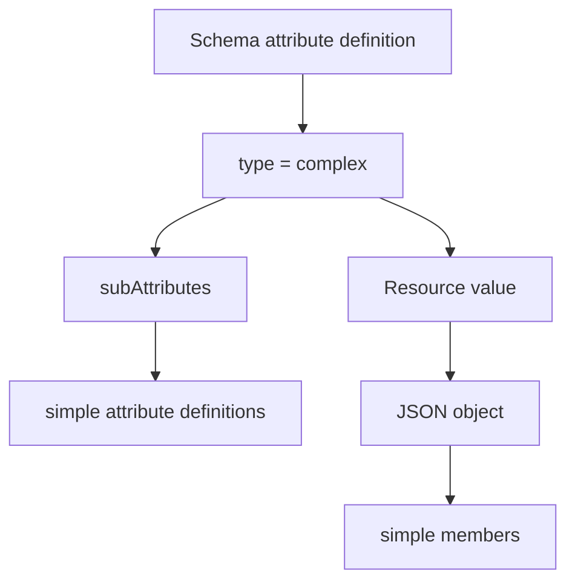

<!--
Article brief
- Type: Requirement
- Reader: SCIM 2.0 の schema と resource representation を実装またはレビューする Client / Service Provider 開発者
- Question: type が complex の attribute はどのような JSON object になり、subAttributes はどこまでネストできるのか
- Answer: complex attribute は1つ以上の simple attribute から構成され、component attribute の順序に意味はなく、complex attribute の sub-attribute をさらに complex にすることはできないと理解できる
- Scope: RFC 7643 §1.2, §2.3.8, §7, §8.7.1 に基づく complex data type、sub-attribute、Schema resource の subAttributes、resource representation の JSON object
- Out of scope: multiValued の一般的な array representation、primary、canonicalValues、filter/valuePath、PATCH path、個別 User/Group attribute の業務上の意味
- Primary sources: RFC 7643 §1.2, §2.3.8, §7, §8.7.1
- Diagram: Schema resource の type=complex / subAttributes と resource representation の JSON object の対応を示す flowchart
-->

## この記事について

**記事タイプ:** Requirement  
**対象読者:** SCIM 2.0 の schema と resource representation を実装またはレビューする Client / Service Provider 開発者  
**この記事で伝えること:** `type: "complex"` の attribute と `subAttributes` の関係、および complex attribute が resource representation で JSON object になること  
**扱わないこと:** `multiValued` の一般的な array representation、`primary`、`canonicalValues`、filter / valuePath、PATCH path、個別 User / Group attribute の業務上の意味

SCIM では attribute の data type として `complex` を定義できます。complex attribute は複数の component を持てますが、任意の深さまで object をネストできる型ではありません。

**A SCIM complex attribute is composed of simple sub-attributes; complex sub-attributes cannot themselves contain sub-attributes.**  
（SCIM の complex attribute は simple な sub-attribute から構成され、complex な sub-attribute をさらにネストすることはできません。）

この記事では、Schema resource での `type` / `subAttributes` と、resource representation での JSON object の対応に範囲を限定します。

## 1. complex attribute は simple attribute の組み合わせ

RFC 7643 §1.2 は、complex attribute を1つ以上の simple attribute の組み合わせとして定義しています。同じ section では sub-attribute を complex attribute に含まれる simple attribute と定義し、simple attribute は sub-attribute を含んではならない（**MUST NOT**）としています。

RFC 7643 §2.3.8 でも、complex attribute は1つ以上の simple attribute の composition であると定義されています。

たとえば、次の `name` は JSON object であり、その中の `givenName` と `familyName` が component attribute です。以下は構造を確認するための**非規範的な例**で、文字列は illustrative value です。

```json
{
  "name": {
    "givenName": "Illustrative",
    "familyName": "Person"
  }
}
```

RFC 7643 §2.3.8 では complex data type の JSON format を JSON object としています。したがって、上の例で `name` の値は object であり、`givenName` と `familyName` はその object の member として配置されます。

## 2. Schema resource では type と subAttributes を分けて記述する

RFC 7643 §7 の Schema Definition では、Schema resource の `attributes` が各 attribute の定義を保持します。

`type` は attribute の data type を示します。`type` が `complex` の場合、対応する `subAttributes` を定義して sub-attributes を列挙することが **SHOULD** とされています（RFC 7643 §7）。

`subAttributes` は、`type: "complex"` の attribute に対して sub-attributes の集合を定義します。`subAttributes` は `attributes` と同じ schema sub-attributes を持ちます（RFC 7643 §7）。

以下は配置を確認するための**非規範的な最小例**です。

```json
{
  "attributes": [
    {
      "name": "name",
      "type": "complex",
      "multiValued": false,
      "subAttributes": [
        {
          "name": "givenName",
          "type": "string",
          "multiValued": false
        },
        {
          "name": "familyName",
          "type": "string",
          "multiValued": false
        }
      ]
    }
  ]
}
```

この例では、`subAttributes` は complex attribute definition の JSON member であり、その値は sub-attribute definition の配列です。resource representation の `name` object 自体に `subAttributes` という member を置くわけではありません。

## 3. complex のネストには上限がある

RFC 7643 §2.3.8 は、complex attribute が sub-attributes を持つ sub-attribute、すなわち complex な sub-attribute を含んではならない（**MUST NOT**）と規定しています。

したがって、Schema resource で次のような構造を定義することは、この規則に適合しません。

```json
{
  "name": "outer",
  "type": "complex",
  "subAttributes": [
    {
      "name": "inner",
      "type": "complex",
      "subAttributes": [
        {
          "name": "value",
          "type": "string"
        }
      ]
    }
  ]
}
```

このコードは、禁止されるネストの形を説明するための**非規範的な反例**です。RFC 7643 §2.3.8 の **MUST NOT** により、complex attribute の sub-attribute をさらに complex attribute としてネストする構造は使用できません。

この制約は、JSON 一般が object の多段ネストを表現できるかどうかとは別です。SCIM の `complex` data type に対して仕様が課している構造上の制約です。

## 4. object 内の component attribute の順序に意味はない

RFC 7643 §2.3.8 は、complex attribute の component attributes の順序は significant ではないとしています。Server と Client は object を生成または解析するとき、attribute が特定の順序で並ぶことを要求または期待してはなりません（**MUST NOT**）。

したがって、次の2つの object は member の順序だけが異なります。

```json
{
  "name": {
    "givenName": "Illustrative",
    "familyName": "Person"
  }
}
```

```json
{
  "name": {
    "familyName": "Person",
    "givenName": "Illustrative"
  }
}
```

SCIM の complex attribute を処理する際、member order を protocol 上の意味として扱うことはできません。

## 5. complex attribute 自体には uniqueness と case sensitivity がない

RFC 7643 §2.3.8 は、complex attribute 自体には uniqueness と case sensitivity がないと定義しています。

これは、complex attribute を構成する個々の simple sub-attribute の characteristic まで失われるという意味ではありません。Schema resource の `subAttributes` は `attributes` と同じ schema sub-attributes を持つため（RFC 7643 §7）、個々の sub-attribute definition は、その sub-attribute に適用される characteristic を持てます。

この記事では個々の `caseExact` や `uniqueness` の処理規則には踏み込みません。それぞれ別の characteristic として扱います。

## 6. Schema definition と resource representation の対応

`type: "complex"` と `subAttributes` の関係を、resource representation まで含めて整理すると次のようになります。



Schema resource 側では `subAttributes` が「どの sub-attributes が定義されているか」を記述します。resource representation 側では、complex attribute の値が JSON object となり、定義された sub-attributes が object の member として現れます。

**`subAttributes` is schema metadata; it is not a wrapper member in the resource value.**  
（`subAttributes` は schema metadata であり、resource value の中に置く wrapper member ではありません。）

## まとめ

RFC 7643 における complex attribute と `subAttributes` の要点は次のとおりです。

- complex attribute は1つ以上の simple attribute から構成されます（§1.2、§2.3.8）。
- complex data type の resource value は JSON object です（§2.3.8）。
- Schema resource では `type: "complex"` の場合、対応する `subAttributes` を定義することが **SHOULD** です（§7）。
- complex attribute は、さらに sub-attributes を持つ sub-attribute を含んではなりません（**MUST NOT**、§2.3.8）。
- component attribute の順序に意味はなく、Server と Client は特定順序を要求または期待してはなりません（**MUST NOT**、§2.3.8）。
- complex attribute 自体には uniqueness と case sensitivity がありません（§2.3.8）。

## 一次資料

- RFC 7643, *System for Cross-domain Identity Management: Core Schema*, §1.2, §2.3.8, §7, §8.7.1  
  https://www.rfc-editor.org/rfc/rfc7643.html
