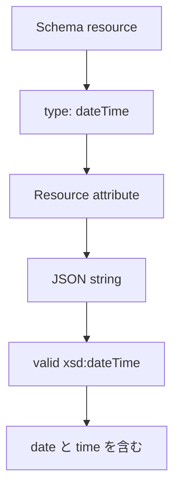

<!--
Article brief
- Type: Requirement
- Reader: SCIM 2.0 の schema と resource representation を実装またはレビューする Client / Service Provider 開発者
- Question: SCIM の dateTime attribute は JSON でどの型・形式になり、どの要件を満たす必要があるのか
- Answer: dateTime は Schema resource では type="dateTime" と定義され、resource representation では JSON string として表現され、valid xsd:dateTime で date と time の両方を含む必要があると理解できる
- Scope: RFC 7643 §2.3, §2.3.5, §7 に基づく dateTime data type、JSON representation、xsd:dateTime への適合、date と time の包含、Schema resource の type
- Out of scope: created / lastModified の意味、時刻同期、タイムゾーン運用方針、日付計算、filter comparison、個別 attribute の業務上の意味
- Primary sources: RFC 7643 §2.3, §2.3.5, §7
- Diagram: Schema resource の type=dateTime と resource representation の JSON string の対応を示す flowchart
-->

## この記事について

**記事タイプ:** Requirement  
**対象読者:** SCIM 2.0 の schema と resource representation を実装またはレビューする Client / Service Provider 開発者  
**この記事で伝えること:** `dateTime` attribute の Schema resource 上の型と、resource representation における JSON string の形式要件  
**扱わないこと:** `created` / `lastModified` の意味、時刻同期、タイムゾーン運用方針、日付計算、filter comparison、個別 attribute の業務上の意味

SCIM の `dateTime` は、JSON に日時らしい文字列を置けばよいという型ではありません。RFC 7643 は、SCIM data type と JSON representation に加えて、値が満たす形式要件を定義しています。

**A SCIM `dateTime` value is represented as a JSON string, but the string must satisfy the dateTime constraints defined by RFC 7643.**  
（SCIM の `dateTime` 値は JSON 文字列として表現されますが、その文字列は RFC 7643 が定める dateTime の制約を満たす必要があります。）

## 1. Schema resource では type は dateTime

RFC 7643 §2.3 は SCIM の data type と underlying JSON type の対応を定義しています。`dateTime` の SCIM Schema `type` は `dateTime` で、JSON type は string です。

RFC 7643 §7 の Schema Definition でも、attribute definition の `type` に指定できる値として `dateTime` が定義されています。

以下は配置を確認するための**非規範的な最小例**です。attribute 名は illustrative value です。

```json
{
  "attributes": [
    {
      "name": "illustrativeTime",
      "type": "dateTime",
      "multiValued": false
    }
  ]
}
```

この例で `type` は Schema resource の attribute definition に置かれる JSON member です。resource representation の日時値そのものに `type` member を付加するわけではありません。

## 2. resource representation では JSON string

RFC 7643 §2.3.5 は、JSON format の `dateTime` value が JSON string として表現されることを規定しています。

以下は構造を確認するための**非規範的な例**です。

```json
{
  "illustrativeTime": "2008-01-23T04:56:22Z"
}
```

`illustrativeTime` の JSON value は number や object ではなく string です。例の日時値は RFC 7643 §2.3.5 が示す形式例に基づく illustrative value です。

## 3. valid xsd:dateTime でなければならない

RFC 7643 §2.3.5 は、`dateTime` attribute value について次の要件を定めています。

- 値は XML Schema で定義された valid `xsd:dateTime` として encode されなければなりません（**MUST**、RFC 7643 §2.3.5）。
- 値は date と time の両方を含まなければなりません（**MUST**、RFC 7643 §2.3.5）。
- JSON representation の値は上記 XML constraints に適合しなければなりません（**MUST**、RFC 7643 §2.3.5）。
- JSON 上では string として表現されます（RFC 7643 §2.3.5）。

したがって、Schema resource で `type: "dateTime"` と宣言することと、resource representation で JSON string を使用することだけでは要件は完結しません。その string value 自体が §2.3.5 の形式制約を満たす必要があります。

## 4. dateTime には case sensitivity と uniqueness がない

RFC 7643 §2.3.5 は、dateTime format には case sensitivity と uniqueness がないと定義しています。

これは `dateTime` data type 自体についての定義です。個別 attribute に別の意味や処理要件が定義されている場合は、その attribute の仕様を別途確認する必要があります。本記事では `created` や `lastModified` など個別 attribute の要件には踏み込みません。

## 5. Schema definition と resource value の対応



図は RFC 7643 §2.3、§2.3.5、§7 の関係を整理したものです。新しい actor や protocol processing を追加するものではありません。

## まとめ

SCIM の `dateTime` では、Schema resource の `type` は `dateTime` です。resource representation では値を JSON string として表現します。

ただし、JSON string であることだけが要件ではありません。RFC 7643 §2.3.5 により、値は valid `xsd:dateTime` として encode され、date と time の両方を含まなければなりません（いずれも **MUST**）。JSON representation も同じ XML constraints に適合する必要があります（**MUST**）。

## 一次資料

- RFC 7643, §2.3 "Attribute Data Types"  
  https://www.rfc-editor.org/rfc/rfc7643.html#section-2.3
- RFC 7643, §2.3.5 "DateTime"  
  https://www.rfc-editor.org/rfc/rfc7643.html#section-2.3.5
- RFC 7643, §7 "Schema Definition"  
  https://www.rfc-editor.org/rfc/rfc7643.html#section-7
