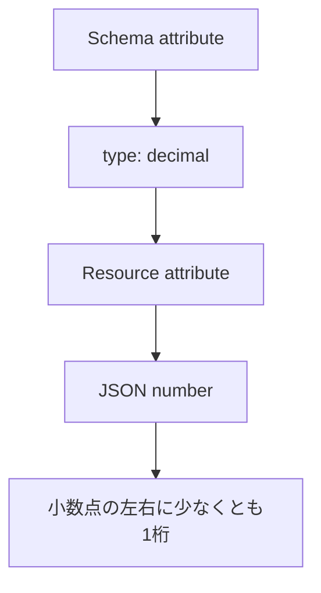

- **記事タイプ**: Requirement
- **対象読者**: SCIM schema を定義・実装し、`decimal` attribute の JSON 表現を仕様本文から確認したい読者
- **この記事で伝えること**: SCIM の `decimal` がどの JSON type で表現され、RFC 7643 が値の形式をどこまで定義しているか
- **扱わないこと**: `integer`、実装言語の浮動小数点型、丸め・精度・数値範囲、filter の比較規則、個別 schema における decimal attribute の設計

## Article brief

**Reader**: SCIM schema を定義・実装し、`decimal` attribute の JSON 表現を確認したい読者。

**Question**: `type: "decimal"` の attribute は resource representation でどのような JSON value になり、値にはどの形式上の条件があるか。

**Answer**: RFC 7643 では `decimal` を JSON number に対応付け、実数として小数点の左側と右側にそれぞれ少なくとも1桁を持つものと定義している。`decimal` には case sensitivity はない。

**Scope**: RFC 7643 §2.3 と §2.3.3 における `decimal` data type と JSON representation。

**Out of scope**: `integer`、実装言語での型選択、丸め・精度・数値範囲、filter comparison、個別 schema の設計。

**Primary sources**: RFC 7643 §2.3, §2.3.3。

**Diagram**: Schema definition の `type: "decimal"` と resource representation の JSON number の対応を示す `flowchart TD`。

## `decimal` は JSON number として表現する

RFC 7643 §2.3 の Table 1 は、SCIM data type `Decimal` の schema `type` を `"decimal"`、underlying JSON type を RFC 7159 §6 の Number としています。

したがって、Schema resource で `type` が `decimal` の attribute は、resource representation では JSON string ではなく JSON number として表現されます。

次は配置と構造を示す**非規範的な例**です。attribute 名 `exampleDecimal` と値 `12.5` は説明用です。

```json
{
  "name": "exampleDecimal",
  "type": "decimal",
  "multiValued": false
}
```

対応する resource value の例は次の形です。

```json
{
  "exampleDecimal": 12.5
}
```

`12.5` は引用符で囲まれていないため JSON number です。

## RFC 7643 が定義する decimal の形式

RFC 7643 §2.3.3 は `decimal` を、実数であり、小数点の左側と右側にそれぞれ少なくとも1桁を持つ値として定義しています。また JSON format は RFC 7159 §6 に従います。

この定義から、たとえば次の値はこの記事で確認している形式を示す**非規範的な例**です。

```json
{
  "exampleDecimal": 12.5
}
```

一方、RFC 7643 §2.3.3 は、実装言語でどの数値型を使用するか、何桁の精度を保持するか、どのように丸めるかを規定していません。この記事では、それらに独自の要件を追加しません。

## case sensitivity はない

RFC 7643 §2.3.3 は、decimal には case sensitivity がないと定義しています。これは decimal が文字列ではなく数値として扱われる data type であることと整合します。

この規定を、値の uniqueness、precision、range についての要件として拡張して解釈することはしません。

## Schema definition と resource value の対応



The schema type and the JSON representation are related, but they are not the same field.  
（schema の `type` と JSON 上の値の表現は対応していますが、同じ field ではありません。）

Schema resource の `type: "decimal"` は attribute definition に置かれます。実際の resource representation では、その attribute の値が JSON number として現れます。

## まとめ

RFC 7643 §2.3 と §2.3.3 から確認できる範囲は明確です。

- SCIM schema type は `decimal`。
- JSON representation は RFC 7159 §6 の Number。
- `decimal` は実数として定義され、小数点の左側と右側にそれぞれ少なくとも1桁を持つ。
- `decimal` には case sensitivity はない。

精度、丸め、数値範囲、実装言語での型選択は、この定義から追加の要件として導きません。

## Primary sources

- RFC 7643, §2.3 "Attribute Data Types": https://www.rfc-editor.org/rfc/rfc7643.html#section-2.3
- RFC 7643, §2.3.3 "Decimal": https://www.rfc-editor.org/rfc/rfc7643.html#section-2.3.3
