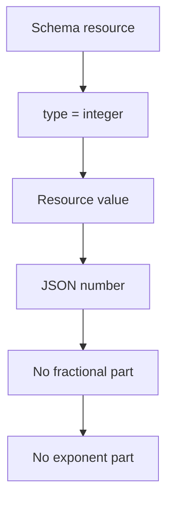

<!--
Article brief
- Type: Requirement
- Reader: SCIM 2.0 の schema と resource representation を実装またはレビューする Client / Service Provider 開発者
- Question: SCIM の integer attribute は JSON でどの型になり、JSON number のうちどの表現が許されないのか
- Answer: integer は Schema resource では type="integer" と定義され、resource representation では JSON number だが、fractional part と exponent part を含めてはならないと理解できる
- Scope: RFC 7643 §2.3, §2.3.4, §7 に基づく integer data type、JSON representation、fractional part と exponent part の禁止、Schema resource の type
- Out of scope: decimal data type、数値範囲、実装言語の整数型、オーバーフロー処理、filter comparison、個別 attribute の業務上の意味
- Primary sources: RFC 7643 §2.3, §2.3.4, §7
- Diagram: Schema resource の type=integer と resource representation の JSON number、追加制約の対応を示す flowchart
-->

## この記事について

**記事タイプ:** Requirement  
**対象読者:** SCIM 2.0 の schema と resource representation を実装またはレビューする Client / Service Provider 開発者  
**この記事で伝えること:** `integer` attribute の Schema resource 上の型、JSON representation、および fractional part / exponent part に対する制約  
**扱わないこと:** `decimal` data type、数値範囲、実装言語の整数型、オーバーフロー処理、filter comparison、個別 attribute の業務上の意味

SCIM の `integer` は JSON number として表現されます。ただし、JSON number として構文上表現できる値がすべて SCIM `integer` として許されるわけではありません。RFC 7643 は `integer` に追加の制約を定めています。

**A SCIM `integer` is a JSON number with an additional restriction: it must not contain fractional or exponent parts.**  
（SCIM の `integer` は JSON number ですが、fractional part または exponent part を含めてはならないという追加制約があります。）

## 1. Schema resource では type は integer

RFC 7643 §2.3 は SCIM data type と underlying JSON type の対応を定義しています。`integer` の SCIM Schema `type` は `integer`、underlying JSON type は number です。

RFC 7643 §7 の Schema Definition でも、attribute definition の `type` に指定できる値として `integer` が定義されています。

以下は配置を確認するための**非規範的な最小例**です。attribute 名は illustrative value です。

```json
{
  "attributes": [
    {
      "name": "illustrativeCount",
      "type": "integer",
      "multiValued": false
    }
  ]
}
```

この例の `type` は Schema resource の `attributes` array 内にある attribute definition の JSON member です。resource representation の数値そのものに `type` member を付加するわけではありません。

## 2. resource representation では JSON number

RFC 7643 §2.3 の対応表では、SCIM `integer` の JSON type は number とされています。したがって、resource representation では JSON string ではなく JSON number として値を置きます。

以下は構造を確認するための**非規範的な例**です。

```json
{
  "illustrativeCount": 42
}
```

`42` は illustrative value です。この例では `illustrativeCount` の value は引用符で囲まれていない JSON number です。

## 3. fractional part と exponent part を含めてはならない

RFC 7643 §2.3.4 は `integer` を、fractional digits や decimal を持たない whole number と定義しています。さらに JSON number に対する追加制約として、値は fractional part または exponent part を含んではなりません（**MUST NOT**、RFC 7643 §2.3.4）。

したがって、次の例は SCIM `integer` の制約を説明するための**非規範的な反例**です。

```json
{
  "illustrativeCount": 42.0
}
```

`42.0` は fractional part を含むため、RFC 7643 §2.3.4 の `integer` 制約に適合しません。

次の例も**非規範的な反例**です。

```json
{
  "illustrativeCount": 4.2e1
}
```

この表現は exponent part を含むため、同じく RFC 7643 §2.3.4 の `integer` 制約に適合しません。

## 4. integer には case sensitivity がない

RFC 7643 §2.3.4 は、`integer` には case sensitivity がないとしています。これは `integer` が数値 data type であることに対応する性質です。

この記事では `caseExact` characteristic の一般的な意味や filter comparison の処理には広げません。

## 5. Schema definition と resource value の関係



この図は RFC 7643 §2.3 と §2.3.4 の関係を整理したものです。新しい actor や protocol processing を追加するものではありません。

## まとめ

SCIM の `integer` attribute は、Schema resource では `type: "integer"` と定義され、resource representation では JSON number として表現されます（RFC 7643 §2.3, §7）。

ただし RFC 7643 §2.3.4 は JSON number に追加制約を設けており、`integer` value は fractional part または exponent part を含んではなりません（**MUST NOT**）。そのため、SCIM `integer` の検証では JSON number であることと、§2.3.4 の追加制約を満たすことを分けて確認できます。

## 一次資料

- [RFC 7643: System for Cross-domain Identity Management: Core Schema](https://www.rfc-editor.org/rfc/rfc7643.html)
  - §2.3 Attribute Data Types
  - §2.3.4 Integer
  - §7 Schema Definition
