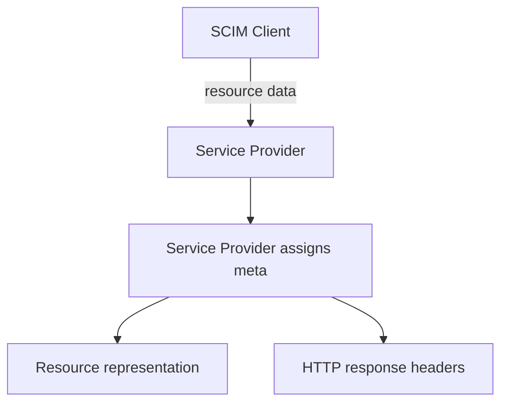

**記事タイプ:** Requirement  
**対象読者:** SCIM 2.0 の resource metadata を生成・返却・検証する Service Provider / Client の実装者・レビュー担当者  
**この記事で伝えること:** common attribute `meta` の発行主体と、`resourceType`、`created`、`lastModified`、`location`、`version` の仕様上の意味を RFC 7643 §3.1 の規範強度のまま確認する  
**扱わないこと:** conditional request の処理、`If-Match` / `If-None-Match`、ETag による versioning の protocol flow、resource `id`、`externalId`

## Article brief

- **Reader:** SCIM resource の metadata を生成・返却・利用する Service Provider / Client の実装者・レビュー担当者
- **Question:** `meta` は誰が設定し、各 sub-attribute は何を表すのか。Client から送られた `meta` はどう扱われるのか
- **Answer:** `meta` は Service Provider が割り当てる read-only common attribute であり、Client 提供値は無視されること、各 sub-attribute の意味と `location` / `version` の HTTP header との一致要件を説明できる
- **Scope:** RFC 7643 §3, §3.1 における common attribute `meta` とその sub-attributes
- **Out of scope:** RFC 7644 §3.14 の conditional request 処理、`If-Match` / `If-None-Match`、resource `id` / `externalId`、ETag の生成方式
- **Primary sources:** RFC 7643 §3, §3.1
- **Diagram:** Client が resource data を送り、Service Provider が `meta` を割り当てて representation と HTTP headers を返す関係

SCIM の `meta` は、resource に関する metadata を保持する common attribute です。RFC 7643 §3.1 は、その sub-attributes を Service Provider が割り当てるものとして定義しています。

## 1. `meta` は common attribute

RFC 7643 §3 は、SCIM resource の common attributes は `schemas` の値にかかわらず resource の一部として扱われると定義しています。`meta` はその common attribute の一つです。

RFC 7643 §3.1 では、`/ServiceProviderConfig` と `/ResourceTypes` の server discovery endpoint および関連 resource を例外として、common attributes はすべての resource で定義されなければなりません（MUST）。Service Provider が resource を受け入れた後、`id` と `meta` およびその sub-attributes には Service Provider が値を割り当てなければなりません（MUST）。

## 2. Client が送った `meta` は無視される

RFC 7643 §3.1 は、`meta` のすべての sub-attributes を Service Provider が割り当て、mutability は `readOnly`、returned characteristic は `default` としています。また、Client が提供した `meta` は無視されます（SHALL）。

次は配置を確認するための**非規範的な例**です。値は illustrative value です。

```json
{
  "schemas": [
    "urn:ietf:params:scim:schemas:core:2.0:User"
  ],
  "id": "illustrative-resource-id",
  "userName": "alice@example.test",
  "meta": {
    "resourceType": "User",
    "created": "2026-09-24T00:00:00Z",
    "lastModified": "2026-09-24T00:05:00Z",
    "version": "W/\"illustrative-version\"",
    "location": "https://example.test/Users/illustrative-resource-id"
  }
}
```

`meta` は resource JSON object の top-level memberで、その値は complex attribute です。上の例は Client がこれらの値を指定する例ではなく、Service Provider が返す representation の構造を示しています。

## 3. `resourceType`

`meta.resourceType` は resource の resource type 名です。RFC 7643 §3.1 は、この sub-attribute の mutability を `readOnly`、`caseExact` を `true` と定義しています。

## 4. `created` と `lastModified`

`meta.created` は resource が Service Provider に追加された DateTime であり、DateTime でなければなりません（MUST）。

`meta.lastModified` は、Service Provider において resource の details が最後に更新された DateTime です。resource が作成後に一度も変更されていない場合、`lastModified` は `created` と同じ値でなければなりません（MUST）。

この要件は timestamp の具体的な生成・保存方式までは規定していません。

## 5. `location` は Content-Location と一致する

`meta.location` は返される resource の URI です。RFC 7643 §3.1 は、この値が HTTP response の `Content-Location` header と同じでなければならない（MUST）と規定しています。

次は配置関係だけを示す**非規範的な HTTP response 例**です。

```http
HTTP/1.1 200 OK
Content-Type: application/scim+json
Content-Location: https://example.test/Users/illustrative-resource-id

{
  "schemas": ["urn:ietf:params:scim:schemas:core:2.0:User"],
  "id": "illustrative-resource-id",
  "userName": "alice@example.test",
  "meta": {
    "resourceType": "User",
    "location": "https://example.test/Users/illustrative-resource-id"
  }
}
```

## 6. `version` は ETag と一致する

`meta.version` は返される resource の version です。RFC 7643 §3.1 は、この値を HTTP response の entity-tag、すなわち `ETag` と同じ値としています。`version` の `caseExact` は `true` です。

Service Provider による `version` の support は optional であり、resource versioning の support に依存します。Service Provider が representation に entity-tag を提供し、その entity-tag が strong validator のすべての characteristics を満たさない場合、origin server は opaque value の前に case-sensitive な `W/` を付けて weak entity-tag としなければなりません（MUST、RFC 7643 §3.1）。

次は header と JSON member の配置関係を示す**非規範的な例**です。

```http
HTTP/1.1 200 OK
Content-Type: application/scim+json
ETag: W/"illustrative-version"

{
  "schemas": ["urn:ietf:params:scim:schemas:core:2.0:User"],
  "id": "illustrative-resource-id",
  "userName": "alice@example.test",
  "meta": {
    "resourceType": "User",
    "version": "W/\"illustrative-version\""
  }
}
```

ETag を conditional request に使用する protocol processing は RFC 7644 §3.14 の別論点であり、本記事では扱いません。

## 7. Service Provider が `meta` を割り当てる流れ



この図は `meta` の発行主体と response representation / headers の関係だけを示しています。認証、認可、conditional request などの actor や処理は追加していません。

## まとめ

RFC 7643 §3.1 の `meta` は Service Provider が管理する read-only の complex common attribute です。Client が提供した `meta` は無視されます（SHALL）。`created` と `lastModified` は resource の時刻 metadata、`location` は `Content-Location` と一致する resource URI、optional な `version` は `ETag` と対応する resource version を表します。

`meta` の構造を理解する際は、resource metadata の定義と、RFC 7644 が定める conditional request の protocol processing を分けて扱う必要があります。

## Primary sources

- RFC 7643, §3 “SCIM Resources”
- RFC 7643, §3.1 “Common Attributes”
