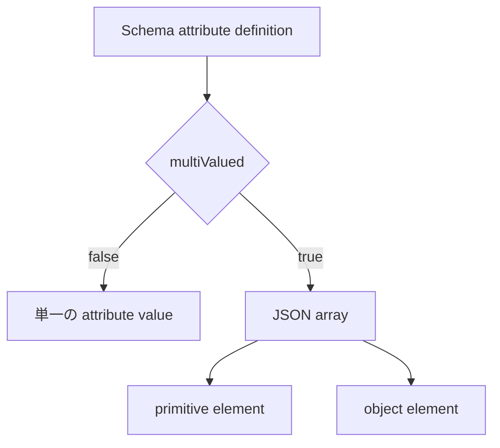

<!--
Article brief
- Type: Requirement
- Reader: SCIM 2.0 の schema と resource representation を実装またはレビューする Client / Service Provider 開発者
- Question: Schema resource の multiValued は何を表し、resource representation では単一値と複数値がどの JSON 構造になるのか
- Answer: multiValued が attribute の plurality を示す Boolean であること、multi-valued attribute が JSON array で表現され、その要素が primitive value または object になり得ることを区別して理解できる
- Scope: RFC 7643 §2.1、§2.4、§7、§8.7.1 に基づく attribute plurality、multiValued characteristic、multi-valued attribute の JSON array representation
- Out of scope: primary の cardinality と PATCH 更新規則、canonicalValues、filter/valuePath、個別 User/Group attribute の意味、PATCH の add/remove/replace 処理
- Primary sources: RFC 7643 §2.1, §2.4, §7, §8.7.1
- Diagram: Schema resource の multiValued と resource representation の JSON array の対応を示す flowchart
-->

## この記事について

**記事タイプ:** Requirement  
**対象読者:** SCIM 2.0 の schema と resource representation を実装またはレビューする Client / Service Provider 開発者  
**この記事で伝えること:** `multiValued` が attribute の plurality を示すことと、multi-valued attribute が resource representation で JSON array になること  
**扱わないこと:** `primary` の cardinality と PATCH 更新規則、`canonicalValues`、filter / valuePath、個別 User / Group attribute の意味、PATCH の `add` / `remove` / `replace` 処理

SCIM schema は attribute ごとに data type だけでなく plurality も定義します。RFC 7643 §2.1 は、attribute が simple / complex のいずれでも multi-valued になり得ることを示しています。

**`multiValued` describes an attribute's plurality; a multi-valued attribute is represented as a JSON array.**  
（`multiValued` は属性の単一値・複数値という性質を表し、複数値属性は JSON 配列として表現されます。）

この記事では Schema resource の `multiValued` と、実際の resource representation の JSON 構造の対応だけを扱います。

## 1. multiValued は Schema resource の Boolean member

RFC 7643 §7 では、Schema resource の `attributes` は complex な multi-valued attribute として定義されます。その各 attribute definition に含まれる `multiValued` は、attribute の plurality を示す Boolean value です。

以下は配置を確認するための**非規範的な最小例**です。値は illustrative value です。

```json
{
  "attributes": [
    {
      "name": "tags",
      "type": "string",
      "multiValued": true
    }
  ]
}
```

- `multiValued` の型は Boolean です。
- `multiValued` は attribute definition の JSON member です。
- RFC 7643 §8.7.1 の Schema schema では、この member 自体は `multiValued: false`、`required: true` と定義されています。

ここで `multiValued: true` が示すのは、`tags` という attribute が複数の値を持つという plurality です。`multiValued` 自体が配列になるわけではありません。

## 2. multi-valued attribute は JSON array で表現する

RFC 7643 §2.4 は、multi-valued attribute が JSON array format を使用して element の list を保持すると定義しています。

simple attribute が multi-valued の場合、array element は primitive value にできます。以下は構造だけを示す**非規範的な例**です。

```json
{
  "tags": [
    "illustrative-a",
    "illustrative-b"
  ]
}
```

Schema definition と resource representation の関係は次のようになります。



この図は RFC 7643 §2.1 と §2.4 の構造上の関係だけを示しています。

## 3. array element は primitive value または object

RFC 7643 §2.4 では、multi-valued attribute の element として次の2種類を定義しています。

- primitive value
- sub-attributes と values を持つ object

後者の object は complex attribute として扱われます（**SHALL**、RFC 7643 §2.4）。また、complex attribute と同様に sub-attribute の順序は significant ではありません。

以下は object element の配置を示す**非規範的な最小例**です。

```json
{
  "contacts": [
    {
      "type": "work",
      "value": "illustrative-value"
    }
  ]
}
```

RFC 7643 §2.4 は、multi-valued attribute object で利用できる既定の sub-attributes として `type`、`primary`、`display`、`value`、`$ref` を定義しています。これらを使用する場合、その意味は同 section の定義に従うことが **MUST** です。

`primary` 固有の cardinality と PATCH 時の更新規則は別テーマであるため、この記事では扱いません。

## 4. complex attribute も singular / multi-valued のどちらにもなれる

RFC 7643 §2.3.8 は complex attribute を、1つ以上の simple attributes から構成される singular または multi-valued attribute と定義しています。したがって、`type: "complex"` と `multiValued: true` は別々の性質を表します。

以下は両者の配置を確認するための**非規範的な Schema resource の最小例**です。

```json
{
  "attributes": [
    {
      "name": "contacts",
      "type": "complex",
      "multiValued": true,
      "subAttributes": [
        {
          "name": "value",
          "type": "string",
          "multiValued": false
        }
      ]
    }
  ]
}
```

この例では `contacts` が複数値であるため resource representation では array になり、その各 element が complex object になります。一方、`contacts.value` は `multiValued: false` なので、各 object 内の `value` は単一値です。

## 5. multiValued と他の characteristic は別の軸

RFC 7643 §2.1 は SCIM schema が attribute の data type、plurality、mutability などを定義するとしています。`multiValued` は plurality を表すため、`required`、`mutability`、`returned`、`uniqueness` などの characteristic と同じ意味ではありません。

たとえば `multiValued: true` だけから、その attribute が必須であることや、値を更新できること、response に常に返されることは導けません。それぞれの characteristic は個別の定義に従います。

## まとめ

RFC 7643 における `multiValued` は attribute の plurality を示す Boolean です。`multiValued: true` の attribute は resource representation で JSON array として表現され、array element は primitive value または object にできます。object element は complex attribute として扱われます（**SHALL**、RFC 7643 §2.4）。

**The schema characteristic and the resource value have different shapes: `multiValued` is a Boolean, while the corresponding multi-valued resource attribute is an array.**  
（schema characteristic と resource value の形は異なります。`multiValued` は Boolean であり、対応する複数値の resource attribute は配列です。）

## 一次資料

- RFC 7643, §2.1 “Attributes”
- RFC 7643, §2.4 “Multi-Valued Attributes”
- RFC 7643, §7 “Schema Definition”
- RFC 7643, §8.7.1 “Schema Representation”
