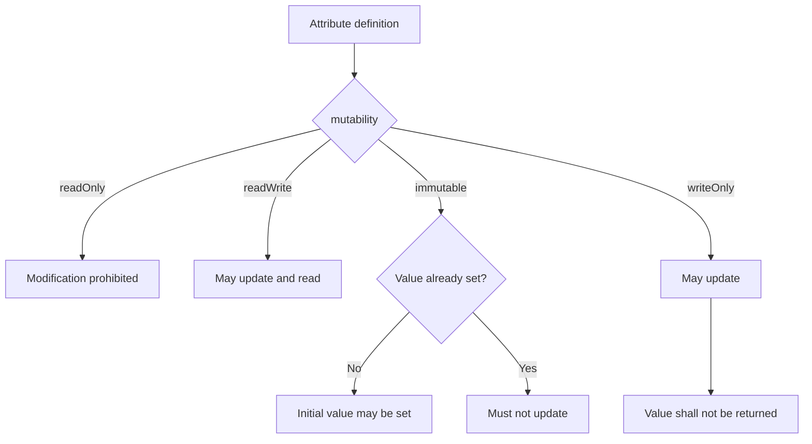

<!--
Article brief
- Type: Requirement
- Reader: SCIM 2.0 の schema と resource 更新処理を実装・レビューする Client / Service Provider 開発者
- Question: mutability の4値は attribute の定義・更新・返却にどのような制約を与え、POST / PUT / PATCH でどう処理されるか
- Answer: readOnly / readWrite / immutable / writeOnly の意味と既定値を区別し、POST / PUT / PATCH における規範的な処理差を追える
- Scope: RFC 7643 §2.2, §7 と RFC 7644 §3.3, §3.5.1, §3.5.2, §3.12 に基づく mutability characteristic と resource write operation の処理
- Out of scope: returned characteristic の詳細、authorization policy、ETag と conditional request、PATCH の add/remove/replace 各 operation の一般的な path 処理、個別 schema attribute の業務設計
- Primary sources: RFC 7643 §2.2, §7; RFC 7644 §3.3, §3.5.1, §3.5.2, §3.12
- Diagram: mutability の4値から write operation の処理へ縦方向に分岐する flowchart
-->

## この記事について

**記事タイプ:** Requirement  
**対象読者:** SCIM 2.0 の schema と resource 更新処理を実装・レビューする Client / Service Provider 開発者  
**この記事で伝えること:** `mutability` の4値と、POST / PUT / PATCH で attribute を処理するときの規範的な差  
**扱わないこと:** `returned` characteristic の詳細、authorization policy、ETag と conditional request、PATCH の `add` / `remove` / `replace` に共通しない path 処理、個別 schema attribute の業務設計

SCIM の attribute definition には、その値をどのような条件で定義・再定義できるかを表す `mutability` characteristic があります。RFC 7643 §2.2 は `readOnly`、`readWrite`、`immutable`、`writeOnly` の4値を定義しています。

**`mutability` describes whether and when an attribute value can be defined or redefined.**  
（`mutability` は、attribute value を定義または再定義できるか、またその条件を表します。）

## 1. mutability の既定値は readWrite

RFC 7643 §2.2 では、別途指定されない場合の `mutability` は `readWrite` です。

4つの値には次の規則があります。

- `readOnly`: attribute は変更してはなりません（**SHALL NOT**）。
- `readWrite`: attribute はいつでも更新・読み取りできます（**MAY**）。既定値です。
- `immutable`: resource creation、または PUT などによる record replacement で定義できます（**MAY**）が、その後は更新してはなりません（**SHALL NOT**）。
- `writeOnly`: attribute はいつでも更新できます（**MAY**）。その値を返してはなりません（**SHALL NOT**）。RFC 7643 §2.2 は、通常 `returned` も `never` になると注記しています。

ここで `writeOnly` だけは更新可否に加えて返却にも制約を持ちます。ただし `returned` characteristic 全体の規則は別の仕様事項です。

## 2. Schema resource では mutability は string member

RFC 7643 §7 の Schema definition では、attribute definition に `mutability` が含まれます。次は配置と構造だけを示す**非規範的な最小例**です。

```json
{
  "name": "illustrativeAttribute",
  "type": "string",
  "mutability": "immutable"
}
```

`illustrativeAttribute` は説明用の値です。標準 schema に field を追加することを意味しません。

RFC 7643 §7 の Schema resource では `mutability` 自体は single-valued string で、canonical values は `readOnly`、`readWrite`、`immutable`、`writeOnly` です。

## 3. POST では readOnly を無視する

RFC 7644 §3.3 は resource creation の request body に対する mutability 処理を定義しています。Service Provider は mutability rule に従って attribute を処理することが **SHALL** です。

`readOnly` attribute が request body に含まれている場合、その値は **SHALL** ignored です。

以下は HTTP method、Content-Type、attribute の配置を示す**非規範的な例**です。

```http
POST /Users HTTP/1.1
Content-Type: application/scim+json

{
  "schemas": ["urn:ietf:params:scim:schemas:core:2.0:User"],
  "userName": "illustrative-user"
}
```

この例では resource attributes は JSON request body に置かれます。`userName` の値は illustrative value です。

## 4. PUT は attribute ごとに mutability rule を適用する

RFC 7644 §3.5.1 では、Client は PUT で各 attribute の mutability にかかわらず全 attributes を送ることが **MAY** です。そのうえで Service Provider が attribute ごとの rule を適用します。

`readWrite` と `writeOnly` では、request に値があれば既存値を置き換えることが **SHALL** です。

`immutable` では、すでに1つ以上の値が設定されている場合、入力値は既存値と一致することが **MUST** です。一致しない場合は HTTP 400 と `scimType` が `mutability` の error を返すことが **SHOULD** です。既存値がなければ、新しい値を適用することが **SHALL** です。

`readOnly` の入力値は **SHALL** ignored です。

**An immutable attribute can receive its initial value; immutability does not mean that the attribute must always be absent.**  
（immutable attribute は初期値を受け取れます。immutable は、その attribute が常に未設定でなければならないという意味ではありません。）

## 5. PATCH では operation と mutability の互換性を確認する

RFC 7644 §3.5.2 では、各 PATCH operation は RFC 7643 §2.2、§2.3 の mutability と schema に適合することが **MUST** です。

Client は `readOnly` または値が設定済みの `immutable` attribute を変更してはなりません（**MUST NOT**）。ただし、値がまだ存在しない `immutable` attribute に値を `add` することは **MAY** です。

互換性のない operation に対して Service Provider は、RFC 7644 §3.12 に従う適切な HTTP status code と JSON detail error response を返すことが **SHALL** です。§3.12 は `mutability` を、target attribute の mutability または現在の状態と互換性のない変更に対する `scimType` として定義しています。

以下は PATCH message の配置を示す**非規範的な最小例**です。対象 attribute が schema 上 `immutable` で、まだ値を持たない場合を想定しています。

```http
PATCH /Users/illustrative-id HTTP/1.1
Content-Type: application/scim+json

{
  "schemas": ["urn:ietf:params:scim:api:messages:2.0:PatchOp"],
  "Operations": [
    {
      "op": "add",
      "path": "illustrativeImmutableAttribute",
      "value": "illustrative-value"
    }
  ]
}
```

`Operations` は JSON request body の member で、各 operation も JSON object です。`illustrativeImmutableAttribute` は配置を示す説明用 attribute name であり、標準 schema の field ではありません。この例は RFC 7644 §3.5.2 が許容する「未設定の immutable attribute への add」という条件だけを示します。



## 6. PUT と PATCH では readOnly の入力処理が同じではない

PUT と PATCH では、`readOnly` attribute が request に現れた場合の規則を同一視できません。

RFC 7644 §3.5.1 の PUT では `readOnly` の入力値を **SHALL** ignored としています。一方、§3.5.2 の PATCH では Client が `readOnly` attribute を変更することを **MUST NOT** とし、mutability と互換性のない operation に対して Service Provider は error response を返すことが **SHALL** です。

この差は HTTP method ごとに RFC 7644 が定めた processing rule です。

## まとめ

SCIM の `mutability` は attribute value を定義・再定義できる条件を `readOnly`、`readWrite`、`immutable`、`writeOnly` の4値で表し、指定がなければ `readWrite` です（RFC 7643 §2.2）。

POST / PUT / PATCH では、同じ characteristic に対して operation 固有の processing rule があります。特に `immutable` は「値を一度も設定できない」という意味ではなく、初期値の設定と、その後の変更を区別します。PUT では既存 immutable value との一致を要求し、PATCH では未設定の場合に `add` することを許容しています（RFC 7644 §3.5.1, §3.5.2）。

## Primary sources

- RFC 7643, §2.2 Attribute Characteristics
- RFC 7643, §7 Schema Definition
- RFC 7644, §3.3 Creating Resources
- RFC 7644, §3.5.1 Replacing with PUT
- RFC 7644, §3.5.2 Modifying with PATCH
- RFC 7644, §3.12 Error Response
