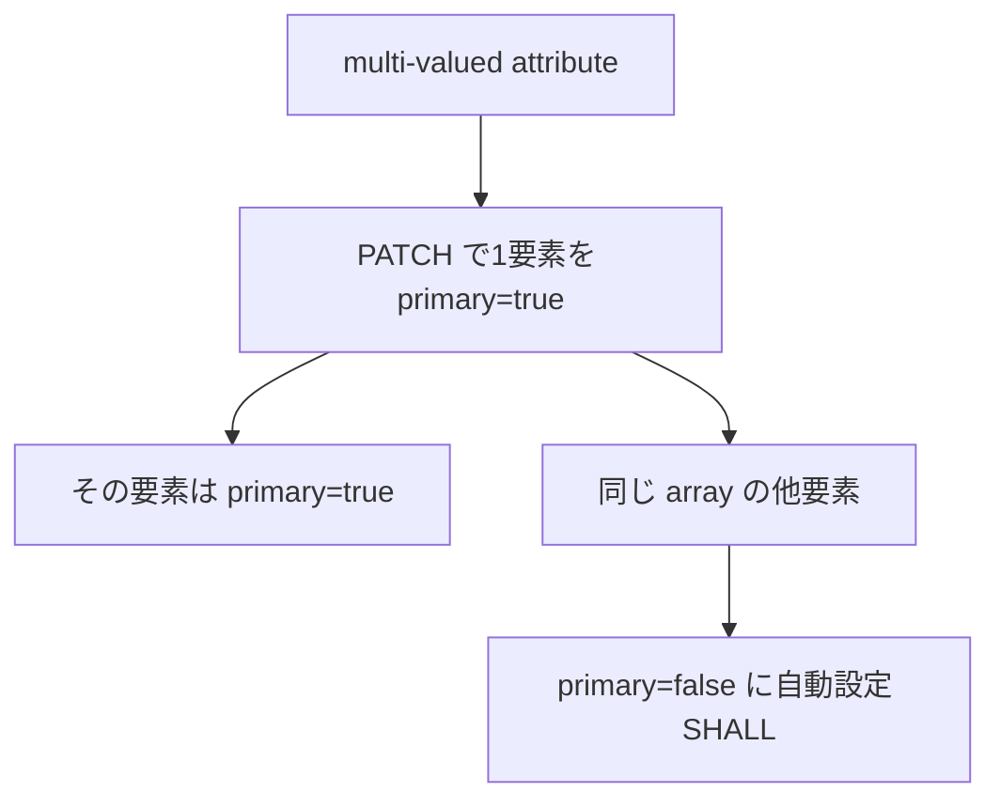

<!--
Article brief
- Type: Requirement
- Reader: SCIM 2.0 の User resource と PATCH 処理を実装またはレビューする Client / Service Provider 開発者
- Question: multi-valued attribute の primary は何を意味し、true をいくつ持てるのか。PATCH で primary=true を設定すると他の値はどうなるのか
- Answer: primary の Boolean semantics、未指定時の扱い、true の cardinality、および PATCH で true を設定した際の Service Provider の更新規則を区別して理解できる
- Scope: RFC 7643 §2.4 に基づく primary sub-attribute と、RFC 7644 §3.5.2 に基づく PATCH 時の primary 更新規則
- Out of scope: multi-valued attribute 全般の canonicalization、PATCH の add/remove/replace 全般、filter/valuePath の構文全般、個別製品の UI や preferred-value policy
- Primary sources: RFC 7643 §2.4; RFC 7644 §3.5.2
- Diagram: multi-valued attribute の primary 状態と、PATCH で primary=true を設定した場合の他要素の primary=false への更新を示す flowchart
-->

## この記事について

**記事タイプ:** Requirement  
**対象読者:** SCIM 2.0 の User resource と PATCH 処理を実装またはレビューする Client / Service Provider 開発者  
**この記事で伝えること:** multi-valued attribute の `primary` の意味、`true` の cardinality、未指定時の扱い、PATCH で `primary=true` を設定したときの更新規則  
**扱わないこと:** multi-valued attribute 全般の canonicalization、PATCH の `add` / `remove` / `replace` 全般、filter / valuePath の構文全般、個別製品の UI や preferred-value policy

SCIM では、`emails` や `addresses` のような multi-valued attribute の各要素を object として表現できます。RFC 7643 §2.4 は、そのような要素で利用できる既定の sub-attribute の一つとして `primary` を定義しています。

**`primary` identifies the preferred value within one multi-valued attribute; at most one value can be primary.**  
（`primary` は1つの multi-valued attribute の中で優先される値を示し、primary にできる値は最大1つです。）

この記事では `primary` 自体の意味と、SCIM PATCH で `primary=true` を設定したときの規則だけを扱います。

## 1. primary は multi-valued attribute の要素に置く Boolean

RFC 7643 §2.4 では、multi-valued attribute の要素は primitive value または sub-attribute を持つ object として表現されます。object の場合、仕様が定義する既定の sub-attribute には `type`、`primary`、`display`、`value`、`$ref` があります。

`primary` は Boolean value で、その attribute における primary または preferred な値を示します。たとえば `emails` なら primary email address、`addresses` なら preferred mailing address を表現できます。

以下は `emails` 内での配置を示す**非規範的な最小例**です。値は構造を示すための illustrative value です。

```json
{
  "emails": [
    {
      "value": "primary@example.com",
      "primary": true
    },
    {
      "value": "other@example.com",
      "primary": false
    }
  ]
}
```

- `primary` の型は Boolean です。
- `primary=true` は、同じ multi-valued attribute 内で **MUST** appear no more than once です（RFC 7643 §2.4）。
- `primary` が指定されていない場合、その値は `false` とみなされます（**SHALL**、RFC 7643 §2.4）。

したがって、すべての要素に `primary` member を明示する必要がある、という規則ではありません。

## 2. primary=true は最大1つ

RFC 7643 §2.4 が定める cardinality は、「`primary=true` が最大1つ」というものです。2つ以上の要素を同時に primary として表すことは、この規則に適合しません。

一方、仕様は `primary=true` が必ず1つ存在しなければならないとは定めていません。未指定の `primary` は `false` とみなされるため、すべての要素が non-primary である表現も仕様上可能です。

この規則は、たとえば `emails` と `phoneNumbers` を横断して1つだけ primary を選ぶという意味ではありません。`primary` は「for this attribute」の preferred value を示す sub-attribute として定義されています（RFC 7643 §2.4）。

## 3. PATCH で primary=true を設定すると他の値は false になる

RFC 7644 §3.5.2 は SCIM PATCH に固有の処理規則を定めています。multi-valued attribute に対する PATCH operation が、ある値の `primary` sub-attribute を `true` に設定した場合、Service Provider は同じ array 内の他の値について `primary` を自動的に `false` に設定します（**SHALL**）。

この規則により、PATCH 後も RFC 7643 §2.4 の「`primary=true` は最大1つ」という状態が維持されます。



この自動更新は RFC 7644 §3.5.2 が PATCH operation に対して明示している規則です。この記事では、この規則を POST や PUT に対する同一の自動更新規則として一般化しません。

## 4. PATCH request では request body 内の value に置く

以下は、`addresses` のうち `type` が `work` の要素を対象にし、その要素の `primary` を `true` にする配置を示す**非規範的な HTTP PATCH 例**です。RFC 7644 §3.5.2 の PATCH message structure と同 §3.5.2.3 の例に沿って、この記事に必要な部分だけを示しています。

```http
PATCH /Users/illustrative-user-id HTTP/1.1
Host: example.com
Content-Type: application/scim+json
Accept: application/scim+json

{
  "schemas": [
    "urn:ietf:params:scim:api:messages:2.0:PatchOp"
  ],
  "Operations": [
    {
      "op": "replace",
      "path": "addresses[type eq \"work\"]",
      "value": {
        "type": "work",
        "primary": true
      }
    }
  ]
}
```

ここで `primary` は HTTP header や query parameter ではなく、PATCH request body の `Operations` 内にある `value` object の JSON member です。`illustrative-user-id` は規範的意味を持たない例示値です。

この operation によって対象要素の `primary` が `true` に設定される場合、RFC 7644 §3.5.2 により、同じ `addresses` array の他の値の `primary` は Service Provider によって `false` に設定されます（**SHALL**）。

## 5. primary が規定しないこと

RFC 7643 §2.4 が `primary` に与えている意味は、その multi-valued attribute における primary / preferred value の表示です。同 section は、アプリケーションが primary value をどの UI に表示するか、どの業務処理で優先利用するか、また primary value が存在しない場合にどの要素を選択するかという local policy を定めていません。

そのため、この記事でも特定の選択方法や fallback policy は定めません。

## まとめ

`primary` は multi-valued attribute の object 要素に置く Boolean sub-attribute です。RFC 7643 §2.4 では、`true` は同じ attribute 内で最大1つに制限され（**MUST**）、未指定なら `false` とみなされます（**SHALL**）。

さらに RFC 7644 §3.5.2 では、PATCH operation が1つの値を `primary=true` に設定すると、Service Provider は同じ array の他の値を自動的に `primary=false` に設定します（**SHALL**）。

`primary` は preferred value を表現しますが、その値をアプリケーションがどのように利用するかという policy までは規定しません。

## 参考仕様

- RFC 7643, *System for Cross-domain Identity Management: Core Schema*, §2.4 Multi-Valued Attributes  
  https://www.rfc-editor.org/rfc/rfc7643.html#section-2.4
- RFC 7644, *System for Cross-domain Identity Management: Protocol*, §3.5.2 Modifying with PATCH  
  https://www.rfc-editor.org/rfc/rfc7644.html#section-3.5.2
