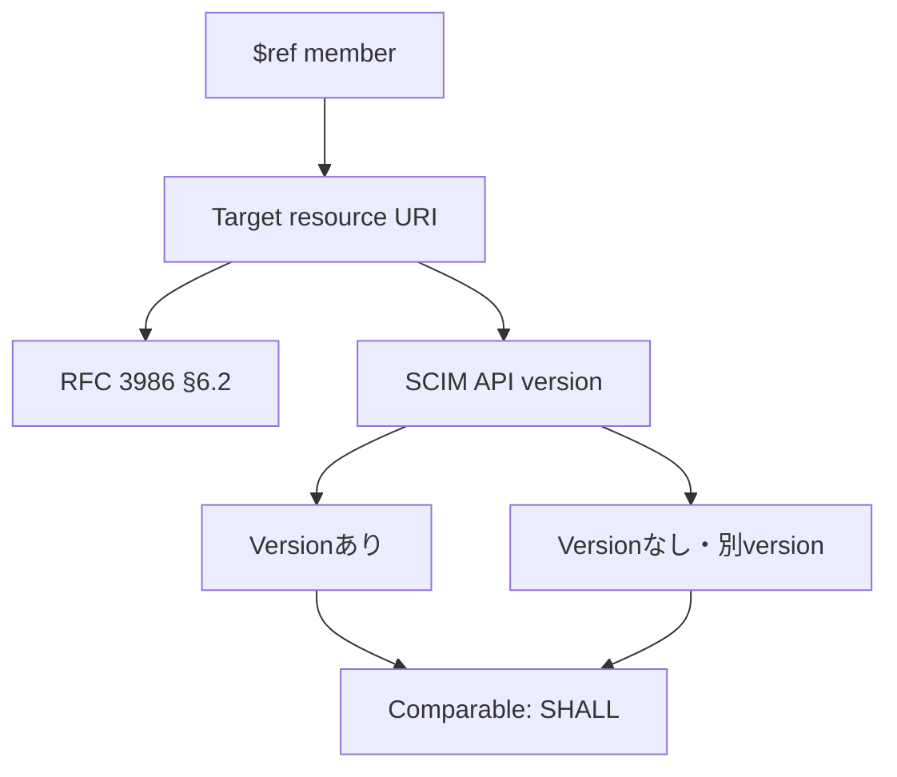

- **記事タイプ**: Requirement
- **対象読者**: SCIM の multi-valued complex attribute に現れる `$ref` を実装・検証し、参照 URI の比較規則を仕様本文から確認したい読者
- **この記事で伝えること**: `$ref` が target resource の reference URI を保持する sub-attribute であること、URI canonicalization と SCIM API version の有無・相違をまたぐ比較規則
- **扱わないこと**: `referenceTypes` の分類、HTTP authorization、referential integrity の実装、個別 User / Group attribute の更新規則、URI normalization の一般的な実装手順

## Article brief

**Reader**: SCIM の multi-valued complex attribute に現れる `$ref` を実装・検証し、参照 URI の比較規則を確認したい読者。

**Question**: `$ref` は何を表し、SCIM resource URI に API version が含まれる場合と含まれない場合をどのように比較するのか。

**Answer**: RFC 7643 §2.4 は `$ref` を、attribute が reference である場合の target resource の reference URI と定義する。URI は RFC 3986 §6.2 に従って canonicalize される。また SCIM resource URI は、API version を含む URIと、version を含まない URIまたは異なる version を含む URIを comparable とみなす（SHALL）。

**Scope**: RFC 7643 §2.4 の `$ref` sub-attribute、RFC 3986 §6.2 による URI comparison / normalization の参照、RFC 7644 §3.13 の SCIM protocol versioning と URI comparison の関係。

**Out of scope**: `referenceTypes` characteristic、reference data type 全般、authorization、referential integrity、個別 Core schema attribute の mutability、URI dereference の application behavior。

**Primary sources**: RFC 7643 §2.4、RFC 7644 §3.13、RFC 3986 §6.2。

**Diagram**: `$ref` の URI から RFC 3986 §6.2 の canonicalization と SCIM API version comparison へ至る関係を示す `flowchart TD`。

## `$ref` は target resource の reference URI を表す

RFC 7643 §2.4 は、multi-valued attribute で既定として用いられる sub-attribute の一つとして `$ref` を定義しています。`$ref` は、その attribute が reference である場合の target resource の reference URI です。

`$ref` という名前は JSON object の member name として現れ、値は URI を表します。この記事では `$ref` の URI comparison に範囲を限定し、`referenceTypes` が示す参照先の分類は扱いません。

**`$ref` carries a reference URI; SCIM also defines how versioned resource URIs participate in comparison.**  
（`$ref` は reference URI を保持し、SCIM は version 付き resource URI を比較するときの規則も定めています。）

## JSON object 上の配置

次は配置と構造を確認するための**非規範的な例**です。`illustrative-user-id` は説明用の値です。

```json
{
  "members": [
    {
      "value": "illustrative-user-id",
      "$ref": "https://example.com/v2/Users/illustrative-user-id"
    }
  ]
}
```

この例では `$ref` は `members` の各 element object 内にある JSON member です。RFC 7643 §2.4 の `$ref` の定義に対応して、値は target resource の URI を示しています。この例から authorization や dereference 成功などの security property は導きません。

## URI は RFC 3986 §6.2 に従って canonicalize される

RFC 7643 §2.4 は `$ref` の URI について、RFC 3986 §6.2 に従って canonicalize するとしています。RFC 3986 §6.2 は URI comparison のための normalization / comparison ladder を定義し、比較の目的に応じて syntax-based normalization などの方法を説明しています。

この記事では RFC 3986 §6.2 の一般的な URI normalization 手順を独自に選択・推奨しません。SCIM 側の規定として確認できるのは、`$ref` の URI canonicalization が同 section を参照していることです。

## SCIM API version が異なっても comparable とみなす

RFC 7643 §2.4 は SCIM resource URI の比較について追加規則を定めています。resource representation は SCIM protocol API version によって異なる場合がありますが、SCIM resource の URI は、API version を含む URIと、version を含まない URIまたは異なる version を含む URIを comparable とみなします（**SHALL**、RFC 7643 §2.4）。

RFC 7643 が示す例では、次の2つは equivalent とされています。

```text
https://example.com/Users/12345
https://example.com/v2/Users/12345
```

この規則は「すべての異なる URI が同じ resource を表す」という一般則ではありません。RFC 7643 §2.4 が明示しているのは、SCIM resource URI の API version の有無または相違に関する comparison です。

RFC 7644 §3.13 は protocol versioning を扱い、SCIM の version は Base URI によって識別され得ることを定めています。RFC 7643 §2.4 の比較規則は、この protocol API version の差を持つ resource URI を対象にしています。

## `$ref` と URI comparison の関係



図は RFC 7643 §2.4 が定める `$ref`、URI canonicalization、SCIM API version をまたぐ comparison の関係だけを示しています。

## まとめ

RFC 7643 §2.4 から確認できる要点は次のとおりです。

- `$ref` は、attribute が reference である場合の target resource の reference URI を表す。
- `$ref` の URI は RFC 3986 §6.2 に従って canonicalize される。
- SCIM resource URI は、API version を含む URIと、version を含まない URIまたは異なる version を含む URIを comparable とみなす（**SHALL**、RFC 7643 §2.4）。
- RFC 7644 §3.13 は SCIM protocol versioning と Base URI による version identification を扱う。

`referenceTypes`、authorization、referential integrity、個別 resource attribute の更新規則は別テーマとして扱います。

## Primary sources

- RFC 7643, §2.4 "Multi-Valued Attributes": https://www.rfc-editor.org/rfc/rfc7643.html#section-2.4
- RFC 7644, §3.13 "Versioning": https://www.rfc-editor.org/rfc/rfc7644.html#section-3.13
- RFC 3986, §6.2 "Comparison Ladder": https://www.rfc-editor.org/rfc/rfc3986.html#section-6.2
