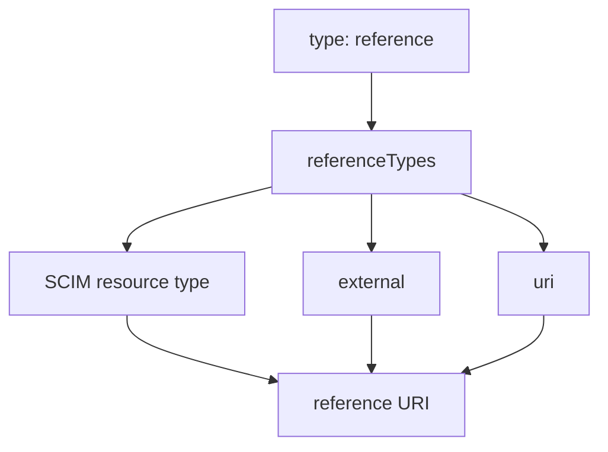

- **記事タイプ**: Requirement
- **対象読者**: SCIM schema の `reference` 型 attribute を定義・確認し、`referenceTypes` が許容する参照先の種類を読み分けたい読者
- **この記事で伝えること**: `reference` 型の値に課される URI 要件と、`referenceTypes` の `User` / `Group` などの SCIM resource type、`external`、`uri` の意味、および Schema resource 上での配置
- **扱わないこと**: HTTP authorization、参照先 resource の access control、referential integrity の実装方式、`$ref` を持つ個別 Core schema attribute の詳細、URI canonicalization 全般

## Article brief

- **Reader**: SCIM schema の `reference` 型 attribute を定義・確認し、`referenceTypes` が許容する参照先の種類を読み分けたい読者
- **Question**: `referenceTypes` はどの attribute に適用され、各値はどの種類の参照先を表すのか
- **Answer**: `referenceTypes` は `type: "reference"` の attribute にだけ適用される multi-valued string array で、SCIM resource type、`external`、`uri` を参照先の種類として示す。実際の reference value は target resource の absolute または relative URI でなければならず、reference URI は HTTP-addressable resource を指さなければならない
- **Scope**: RFC 7643 §2.3.7 と §7 における reference data type、`referenceTypes` characteristic、Schema resource 上の最小構造
- **Out of scope**: authorization、access control、referential integrity の実装、個別 resource schema の参照関係、HTTP redirect、URI normalization の一般論
- **Primary sources**: RFC 7643 §2.3.7, §7, §8.7.1
- **Diagram**: `type: reference` から `referenceTypes` の3分類と reference URI へ至る関係を示す `flowchart TD`

## `referenceTypes` は `reference` 型にだけ適用される

RFC 7643 §7 は `referenceTypes` を、参照可能な SCIM resource type を示す JSON string の multi-valued array と定義しています。この characteristic は `type` が `reference` の attribute にだけ適用されます。

**`referenceTypes` classifies what a reference attribute may point to; it does not change the reference value into a resource object.**  
（`referenceTypes` は reference attribute が何を参照できるかを分類するものであり、reference value 自体を resource object に変えるものではありません。）

RFC 7643 §7 が定める valid value は次の3種類です。

- SCIM resource type: `User` や `Group` などの SCIM resource type を示します。
- `external`: photo など、SCIM 外部の resource を示します。
- `uri`: service endpoint や schema URN などの identifier への参照を示します。

`referenceTypes` は参照先の種類を記述する characteristic です。reference value 自体の形式は RFC 7643 §2.3.7 が定めます。

## reference value は URI である

RFC 7643 §2.3.7 は `reference` data type を resource の URI と定義しています。resource は SCIM resource、外部 resource への link、URN などの identifier のいずれでもあり得ます。

reference value は target resource の absolute または relative URI であることが **MUST** です。relative URI の resolution については RFC 3986 §5.2 に従うべきであり、SCIM では resolution に使う base URI に関する追加規則が RFC 7643 §2.3.7 にあります。

同 section はさらに、reference URI が HTTP-addressable resource を指すことを **MUST** としています。HTTP client が reference URI に GET を行った場合、target resource または適切な HTTP response code を受け取ることが **MUST** です。

SCIM resource を参照する reference type について、Service Provider が referential integrity を enforce することは **MAY** です。仕様は enforce の具体的な方式を定めていません。

## Schema resource では string array として配置される

RFC 7643 §7 の Schema resource では、`referenceTypes` は attribute definition の member です。以下は配置と構造だけを示す**非規範的な最小例**です。`managerRef` と値は説明用です。

```json
{
  "name": "managerRef",
  "type": "reference",
  "multiValued": false,
  "referenceTypes": ["User"]
}
```

- `referenceTypes` は attribute definition JSON object の member です。
- 値は JSON string の array です。
- `referenceTypes` 自体は multi-valued です。
- `type: "reference"` の attribute にだけ適用されます。

参照先の種類を複数示す場合も array のまま表現します。以下も**非規範的な構造例**です。

```json
{
  "name": "relatedResource",
  "type": "reference",
  "multiValued": false,
  "referenceTypes": ["User", "Group"]
}
```

ここで `multiValued: false` は `relatedResource` attribute 自体の plurality を表します。`referenceTypes` が array であることとは別の性質です。

## resource 上の reference value と Schema definition を分けて読む

次は reference value の JSON 上の形を示す**非規範的な最小例**です。URI は説明用です。

```json
{
  "managerRef": "Users/illustrative-user-id"
}
```

この例の `managerRef` value は JSON string です。RFC 7643 §2.3.7 により、`reference` は JSON representation では string として表現されます。

Schema definition の `referenceTypes: ["User"]` と resource representation の `managerRef` は役割が異なります。前者は参照先として許容される resource type を示し、後者は実際の target resource の URI value です。

## `referenceTypes` と reference value の関係



`referenceTypes` は `reference` data type に付随する schema characteristic です。実際の value が URI であること、HTTP-addressable resource を指すこと、参照先の種類を `referenceTypes` が表すことは、それぞれ別の規定として確認できます。

## 一次資料

- RFC 7643, *System for Cross-domain Identity Management: Core Schema*, §2.3.7, §7, §8.7.1
