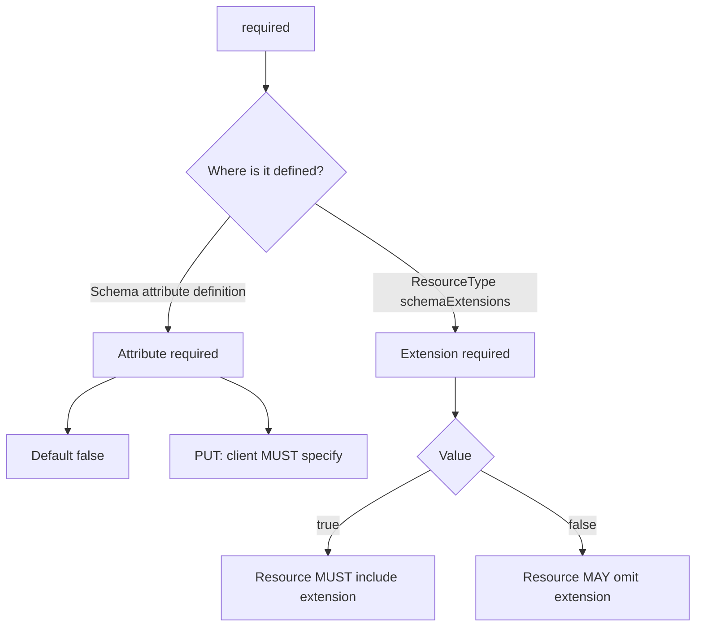

<!--
Article brief
- Type: Requirement
- Reader: SCIM 2.0 の schema と resource write request を実装・レビューする Client / Service Provider 開発者
- Question: attribute characteristic の required=true/false は何を表し、PUT や schema extension の required とどう区別するか
- Answer: required の既定値、Schema resource 上の表現、PUT request での MUST、および ResourceType.schemaExtensions.required との意味の違いを追える
- Scope: RFC 7643 §2.2, §4.1.1, §6, §7 と RFC 7644 §3.5.1 に基づく attribute characteristic required
- Out of scope: mutability / returned / uniqueness の詳細、PATCH operation の一般処理、個別 deployment の入力検証方針、extension schema の設計方法
- Primary sources: RFC 7643 §2.2, §4.1.1, §6, §7; RFC 7644 §3.5.1
- Diagram: attribute required と schemaExtensions.required を分離し、attribute required=true の PUT requirement へつなぐ flowchart
-->

## この記事について

**記事タイプ:** Requirement  
**対象読者:** SCIM 2.0 の schema と resource write request を実装・レビューする Client / Service Provider 開発者  
**この記事で伝えること:** attribute characteristic の `required` の既定値と意味、PUT における規範的要件、および `schemaExtensions.required` との区別  
**扱わないこと:** `mutability` / `returned` / `uniqueness` の詳細、PATCH operation の一般処理、個別 deployment の入力検証方針、extension schema の設計方法

SCIM の Schema resource では、attribute definition に Boolean の `required` characteristic を持たせられます。RFC 7643 §2.2 では、別途指定されない attribute の `required` は `false`、つまり REQUIRED ではないことが既定です。

**`required` is an attribute characteristic; it is not the same field as `schemaExtensions.required`.**  
（`required` は attribute characteristic であり、`schemaExtensions.required` と同じ意味の field ではありません。）

## 1. attribute の required は Boolean characteristic

RFC 7643 §7 は Schema resource の `attributes` を complex multi-valued attribute として定義し、その sub-attribute の1つに `required` を定義しています。`required` は、その attribute が required かどうかを表す Boolean value です。

RFC 7643 §2.2 により、別途指定されない場合は次の扱いです。

- `required`: `false`
- 意味: attribute は REQUIRED ではない

したがって、Schema definition で `required` が省略されていることだけから `true` を導くことはできません。

## 2. Schema resource では attribute definition の member に置かれる

次は `required` の配置と型だけを示す**非規範的な最小例**です。

```json
{
  "name": "illustrativeAttribute",
  "type": "string",
  "multiValued": false,
  "required": true
}
```

`required` は attribute definition JSON object の member です。値は Boolean です。`illustrativeAttribute` は説明用の attribute name であり、標準 schema に新しい field を定義するものではありません。

RFC 7643 §4.1.1 の core User schema では `userName` が REQUIRED とされ、各 User は non-empty `userName` value を含むことが **MUST** です。この個別 schema requirement は、一般的な既定値 `required=false` を上書きします。

## 3. PUT では required attribute を Client が指定する MUST がある

RFC 7644 §3.5.1 は HTTP PUT による resource replacement を定義しています。同 section は明示的に、attribute が `required` である場合、Client がその attribute を PUT request に指定することを **MUST** としています。

以下は配置を示す**非規範的な例**です。core User schema で REQUIRED とされる `userName` を request body に含めています。

```http
PUT /Users/illustrative-id HTTP/1.1
Content-Type: application/scim+json

{
  "schemas": ["urn:ietf:params:scim:schemas:core:2.0:User"],
  "userName": "illustrative-user"
}
```

resource attributes は JSON request body に置かれます。`illustrative-id` と `illustrative-user` は illustrative value です。

**For PUT, RFC 7644 makes the client-side requirement explicit: a required attribute MUST be specified in the request.**  
（PUT について RFC 7644 は Client 側の要件を明示しており、required attribute は request に指定しなければなりません。）

この規則は RFC 7644 §3.5.1 の PUT に対する規定です。この記事では、同じ文言を仕様上明記されていない別 operation へ一般化しません。

## 4. schemaExtensions.required は extension schema 自体の包含条件

RFC 7643 §6 の ResourceType schema にも `required` という名前の member があります。ただし、これは `schemaExtensions` の sub-attribute であり、§7 の attribute characteristic とは対象が異なります。

`schemaExtensions.required` が `true` の場合、その resource type の resource は当該 schema extension を含むことが **MUST** であり、さらに、その extension schema で required と宣言された attributes も含むことが **MUST** です。

`schemaExtensions.required` が `false` の場合、その resource type の resource は当該 schema extension を省略することが **MAY** です。

次は構造上の位置を示す**非規範的な最小例**です。

```json
{
  "schemaExtensions": [
    {
      "schema": "urn:example:params:scim:schemas:extension:illustrative:2.0:User",
      "required": true
    }
  ]
}
```

URI は illustrative value です。この例は標準 extension schema を定義するものではありません。

## 5. 同じ required でも評価対象が異なる



attribute definition の `required` は attribute の必須性を表します。一方、ResourceType の `schemaExtensions.required` は extension schema の包含条件を表します。名前が同じでも、JSON structure 上の位置と規定対象が異なります。

## まとめ

SCIM attribute characteristic の `required` は Boolean で、別途指定されない場合は `false` です（RFC 7643 §2.2, §7）。個別 schema が required と定義した attribute には、その schema 固有の要件が適用されます。core User の `userName` はその例で、各 User が non-empty value を含むことが **MUST** です（RFC 7643 §4.1.1）。

HTTP PUT では、required attribute を Client が request に指定することが **MUST** です（RFC 7644 §3.5.1）。また、ResourceType の `schemaExtensions.required` は attribute characteristic とは別の field であり、extension schema 自体を resource に含める必要があるかを表します（RFC 7643 §6）。

## Primary sources

- RFC 7643, §2.2 Attribute Characteristics
- RFC 7643, §4.1.1 Singular Attributes (`userName`)
- RFC 7643, §6 ResourceType Schema
- RFC 7643, §7 Schema Definition
- RFC 7644, §3.5.1 Replacing with PUT
