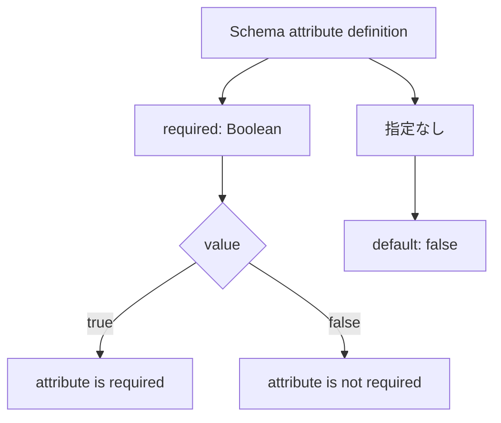

- **記事タイプ**: Requirement
- **対象読者**: SCIM Schema resource を読み、attribute が必須か任意かを仕様上どこで確認するか整理したい読者
- **この記事で伝えること**: RFC 7643 の `required` characteristic が Boolean で attribute の必須性を表し、別途指定がなければ `false` であること
- **扱わないこと**: POST / PUT / PATCH ごとの欠落 attribute の処理、`mutability`、`returned`、schema extension 自体の `required`、個別 Core schema attribute の詳細

## Article brief

**Reader**: SCIM Schema resource を読み、attribute が必須か任意かを仕様上どこで確認するか整理したい読者。

**Question**: SCIM では attribute の必須性をどの characteristic で表し、明示されていない場合はどう扱うのか。

**Answer**: RFC 7643 §7 は attribute definition の `required` を、attribute が required かどうかを指定する Boolean value と定義する。RFC 7643 §2.2 では、別途指定がない attribute の `required` は `false` とされる。また §1.1 は、属性または schema element について指定がなければ optional とみなす。

**Scope**: RFC 7643 §1.1、§2.2、§7 における attribute の `required` characteristic、その Boolean representation、default behavior。

**Out of scope**: RFC 7644 の create / replace / patch 処理、欠落した required attribute に対する operation-specific behavior、`mutability`、`returned`、`uniqueness`、ResourceType の `schemaExtensions.required`、個別 User / Group attribute の意味。

**Primary sources**: RFC 7643 §1.1、§2.2、§7。

**Diagram**: Schema resource の `required` Boolean と attribute の required / optional の関係を縦方向に示す `flowchart TD`。

## `required` は attribute characteristic の一つ

RFC 7643 §2.2 は、SCIM attribute の handling を記述する characteristic の一つとして `required` を挙げています。同 section では、Section 7 で別途指定されない場合、`required` は `false`、すなわち not REQUIRED です。

RFC 7643 §7 の Schema Definition では、attribute definition の `required` を「attribute が required かどうかを指定する Boolean value」と定義しています。

**The `required` characteristic is a Boolean in the schema definition; it is not the attribute value itself.**  
（`required` characteristic は schema definition 内の Boolean であり、attribute 自体の値ではありません。）

## 指定がなければ optional と扱う

RFC 7643 §1.1 は `REQUIRED` と `OPTIONAL` を、attribute または schema element が必須か任意かを示す語として使用すると説明しています。また、指定がなければ attribute は optional とみなすとしています。

この規則は §2.2 の default と対応します。すなわち、別途指定がない attribute の `required` characteristic は `false` です。

この記事では、`required: true` の attribute が特定の POST、PUT、PATCH request で欠落した場合に service provider がどの HTTP response を返すか、といった operation-specific な処理までは扱いません。

## Schema resource での配置を確認する

次は `required` の配置と型だけを確認するための**非規範的な例**です。`exampleAttribute` は説明用の attribute name であり、RFC 7643 が定義する Core attribute ではありません。

Schema resource の `attributes` 配列に含まれる attribute definition object では、`required` は JSON Boolean member として現れます。

```json
{
  "name": "exampleAttribute",
  "type": "string",
  "multiValued": false,
  "required": true
}
```

この例で確認する点は次のとおりです。

- `required` は attribute definition object の JSON member。
- 型は Boolean。
- `true` は、その attribute が required であることを表す。
- `false` は、その attribute が required ではないことを表す。

`"required": "true"` のような quoted string は Boolean representation ではありません。

## resource representation との関係

上の説明用 schema definition に対応する resource representation は、attribute value 自体を JSON member として持ちます。次も配置を確認するための**非規範的な例**です。

```json
{
  "exampleAttribute": "Illustrative Value"
}
```

resource representation に `required: true` を埋め込むわけではありません。`required` は Schema resource が attribute の characteristic として記述する metadata です。

## `required` の関係



この図は RFC 7643 §2.2 と §7 の関係を整理したものであり、operation-specific な処理を追加していません。

## まとめ

RFC 7643 から確認できる範囲は次のとおりです。

- `required` は SCIM attribute characteristic の一つ（RFC 7643 §2.2）。
- Schema Definition の `required` は、attribute が required かどうかを指定する Boolean value（RFC 7643 §7）。
- Section 7 で別途指定されない場合、`required` は `false`（RFC 7643 §2.2）。
- attribute の必須性が指定されていない場合、その attribute は optional とみなされる（RFC 7643 §1.1）。

POST / PUT / PATCH で required attribute をどう処理するか、ResourceType の schema extension 自体が required かどうかは別の論点として扱います。

## Primary sources

- RFC 7643, §1.1 "Requirements Notation and Conventions": https://www.rfc-editor.org/rfc/rfc7643.html#section-1.1
- RFC 7643, §2.2 "Attribute Characteristics": https://www.rfc-editor.org/rfc/rfc7643.html#section-2.2
- RFC 7643, §7 "Schema Definition": https://www.rfc-editor.org/rfc/rfc7643.html#section-7
