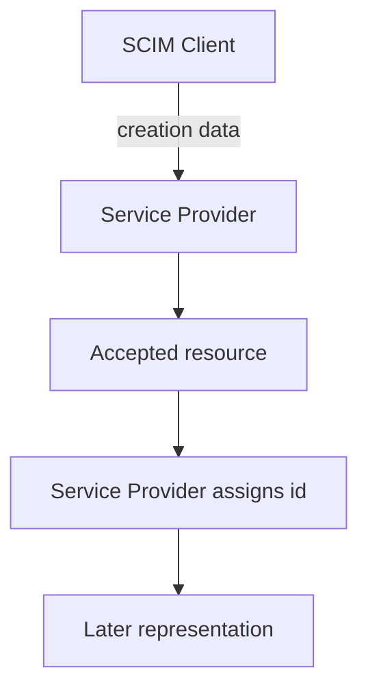

**記事タイプ:** Requirement  
**対象読者:** SCIM 2.0 の resource identifier の生成・保存・返却を実装またはレビューする Client / Service Provider 開発者  
**この記事で伝えること:** RFC 7643 の common attribute `id` について、発行主体、必須性、一意性、安定性、再割り当て禁止、attribute characteristics を区別して確認する  
**扱わないこと:** `externalId` の provisioning domain、Bulk operation の `bulkId` の詳細、`meta.location`、resource versioning / ETag、identifier の具体的な生成アルゴリズム

## Article brief

- **Reader:** SCIM resource の `id` を生成・保存・利用する Client / Service Provider の実装者・レビュー担当者
- **Question:** SCIM resource の `id` は誰が指定し、どの範囲で一意か。後から変更・再利用できるのか。response ではいつ返るのか
- **Answer:** `id` は Service Provider が発行し、resource representation では non-empty、Service Provider 全体で unique、stable、non-reassignable であり、Client は指定できないことを RFC 7643 §3.1 の規範強度とともに説明できる
- **Scope:** RFC 7643 §3, §3.1, §8.1 における SCIM resource の common attribute `id`
- **Out of scope:** `externalId`、`bulkId` の参照処理、URI 設計、`meta.location`、ETag、identifier の乱数性・形式・データベース実装
- **Primary sources:** RFC 7643 §3, §3.1, §8.1
- **Diagram:** Client が resource creation data を送り、Service Provider が `id` を割り当て、以後の representation で同じ `id` を返す関係

SCIM の `id` は、Client が resource に持ち込む identifier ではありません。RFC 7643 §3.1 は、`id` を Service Provider が定義する SCIM resource の unique identifier としています。

## 1. `id` は common attribute

RFC 7643 §3 は、SCIM resource を JSON object として定義し、common attributes と core attributes を区別しています。`id` は common attribute です。

RFC 7643 §3.1 では、`/ServiceProviderConfig` と `/ResourceTypes` の server discovery endpoint および関連 resource を例外として、common attributes はすべての resource で定義されなければなりません（MUST）。Service Provider が resource を受け入れた後、`id` と `meta` およびその sub-attributes には Service Provider が値を割り当てなければなりません（MUST）。

common attribute は独自の `schemas` URI を持たず、各 base resource schema の一部とみなされます。

## 2. `id` の値は Service Provider が発行する

RFC 7643 §3.1 は、`id` の値は常に Service Provider が発行し、Client が指定してはならない（MUST NOT）と規定しています。

次は配置と構造を確認するための**非規範的な例**です。値は illustrative value です。

```json
{
  "schemas": [
    "urn:ietf:params:scim:schemas:core:2.0:User"
  ],
  "id": "illustrative-resource-id",
  "userName": "alice@example.test"
}
```

この例で `id` は resource JSON object の top-level member です。Client が create request でこの値を指定する例ではなく、Service Provider が受け入れた resource の representation に割り当てられた値を示しています。



図は `id` の発行主体と、受け入れ後の resource representation との関係だけを示しています。

## 3. resource representation の `id` は non-empty

RFC 7643 §3.1 は、resource の各 representation が non-empty の `id` value を含まなければならない（MUST）と規定しています。

RFC 7643 §8.1 の minimal User representation でも、`schemas`、`id`、`userName` を含む JSON object が非規範的な最小例として示されています。

`id` の具体的な文字列形式や生成アルゴリズムは、§3.1 のこの要件では規定されていません。本記事では UUID など特定方式を要件として扱いません。

## 4. `id` は Service Provider 全体で unique

RFC 7643 §3.1 は、`id` が Service Provider の resource 全体で unique でなければならない（MUST）と規定しています。

この規則は、ある resource type の collection 内だけに限定された一意性として記述されていません。仕様本文は **the SCIM service provider's entire set of resources** を対象にしています。

したがって、本記事でいう `id` の一意性は、User collection 内だけの一意性という説明には置き換えません。

## 5. `id` は stable かつ non-reassignable

RFC 7643 §3.1 は、`id` が stable で non-reassignable な identifier であり、同じ resource が後続 request で返される際に変化してはならない（MUST）と規定しています。

ここでは2つの要件を区別できます。

- **stable:** 同じ resource の後続 representation で identifier が変化しないこと。
- **non-reassignable:** `id` が再割り当て可能な identifier ではないこと。

仕様はこの要件を満たすための storage layout、採番方式、乱数生成方式を指定していません。そのため、本記事では特定の実装方式を推奨しません。

## 6. Client は `id` を指定できない

`id` は Service Provider issued value であり、Client が指定してはなりません（MUST NOT, RFC 7643 §3.1）。これは `externalId` と異なる役割です。

`externalId` は Client が resource を識別するために使用できる identifier ですが、その詳細は別テーマです。本記事では `id` の要件だけを扱います。

## 7. `id` の attribute characteristics

RFC 7643 §3.1 は `id` に次の characteristics を定めています。

- `caseExact`: `true`
- `mutability`: `readOnly`
- `returned`: `always`

したがって、`id` の文字列値は case-exact です。また Client が書き換える attribute ではなく、response representation では `returned=always` の characteristic を持ちます。

これらの characteristic の一般的な意味は RFC 7643 §2.2 に定義されていますが、本記事では `id` に適用される値だけを扱います。

## 8. `bulkId` という文字列は `id` に使用できない

RFC 7643 §3.1 は、文字列 `bulkId` を reserved keyword とし、unique identifier value の中で使用してはならない（MUST NOT）と規定しています。

ここで扱っているのは resource の `id` に対する予約語の要件です。RFC 7644 の Bulk Operations で使う transient identifier `bulkId` の参照・置換処理は本記事の範囲外です。

## まとめ

SCIM resource の `id` について RFC 7643 §3.1 が定める中心的な要件は、Service Provider が発行すること、representation では non-empty であること、Service Provider の resource 全体で unique であること、stable かつ non-reassignable であることです。

**The SCIM `id` is a service-provider-issued resource identifier, not a client-supplied identifier.**  
（SCIM の `id` は Service Provider が発行する resource identifier であり、Client が指定する identifier ではありません。）

また、`id` は `caseExact=true`、`mutability=readOnly`、`returned=always` です。これらは identifier の生成方式を指定するものではなく、RFC 7643 が定める resource representation 上の要件と characteristics です。

## 一次資料

- RFC Editor: [RFC 7643 — System for Cross-domain Identity Management: Core Schema](https://www.rfc-editor.org/rfc/rfc7643.html)

参照した主要節: RFC 7643 §3, §3.1, §8.1  
最終確認: 2026-09-24
