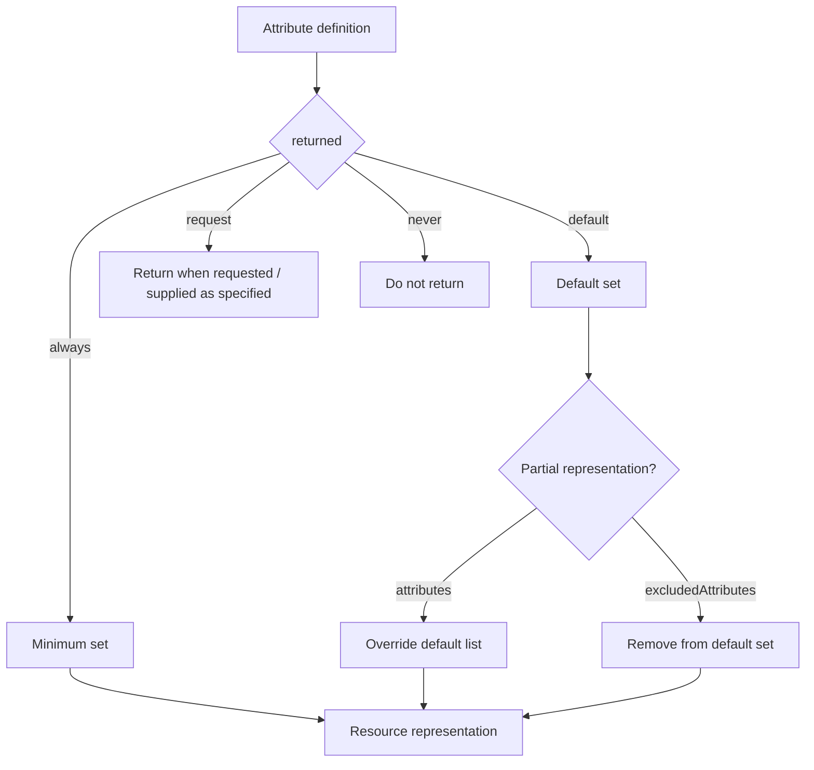

<!--
Article brief
- Type: Requirement
- Reader: SCIM 2.0 の schema と resource response を実装・レビューする Client / Service Provider 開発者
- Question: attribute characteristic の returned は何を制御し、always / never / default / request は response と attributes / excludedAttributes にどう影響するか
- Answer: returned の4値が attribute を返す条件を定義し、always が minimum set、default が default set を構成すること、attributes / excludedAttributes との関係を区別できる
- Scope: RFC 7643 §2.2, §7 と RFC 7644 §3.4.2.5, §3.9 に基づく returned characteristic、minimum/default attribute set、attributes / excludedAttributes による partial representation
- Out of scope: mutability の更新規則、filter evaluation、authorization による attribute access control、個別 schema attribute の業務上の設計
- Primary sources: RFC 7643 §2.2, §7; RFC 7644 §3.4.2.5, §3.9
- Diagram: returned の値から response inclusion rule と attributes / excludedAttributes の影響を縦方向に示す flowchart
-->

## この記事について

**記事タイプ:** Requirement  
**対象読者:** SCIM 2.0 の schema と resource response を実装・レビューする Client / Service Provider 開発者  
**この記事で伝えること:** `returned` の4値が attribute を response に含める条件をどう定義し、`attributes` / `excludedAttributes` とどう関係するか  
**扱わないこと:** `mutability` の更新規則、filter evaluation、authorization による attribute access control、個別 schema attribute の業務上の設計

SCIM の schema には、attribute が response に返される条件を表す `returned` characteristic があります。RFC 7643 は `always`、`never`、`default`、`request` の4値を定義し、RFC 7644 は resource representation を返す際の minimum set と default set、および `attributes` / `excludedAttributes` の処理を定義しています。

**`returned` defines when an attribute is included in a SCIM response; it is distinct from whether the attribute can be written.**  
（`returned` は SCIM response に attribute を含める条件を定義するもので、attribute を書き込めるかどうかとは別の特性です。）

## 1. returned は attribute characteristic

RFC 7643 §2.2 は `returned` を、GET response または PUT / POST / PATCH response に attribute とその値を返す条件を示す単一の keyword と定義しています。

別途指定されない場合、`returned` の既定値は `default` です（RFC 7643 §2.2）。

4つの値の意味は次のとおりです。

- `always`: `attributes` parameter の内容にかかわらず常に返されます。
- `never`: 返されません。Service Provider がその attribute を search filter に使用できるようにすることは **MAY** です。
- `default`: attribute value を返す SCIM operation response で既定で返されます。ただし GET で `attributes` parameter が指定された場合、その attribute が `attributes` に指定されているときだけ返されます。これが既定の `returned` 値です。
- `request`: PUT / POST / PATCH では Client がその attribute を指定した場合に返され、query operation では `attributes` parameter に指定された場合だけ返されます。

これらは RFC 7643 §2.2 の returnability の規則です。

## 2. Schema resource では returned は string member

RFC 7643 §7 の Schema definition では、attribute definition に `returned` characteristic が含まれます。以下は配置だけを確認するための**非規範的な最小例**です。

```json
{
  "name": "illustrativeAttribute",
  "type": "string",
  "returned": "request"
}
```

`illustrativeAttribute` は説明用の名前であり、標準 schema に新しい field を追加する例ではありません。ここで確認する対象は、`returned` が attribute definition の JSON member として置かれる構造です。

## 3. always と default が response の基礎集合を作る

RFC 7644 §3.9 は、resource representation が返される SCIM operation について、返される attributes の基礎を2つの集合として定義しています。

- minimum attribute set: `returned` が `always` の attributes
- default attribute set: `returned` が `default` の attributes

したがって、通常の resource representation は minimum set と default set を基礎に構成されます。

`always` の代表例として RFC 7643 §3.1 の `id` があります。`id` の `returned` characteristic は `always` です。

## 4. attributes は default set を上書きする

RFC 7644 §3.9 では、Client は resource representation を返す operation において、相互排他的な URL query parameter `attributes` または `excludedAttributes` の一方を指定して partial representation を要求することが **MAY** です。

`attributes` を指定すると default list は **SHALL** override され、返される各 resource は minimum set と、`attributes` で明示的に要求した attributes / sub-attributes を含むことが **MUST** です。

以下は配置を示す**非規範的な例**です。

```http
GET /Users/2819c223-7f76-453a-919d-413861904646?attributes=userName
Accept: application/scim+json
```

`attributes` は URL query parameter で、値は standard attribute notation による comma-separated list です（RFC 7644 §3.9）。

## 5. excludedAttributes は default set から除外する

`excludedAttributes` を指定した場合、返される resource は minimum set を含むことが **MUST** です。さらに、default set から `excludedAttributes` に列挙された attributes を除いた集合が返されます（RFC 7644 §3.9）。

RFC 7644 §3.4.2.5 は、`excludedAttributes` が schema の `returned` が `always` である attribute に影響しないことを **SHALL** としています。

以下は配置を示す**非規範的な例**です。

```http
GET /Users/2819c223-7f76-453a-919d-413861904646?excludedAttributes=displayName
Accept: application/scim+json
```

`attributes` と `excludedAttributes` は同時に使う parameter ではなく、RFC 7644 §3.9 は mutually exclusive と定義しています。



`always` の attribute は minimum set に属するため、`excludedAttributes` で取り除く対象にはなりません。

## 6. returned と mutability は別の characteristic

RFC 7643 §2.2 は `mutability` と `returned` を別々の attribute characteristic として定義しています。たとえば `writeOnly` attribute については、attribute value を返してはならない（**SHALL NOT**）とされ、通常 `returned` も `never` になるという note があります。

ただし、`returned=never` 自体は「書き込み可能」を意味しません。書き込み可否は `mutability` の規則で判断し、response への包含条件は `returned` の規則で判断します。

**Returnability and mutability answer different protocol questions.**  
（returnability と mutability は、プロトコル上の異なる問いに答える特性です。）

## まとめ

SCIM の `returned` characteristic は attribute を response に含める条件を `always`、`never`、`default`、`request` の4値で表します。指定がなければ `default` です（RFC 7643 §2.2）。

RFC 7644 §3.9 では `always` の attributes が minimum set、`default` の attributes が default set を構成します。Client は `attributes` または `excludedAttributes` を使って partial representation を要求できますが、`always` の attribute は minimum set に残り、`excludedAttributes` の影響を受けません（RFC 7644 §3.4.2.5, §3.9）。

## Primary sources

- RFC 7643, §2.2 Attribute Characteristics
- RFC 7643, §7 Schema Definition
- RFC 7644, §3.4.2.5 Attributes
- RFC 7644, §3.9 Additional Operation Response Parameters
