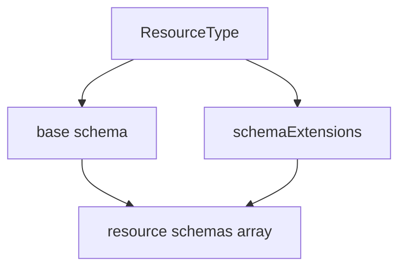

**記事タイプ:** Requirement  
**対象読者:** SCIM 2.0 resource の JSON representation と schema extension の扱いを実装またはレビューする Client / Service Provider 開発者  
**この記事で伝えること:** `schemas` attribute の配置、必須性、base schema と extension schema の表現、値の制約を RFC 7643 の規範強度のまま確認する  
**扱わないこと:** `/Schemas` discovery の取得手順、Schema resource の attribute characteristics、ResourceType discovery の詳細、個別 extension の attribute 定義

## Article brief

- **Reader:** SCIM resource の JSON representation を生成・検証する Client / Service Provider の実装者・レビュー担当者
- **Question:** `schemas` は resource のどこに置き、何を列挙するのか。base schema と extension schema はどう表現し、重複や順序をどう扱うのか
- **Answer:** `schemas` は top-level の REQUIRED な string array で、resource type に定義された base schema と使用中の extension schema の URI を表し、non-empty、unique、順序非依存であることを説明できる
- **Scope:** RFC 7643 §2.1, §3, §3.3 における resource representation の `schemas` attribute
- **Out of scope:** RFC 7643 §7 の Schema resource 全体、RFC 7644 §4 の `/Schemas` discovery operation、extension 固有 attribute の意味、schema URI の登録手続
- **Primary sources:** RFC 7643 §2.1, §3, §3.3
- **Diagram:** resource type が定義する base schema / schemaExtensions と resource JSON の `schemas` array の対応

SCIM resource は JSON object として表現され、どの schema namespace が現在の JSON structure の attributes を定義しているかを `schemas` attribute で示します。

## 1. SCIM resource は `schemas` を指定する

RFC 7643 §2.1 は、SCIM resource が JSON 形式で表現され、Section 3 に従って `schemas` attribute により schema を指定しなければならない（MUST）と規定しています。

RFC 7643 §3 では、`schemas` は REQUIRED attribute です。値は URI を格納する string array で、現在の JSON structure に存在する attributes を定義する SCIM schema namespace を示します。

次は配置と最小構造を確認するための**非規範的な例**です。URI は RFC 7643 で定義された User core schema を使用しています。

```json
{
  "schemas": [
    "urn:ietf:params:scim:schemas:core:2.0:User"
  ],
  "userName": "alice@example.test"
}
```

`schemas` は resource JSON object の top-level member です。各 array element は string です。

## 2. `schemas` は non-empty でなければならない

RFC 7643 §3 は、SCIM schema のすべての representation が、当該 representation でサポートされる URI value を含む non-empty array を `schemas` に持たなければならない（MUST）と規定しています。

RFC 7643 §3.3 は resource についてさらに、`schemas` が少なくとも1つの値を含まなければならず（MUST）、その値が resource の base schema であることを SHALL としています。

したがって、resource representation の `schemas` を空 array とすることは、この要件を満たしません。

## 3. resource type に定義された schema だけを列挙する

RFC 7643 §3 は、resource の `schemas` が、その resource の定義済み `resourceType` における `schema` と `schemaExtensions` として定義された値だけを含まなければならない（MUST）と規定しています。

この関係は次のように整理できます。



図は ResourceType に定義された schema URI と resource representation の `schemas` array の対応だけを示しています。

## 4. extension schema を使う場合の JSON 構造

RFC 7643 §3.3 では、`schemas` の追加 value により、使用中の extended schema を示すことができます（MAY）。base object schema を除き、schema extension URI は、その extension namespace に属する attributes を区別する JSON container として使用されます（SHALL）。

次は配置を確認するための**非規範的な例**です。値は illustrative value です。

```json
{
  "schemas": [
    "urn:ietf:params:scim:schemas:core:2.0:User",
    "urn:ietf:params:scim:schemas:extension:enterprise:2.0:User"
  ],
  "userName": "alice@example.test",
  "urn:ietf:params:scim:schemas:extension:enterprise:2.0:User": {
    "employeeNumber": "illustrative-123"
  }
}
```

この例では、core attribute の `userName` は top level にあり、Enterprise User extension の attribute は extension schema URI を key とする JSON object 内にあります。

## 5. duplicate value は禁止される

RFC 7643 §3 は、`schemas` の各 string value が unique URI であることを要求し、duplicate value を含めてはならない（MUST NOT）と規定しています。

同じ schema URI を複数回列挙しても、複数の schema namespace を意味することにはなりません。array 内では各 URI を一度だけ表現します。

## 6. array の順序は意味を持たない

RFC 7643 §3 は `schemas` の value order を規定しておらず、順序が behavior に影響してはならない（MUST NOT）としています。

したがって、base schema が array の第1要素でなければならない、という順序要件として解釈しません。RFC 7643 §3.3 は少なくとも1つの value が base schema であることを定めていますが、その array position を規定していません。

## 7. base schema と extension schema の判別

RFC 7643 §3.3 は、resource の `schemas` に含まれる URI のうち、どれが base schema でどれが extended schema かを判別するため、resource の `meta.resourceType` value を用いて ResourceType schema を取得することができる（MAY）としています。

ここで仕様が示しているのは判別方法としての MAY です。本記事では ResourceType discovery の HTTP operation 自体は扱いません。

## まとめ

SCIM resource の `schemas` は、resource JSON object の top-level に置かれる REQUIRED な string array です。resource representation は schema を `schemas` で指定しなければならず（MUST, RFC 7643 §2.1）、array は non-empty で、resource type に定義された `schema` / `schemaExtensions` の URI だけを含みます（RFC 7643 §3）。duplicate value は MUST NOT、value order は behavior に影響してはなりません（MUST NOT）。

**The `schemas` array identifies the schema namespaces used by the current SCIM JSON structure; its order does not define behavior.**  
（`schemas` array は現在の SCIM JSON structure で使われる schema namespace を示し、その並び順は動作を定義しません。）

extension schema を使用する場合、その URI を `schemas` に追加できます（MAY）。また、base object schema を除く extension attributes は、extension schema URI を JSON container として使用します（SHALL, RFC 7643 §3.3）。

## 一次資料

- RFC Editor: [RFC 7643 — System for Cross-domain Identity Management: Core Schema](https://www.rfc-editor.org/rfc/rfc7643.html)

参照した主要節: RFC 7643 §2.1, §3, §3.3  
最終確認: 2026-09-24
