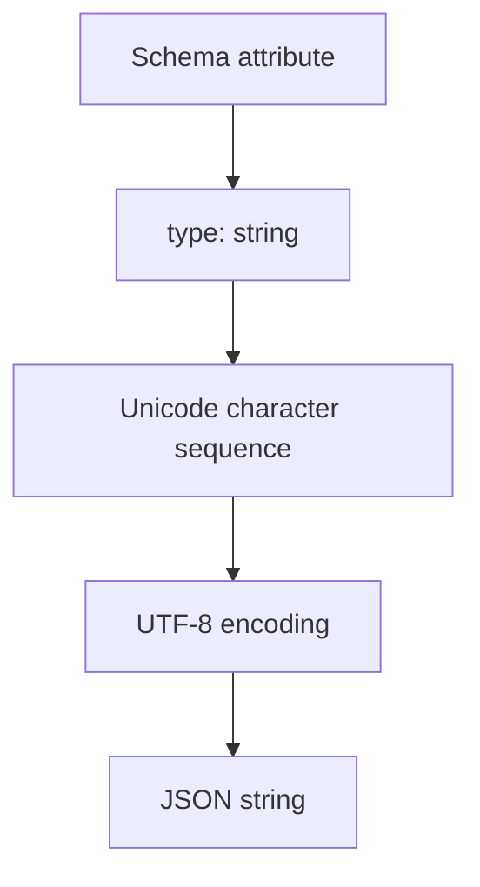

- **記事タイプ**: Requirement
- **対象読者**: SCIM schema を定義・実装し、`string` attribute の値と JSON 表現を仕様本文から確認したい読者
- **この記事で伝えること**: SCIM の `string` が Unicode character sequence として定義され、UTF-8 で encode され、JSON string として表現されること
- **扱わないこと**: `canonicalValues` の意味と処理、`caseExact`、filter comparison、個別 attribute の format、Unicode normalization、他の SCIM data type

## Article brief

**Reader**: SCIM schema を定義・実装し、`string` attribute の値と JSON 表現を確認したい読者。

**Question**: `type: "string"` の attribute は何を値として持ち、resource representation ではどの JSON type で表現されるのか。

**Answer**: RFC 7643 §2.3.1 は String を zero or more Unicode characters の sequence と定義し、RFC 2277 と RFC 3629 に従って UTF-8 で encode するとしている。RFC 7643 §2.3 の Table 1 は SCIM schema type `"string"` を RFC 7159 §7 の JSON String に対応付けている。また、string attribute は required data format を指定してもよい（MAY）。

**Scope**: RFC 7643 §2.3 と §2.3.1 における String data type、UTF-8 encoding、JSON representation、required data format を指定できること。

**Out of scope**: `canonicalValues` の意味と処理、`caseExact`、filter comparison、個別 attribute が指定する format、Unicode normalization、他の SCIM data type。

**Primary sources**: RFC 7643 §2.3, §2.3.1、RFC 3629、RFC 7159 §7。

**Diagram**: Schema definition の `type: "string"` から Unicode character sequence、UTF-8 encoding、JSON string representation までの対応を示す `flowchart TD`。

## `string` は Unicode character sequence である

RFC 7643 §2.3.1 は String を、zero or more Unicode characters の sequence と定義しています。この character sequence は RFC 2277 と RFC 3629 に従って UTF-8 で encode されます。

RFC 7643 §2.3 の Table 1 では、SCIM data type `String` の schema `type` は `"string"`、underlying JSON type は RFC 7159 §7 の String とされています。

The SCIM schema type and the JSON representation describe different layers of the same attribute.  
（SCIM schema type と JSON representation は、同じ attribute の異なる層を記述します。）

Schema resource では attribute definition の `type` に `"string"` を置きます。resource representation では、その attribute の値が JSON string として現れます。

## Schema definition と resource value の配置

次は配置と構造を示す**非規範的な例**です。attribute 名 `exampleString` と値 `Illustrative Value` は説明用であり、RFC 7643 が定義する attribute や規範的な値ではありません。

Schema resource の attribute definition では、`type` は JSON member として配置されます。

```json
{
  "name": "exampleString",
  "type": "string",
  "multiValued": false
}
```

対応する resource representation の例は次の形です。

```json
{
  "exampleString": "Illustrative Value"
}
```

この例では `exampleString` の値は JSON string です。引用符は JSON representation の構文であり、この記事では特定の業務上の値を定義していません。

## UTF-8 で encode する

RFC 7643 §2.3.1 は String を RFC 2277 と RFC 3629 に従って UTF-8 で encode するとしています。RFC 3629 は UTF-8 を Unicode / ISO 10646 の transformation format として定義しています。

この記事では、この要件から Unicode normalization form や application-specific な文字制限を追加しません。それらは RFC 7643 §2.3.1 の String data type の定義そのものには含まれていません。

## required data format を指定してもよい

RFC 7643 §2.3.1 では、SCIM schema type が `string` の attribute は required data format を指定してもよい（**MAY**）とされています。

この **MAY** は、すべての string attribute に特定 format が存在することを意味しません。また、この記事では個別 attribute の format を独自に定義しません。format の有無と内容は、その attribute を定義する仕様で確認する必要があります。

同じ §2.3.1 には `canonicalValues` が指定された場合の記述もありますが、`canonicalValues` の意味と Service Provider の処理は別テーマであるため、この記事では扱いません。

## Schema definition から JSON representation まで



A SCIM string is a Unicode character sequence encoded in UTF-8 and represented as a JSON string.  
（SCIM の string は、UTF-8 で encode され、JSON string として表現される Unicode character sequence です。）

この図は RFC 7643 §2.3 と §2.3.1 が示す data type と representation の対応を整理したものであり、新しい処理主体や security property を追加していません。

## まとめ

RFC 7643 §2.3 と §2.3.1 から確認できる範囲は次のとおりです。

- SCIM schema type は `string`。
- String は zero or more Unicode characters の sequence。
- RFC 2277 と RFC 3629 に従って UTF-8 で encode される。
- resource representation では RFC 7159 §7 の JSON String に対応する。
- string attribute は required data format を指定してもよい（**MAY**、RFC 7643 §2.3.1）。

`canonicalValues`、`caseExact`、filter comparison、個別 attribute の format は、この String data type の基本表現とは分離して扱います。

## Primary sources

- RFC 7643, §2.3 "Attribute Data Types": https://www.rfc-editor.org/rfc/rfc7643.html#section-2.3
- RFC 7643, §2.3.1 "String": https://www.rfc-editor.org/rfc/rfc7643.html#section-2.3.1
- RFC 3629, "UTF-8, a transformation format of ISO 10646": https://www.rfc-editor.org/rfc/rfc3629.html
- RFC 7159, §7 "Strings": https://www.rfc-editor.org/rfc/rfc7159.html#section-7
