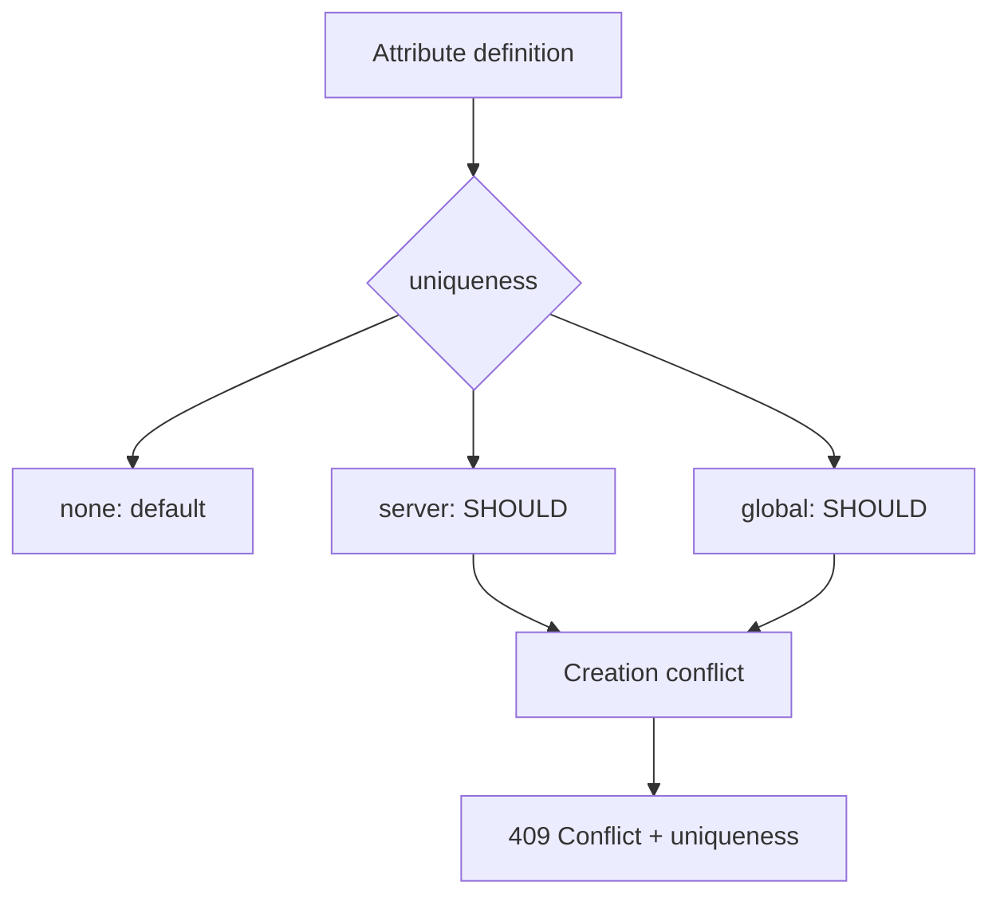

- **記事タイプ**: Requirement
- **対象読者**: SCIM schema の attribute 定義を読み、値の一意性と重複時の protocol response を実装・確認する読者
- **この記事で伝えること**: `uniqueness` characteristic の `none` / `server` / `global` の意味、既定値、Schema resource 上の表現、および resource creation が既存 resource と衝突した場合の response
- **扱わないこと**: database の unique constraint、分散システム上の一意性実装、識別子生成方式、filter による事前検索、SCIM 以外の identity identifier 設計

## Article brief

- **Reader**: SCIM schema の attribute 定義を読み、値の一意性と重複時の protocol response を実装・確認する読者
- **Question**: `uniqueness` の `none` / `server` / `global` はそれぞれ何を意味し、重複する resource creation を Service Provider はどう応答するのか
- **Answer**: `uniqueness` は Service Provider が attribute value の一意性をどの範囲で扱うかを示す single keyword で、既定値は `none` である。`server` と `global` の一意性要件は SHOULD であり、resource creation が既存 resource と衝突すると Service Provider は 409 と `scimType: "uniqueness"` を返す MUST がある
- **Scope**: RFC 7643 の attribute characteristic と `userName`、RFC 7644 の resource creation conflict
- **Out of scope**: database 制約、競合検出アルゴリズム、事前検索、identifier generation、tenant architecture
- **Primary sources**: RFC 7643 §2.2, §4.1.1, §7, §8.7.1; RFC 7644 §3.3, §3.12
- **Diagram**: attribute definition の `uniqueness` と、creation conflict 時の 409 response の関係を示す `flowchart TD`

## `uniqueness` は attribute value の一意性の扱いを示す

RFC 7643 §7 は `uniqueness` を、Service Provider が attribute value の一意性をどのように扱うかを指定する **single keyword value** と定義しています。RFC 7643 §2.2 により、別途指定されない場合の既定値は `none` です。

**The `uniqueness` characteristic describes the intended uniqueness scope; `server` and `global` use SHOULD, not MUST.**  
（`uniqueness` characteristic は意図された一意性の範囲を表し、`server` と `global` の規範強度は MUST ではなく SHOULD です。）

RFC 7643 §7 の3値は次の意味です。

- `none`: value は一意であることを意図しません。DEFAULT です。
- `server`: value は現在の SCIM endpoint または tenancy の範囲で一意であることが **SHOULD** です。global に一意であることは **MAY** です。同一 server 上の2つの resource が同じ value を持たないことが **SHOULD** です。
- `global`: value は globally unique であることが **SHOULD** です。どの server 上の2つの resource も同じ value を持たないことが **SHOULD** です。

RFC 7643 §7 はさらに、Service Provider が uniqueness に基づいて invalid value を HTTP 400 (Bad Request) で拒否することを **MAY** としています。また Client は Service Provider より強い一意性を Client 側で課すことを **MAY** としています。

## Schema resource では `uniqueness` は string member になる

RFC 7643 §8.7.1 の Schema representation では、attribute definition の `uniqueness` は `type: "string"`、`multiValued: false` と定義され、canonical values は `none`、`server`、`global` です。

以下は配置を示す**非規範的な最小例**です。値は説明用です。

```json
{
  "name": "employeeNumber",
  "type": "string",
  "multiValued": false,
  "uniqueness": "server"
}
```

- `uniqueness` は attribute definition JSON object の member です。
- 型は string です。
- cardinality は single-valued です。
- canonical values は `none` / `server` / `global` です。

## `userName` は明示的に一意性が要求される

RFC 7643 §4.1.1 は `userName` を Service Provider における User の unique identifier と定義しています。各 User は non-empty `userName` を含むことが **MUST** で、その identifier は Service Provider の User 全体で一意であることが **MUST** です。

したがって、一般的な `uniqueness: "server"` の **SHOULD** と、Core User schema が `userName` に直接課す **MUST** は同じ規範強度ではありません。

## resource creation が既存 resource と衝突した場合

RFC 7644 §3.3 は、Service Provider が requested resource の creation が既存 resource と conflict すると判断した場合、HTTP status code 409 (Conflict) と `scimType` error code `uniqueness` を返すことを **MUST** としています。仕様は duplicate `userName` を例として挙げています。

以下はその構造を示す**非規範的な例**です。

```http
POST /Users HTTP/1.1
Host: example.com
Content-Type: application/scim+json

{
  "schemas": ["urn:ietf:params:scim:schemas:core:2.0:User"],
  "userName": "illustrative-user"
}
```

creation が既存 resource と conflict すると Service Provider が判断した場合の response 例です。

```http
HTTP/1.1 409 Conflict
Content-Type: application/scim+json

{
  "schemas": ["urn:ietf:params:scim:api:messages:2.0:Error"],
  "status": "409",
  "scimType": "uniqueness"
}
```

`status` と `scimType` を含む SCIM Error の構造は RFC 7644 §3.12 に従います。この例では `detail` は記事テーマに不要なため省略しています。

## 規範強度を分けて読む



`uniqueness` characteristic の一般規則と、個別 attribute に直接課される要件、resource creation conflict の protocol response は別の規定です。`server` / `global` の **SHOULD** を **MUST** に読み替えず、`userName` のように個別 schema がより強い要件を定めている場合は、その個別規定を区別して確認する必要があります。

## 一次資料

- RFC 7643, *System for Cross-domain Identity Management: Core Schema*, §2.2, §4.1.1, §7, §8.7.1
- RFC 7644, *System for Cross-domain Identity Management: Protocol*, §3.3, §3.12
